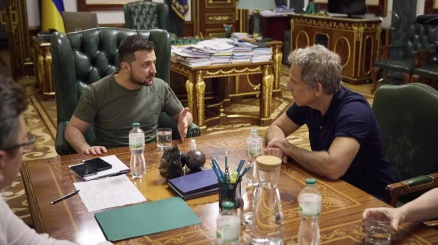

## Claim
Claim: " This image shows Ben Stiller and Ukrainian President Volodymyr Zelensky at their meeting on June 20, 2022, for which Stiller received $4 million from USAID."

## Actions
```
web_search("Ben Stiller Volodymyr Zelensky meeting June 20 2022")
web_search("Ben Stiller USAID Ukraine")
```

## Evidence
### Evidence from `web_search`
Ben Stiller met with Ukrainian President Volodymyr Zelenskyy in Kyiv on June 20, 2022, as part of his visit as a goodwill ambassador for the United Nations High Commissioner for Refugees (UNHCR). The meeting was reported by ABC News ([https://abcnews.go.com/International/ben-stiller-meets-volodymyr-zelenskyy-ukraine-world-refugee/story?id=85517989](https://abcnews.go.com/International/ben-stiller-meets-volodymyr-zelenskyy-ukraine-world-refugee/story?id=85517989)), the New York Post ([https://nypost.com/2022/06/20/ben-stiller-met-with-zelensky-in-ukraine-on-world-refugee-day/](https://nypost.com/2022/06/20/ben-stiller-met-with-zelensky-in-ukraine-on-world-refugee-day/)), and the BBC ([https://www.bbc.com/news/av/world-61875351](https://www.bbc.com/news/av/world-61875351)).

The ABC News article also mentions Stiller's visit to Irpin, Ukraine, and includes images of Stiller with children in Poland and walking through a damaged building in Irpin. , , , , , , 


### Evidence from `web_search`
Ben Stiller met with Ukrainian President Volodymyr Zelensky in June 2022. However, Stiller denied claims that he received $4 million from USAID for his trip to Ukraine, stating that he self-funded his humanitarian trip. The United Nations High Commissioner for Refugees (UNHCR) confirmed that Stiller is not compensated for his work with UNHCR and self-funds his travel.

Sources: [Vanity Fair](https://www.vanityfair.com/hollywood/story/ben-stiller-denies-elon-musks-retweet-claiming-usaid-funded-the-stars-trip-to-ukraine?srsltid=AfmBOoqmZtyUwoMPiFsX8zL7DdXJOT30rVSXIZLNyC8z9NQ6jnf-Uufb), [IMDB](https://www.imdb.com/news/ni65111956/), and [MSNBC](https://www.msnbc.com/morning-joe/watch/-totally-false-actor-ben-stiller-debunks-claims-usaid-funded-ukraine-trip-231285317684).  


## Elaboration
The image does show Ben Stiller and Volodymyr Zelenskyy meeting. The meeting occurred on June 20, 2022, as reported by multiple news outlets ([https://abcnews.go.com/International/ben-stiller-meets-volodymyr-zelenskyy-ukraine-world-refugee/story?id=85517989](https://abcnews.go.com/International/ben-stiller-meets-volodymyr-zelenskyy-ukraine-world-refugee/story?id=85517989), [https://nypost.com/2022/06/20/ben-stiller-met-with-zelensky-in-ukraine-on-world-refugee-day/](https://nypost.com/2022/06/20/ben-stiller-met-with-zelensky-in-ukraine-on-world-refugee-day/), [https://www.bbc.com/news/av/world-61875351](https://www.bbc.com/news/av/world-61875351)). However, the claim that Stiller received $4 million from USAID is false. Stiller denied these claims, stating that he self-funded his humanitarian trip ([https://www.vanityfair.com/hollywood/story/ben-stiller-denies-elon-musks-retweet-claiming-usaid-funded-the-stars-trip-to-ukraine?srsltid=AfmBOoqmZtyUwoMPiFsX8zL7DdXJOT30rVSXIZLNyC8z9NQ6jnf-Uufb](https://www.vanityfair.com/hollywood/story/ben-stiller-denies-elon-musks-retweet-claiming-usaid-funded-the-stars-trip-to-ukraine?srsltid=AfmBOoqmZtyUwoMPiFsX8zL7DdXJOT30rVSXIZLNyC8z9NQ6jnf-Uufb), [https://www.imdb.com/news/ni65111956/](https://www.imdb.com/news/ni65111956/), [https://www.msnbc.com/morning-joe/watch/-totally-false-actor-ben-stiller-debunks-claims-usaid-funded-ukraine-trip-231285317684](https://www.msnbc.com/morning-joe/watch/-totally-false-actor-ben-stiller-debunks-claims-usaid-funded-ukraine-trip-231285317684)).


## Final Judgement
The image accurately depicts Ben Stiller and Volodymyr Zelenskyy meeting on June 20, 2022. However, the claim that Stiller received $4 million from USAID is false.

`false`

### Verdict: FALSE

### Justification
The image accurately depicts Ben Stiller and Volodymyr Zelenskyy meeting on June 20, 2022, as reported by multiple news outlets ([https://abcnews.go.com/International/ben-stiller-meets-volodymyr-zelenskyy-ukraine-world-refugee/story?id=85517989](https://abcnews.go.com/International/ben-stiller-meets-volodymyr-zelenskyy-ukraine-world-refugee/story?id=85517989), [https://nypost.com/2022/06/20/ben-stiller-met-with-zelensky-in-ukraine-on-world-refugee-day/](https://nypost.com/2022/06/20/ben-stiller-met-with-zelensky-in-ukraine-on-world-refugee-day/), [https://www.bbc.com/news/av/world-61875351](https://www.bbc.com/news/av/world-61875351)). However, the claim that Stiller received $4 million from USAID is false, as Stiller stated he self-funded his humanitarian trip ([https://www.vanityfair.com/hollywood/story/ben-stiller-denies-elon-musks-retweet-claiming-usaid-funded-the-stars-trip-to-ukraine?srsltid=AfmBOoqmZtyUwoMPiFsX8zL7DdXJOT30rVSXIZLNyC8z9NQ6jnf-Uufb](https://www.vanityfair.com/hollywood/story/ben-stiller-denies-elon-musks-retweet-claiming-usaid-funded-the-stars-trip-to-ukraine?srsltid=AfmBOoqmZtyUwoMPiFsX8zL7DdXJOT30rVSXIZLNyC8z9NQ6jnf-Uufb), [https://www.imdb.com/news/ni65111956/](https://www.imdb.com/news/ni65111956/), [https://www.msnbc.com/morning-joe/watch/-totally-false-actor-ben-stiller-debunks-claims-usaid-funded-ukraine-trip-231285317684](https://www.msnbc.com/morning-joe/watch/-totally-false-actor-ben-stiller-debunks-claims-usaid-funded-ukraine-trip-231285317684)).
