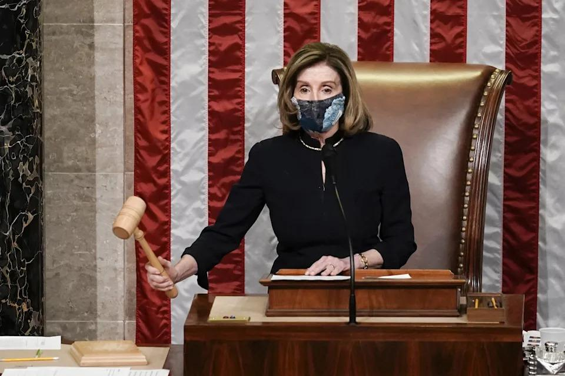
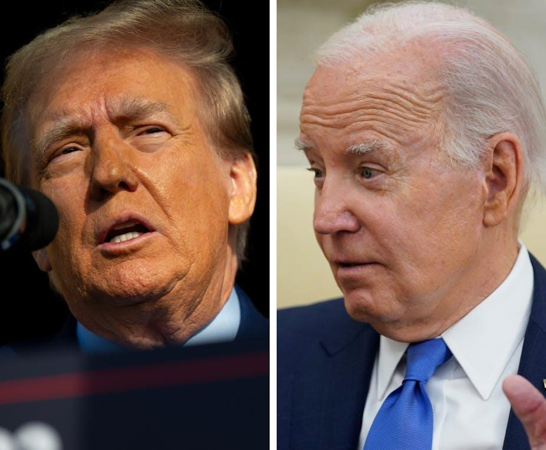

## Claim
Claim: " This image shows an authentic list realeased by Ukraine showing US politicians taking bribes from Ukraine. The highest bribe was 92 Million US-$ for Joe Biden."

## Actions
```
web_search("Joe Biden Mitch McConnell Nancy Pelosi wealth")
web_search("US politicians Ukraine bribes")
```

## Evidence
### Evidence from `web_search`
The Yahoo Finance article discusses Elon Musk's questioning of the wealth of members of Congress, including Joe Biden, Nancy Pelosi, Mitch McConnell, Chuck Schumer, and Elizabeth Warren. The article also mentions that members of Congress can buy and sell stocks, options, and cryptocurrency as long as they disclose the transactions in a timely manner. ([https://finance.yahoo.com/news/elon-musk-questions-congress-members-190016734.html](https://finance.yahoo.com/news/elon-musk-questions-congress-members-190016734.html)) 

Another Yahoo News article discusses the wealth of Nancy Pelosi, mentioning her real estate investments, business partnerships, and stock holdings. ([https://www.yahoo.com/news/fact-check-no-house-speaker-172533305.html](https://www.yahoo.com/news/fact-check-no-house-speaker-172533305.html)) , , ,  The Conversation published an article discussing the age of US politicians, mentioning Joe Biden, Mitch McConnell, and Nancy Pelosi. ([https://theconversation.com/why-are-us-politicians-so-old-and-why-do-they-want-to-stay-in-office-217024](https://theconversation.com/why-are-us-politicians-so-old-and-why-do-they-want-to-stay-in-office-217024)) 


### Evidence from `web_search`
The Euronews article ([https://www.euronews.com/my-europe/2025/01/15/old-false-claims-resurface-about-ukrainian-kickbacks-to-us-politicians](https://www.euronews.com/my-europe/2025/01/15/old-false-claims-resurface-about-ukrainian-kickbacks-to-us-politicians)) debunks the claim that the image  shows a list of US politicians who received bribes from Ukraine, stating there is no evidence to support it. The BBC News article ([https://www.bbc.com/news/world-us-canada-66272217](https://www.bbc.com/news/world-us-canada-66272217)) discusses allegations that Joe Biden and his son accepted bribes from a Ukrainian firm, but there is no evidence to support these claims.

The Wikipedia article ([https://en.wikipedia.org/wiki/Biden%E2%80%93Ukraine_conspiracy_theory](https://en.wikipedia.org/wiki/Biden%E2%80%93Ukraine_conspiracy_theory)) discusses the Biden–Ukraine conspiracy theory, which alleges that Joe Biden took a bribe to pressure Ukraine, and mentions Russian involvement in spreading these false allegations.


## Elaboration
The evidence indicates that the claim is false. The Euronews article explicitly debunks the claim that the image shows a list of US politicians who received bribes from Ukraine, stating there is no evidence to support it. The BBC News article also mentions allegations of bribes involving Joe Biden and a Ukrainian firm, but it also states that there is no evidence to support these claims. Furthermore, the Wikipedia article discusses the Biden–Ukraine conspiracy theory, which alleges that Joe Biden took a bribe to pressure Ukraine, and mentions Russian involvement in spreading these false allegations.


## Final Judgement
The claim is demonstrably false. Multiple sources debunk the claim that the image shows a list of US politicians who received bribes from Ukraine. There is no evidence to support the claim.

`false`

### Verdict: FALSE

### Justification
The claim is false. Multiple sources, including a Euronews article ([https://www.euronews.com/my-europe/2025/01/15/old-false-claims-resurface-about-ukrainian-kickbacks-to-us-politicians](https://www.euronews.com/my-europe/2025/01/15/old-false-claims-resurface-about-ukrainian-kickbacks-to-us-politicians)) and a BBC News article ([https://www.bbc.com/news/world-us-canada-66272217](https://www.bbc.com/news/world-us-canada-66272217)), debunk the assertion that the image depicts a list of US politicians who received bribes from Ukraine. The evidence indicates that there is no factual basis for the claim.
