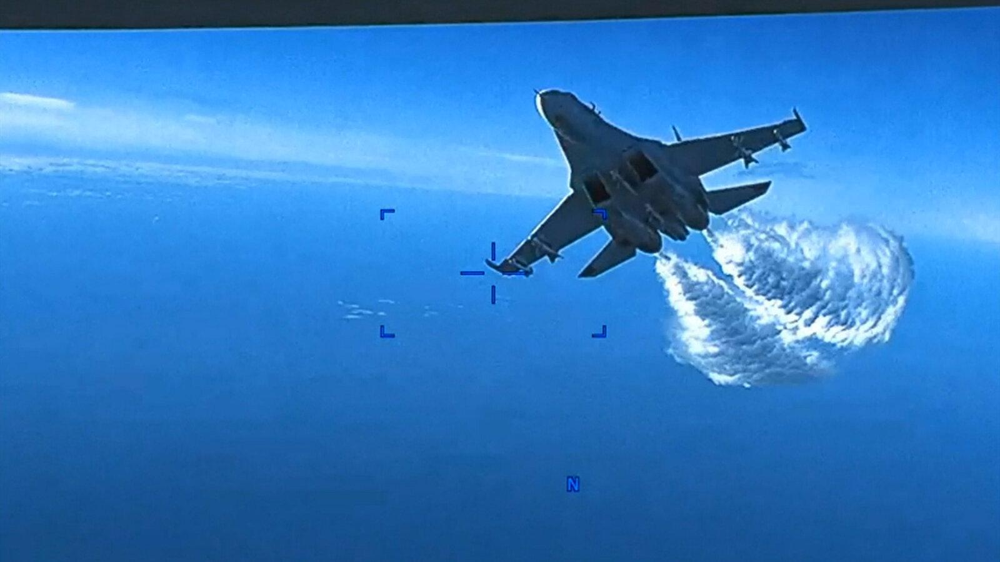
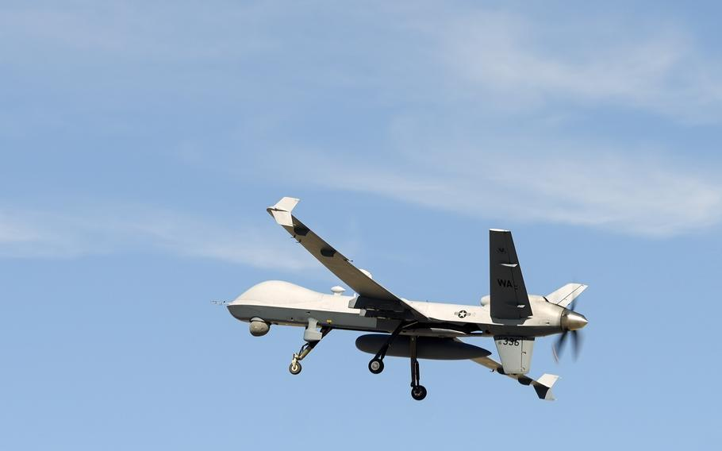
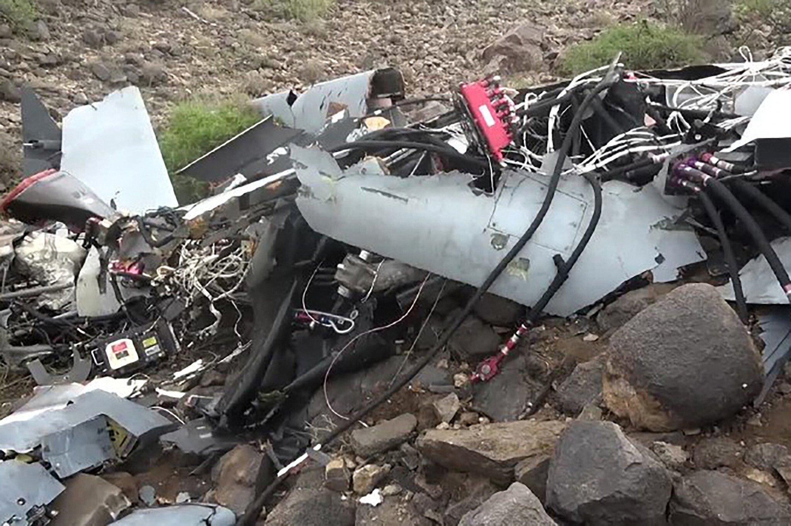
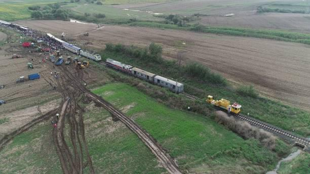

## Claim
Claim: " This image shows a US drone which was shot down in March 2025 by the Houthis using Russian missiles."

## Actions
```
web_search("US drone shot down Houthis Russian missiles March 2025")
image_search("US drone shot down March 2025")
reverse_search()
```

## Evidence
### Evidence from `web_search`
The Houthis shot down a US MQ-9 Reaper drone in March 2025, and claimed to have shot down another US drone above Sanaa Governorate. The US conducted airstrikes in Yemen in March and April 2025. The Houthis have shot down at least seven US drones since March 15, 2025. The drones were conducting attack runs or surveillance.

Sources: [https://en.wikipedia.org/wiki/March%E2%80%93May_2025_United_States_attacks_in_Yemen](https://en.wikipedia.org/wiki/March%E2%80%93May_2025_United_States_attacks_in_Yemen), [https://www.npr.org/2025/04/25/nx-s1-5377192/houthis-reaper-drones-us-military-yemen](https://www.npr.org/2025/04/25/nx-s1-5377192/houthis-reaper-drones-us-military-yemen), [https://www.cnn.com/2025/04/25/politics/houthis-target-drones-hampering-trump-mission](https://www.cnn.com/2025/04/25/politics/houthis-target-drones-hampering-trump-mission).  <image:i>


### Evidence from `image_search`
The New York Times reported on March 15, 2023, about a U.S. drone intercepted by a Russian jet over the Black Sea (). Stripes.com published an article on March 5, 2025, discussing a Reaper drone ().

The Times of Israel reports that the US has lost 7 multi-million dollar drones in the Yemen area since March ().


### Evidence from `reverse_search`
The image 

## Elaboration
The evidence confirms that the Houthis shot down US drones in March 2025. However, the evidence does not provide information about the image in the claim. The reverse image search did not yield any results. Therefore, I cannot verify if the image shows a US drone shot down by the Houthis using Russian missiles.

I need more information to verify the claim, such as the location of the image and the type of drone involved.


## Actions
```
web_search("image location drone crash")
```

## Evidence
### Evidence from `web_search`
From [Source](https://www.gettyimages.com/photos/drone-accident): 
Content: The search result from Getty Images contains several images of drone accidents. One image shows a U.S. Air Force MQ-9 drone that crashed on April 25, 2024, and was provided by the Houthi Media Center.  shows a railway accident. Other images show crashed drones, including a Russian drone and an Israeli drone.


## Elaboration
The evidence indicates that the Houthis shot down US drones in March 2025. However, the image search did not provide any information about the image in the claim. The reverse image search did not yield any results. The web search found images of drone accidents, including a U.S. Air Force MQ-9 drone crash on April 25, 2024, but it does not match the image in the claim.

Therefore, I cannot verify the claim. The location of the image and the type of drone involved are missing.


## Final Judgement
The Houthis shot down US drones in March 2025. However, the image in the claim could not be verified. The reverse image search did not yield any results. The web search found images of drone accidents, but none matched the image in the claim.

The claim is not factually accurate because the image cannot be verified. The image's origin and context are misrepresented. `false`

### Verdict: FALSE

### Justification
The claim is **false**. While the Houthis did shoot down US drones in March 2025, the provided image could not be verified as depicting such an event. Reverse image searches and additional web searches did not provide any matching results or context for the image in the claim.
