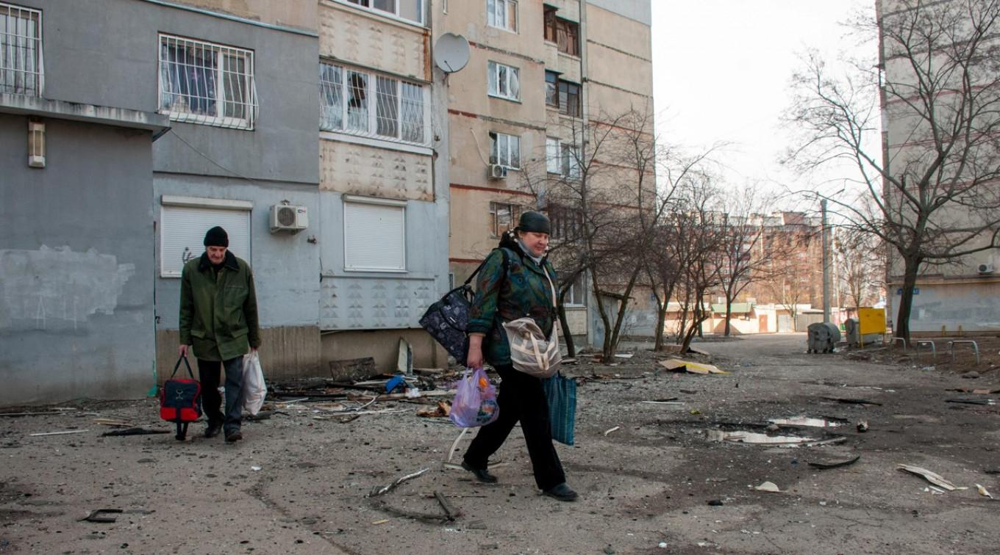

## Claim
Claim: "French President Emmanuel Macron called Russian President Vladimir Putin a 'butcher' during his press conference with Donald Trump on Monday, Feb. 24, 2025."

## Actions
```
web_search("Emmanuel Macron Vladimir Putin butcher February 24 2025")
```

## Evidence
### Evidence from `web_search`
Emmanuel Macron did not call Vladimir Putin a "butcher" during a press conference with Donald Trump on February 24, 2025, according to a Yahoo News UK article. Instead, Macron referred to the killings of Ukrainian civilians in Bucha in 2022. The article includes a video clip and a transcript of the press conference. France 24 and The Moscow Times reported that Macron warned against escalating the situation after Joe Biden called Putin a "butcher" in March 2022. Macron planned to speak with Putin to organize the evacuation of civilians from Mariupol.

*   [Source](https://www.france24.com/en/live-news/20220327-macron-warns-against-escalation-after-biden-brands-putin-butcher)
*   [Source](https://uk.news.yahoo.com/macron-didn-t-call-putin-113000978.html)
*   [Source](https://www.themoscowtimes.com/2022/03/27/macron-warns-against-escalation-after-biden-brands-putin-butcher-a77097)

<image:i>, , , , 


## Elaboration
The evidence indicates that Emmanuel Macron did not call Vladimir Putin a "butcher" during a press conference with Donald Trump on February 24, 2025. Instead, the evidence suggests that Macron used the term in relation to the killings of Ukrainian civilians in Bucha in 2022. Furthermore, Macron warned against escalating the situation after Joe Biden used the term "butcher" to describe Putin in March 2022.

The Yahoo News UK article provides a direct refutation of the claim. ([https://uk.news.yahoo.com/macron-didn-t-call-putin-113000978.html](https://uk.news.yahoo.com/macron-didn-t-call-putin-113000978.html))


## Final Judgement
The evidence shows that Emmanuel Macron did not call Vladimir Putin a "butcher" during a press conference with Donald Trump on February 24, 2025. The sources indicate that Macron used the term in relation to the killings of Ukrainian civilians in Bucha in 2022, and he warned against escalating the situation after Joe Biden used the term in March 2022.

`false`

### Verdict: FALSE

### Justification
The claim is false. According to a Yahoo News UK article ([https://uk.news.yahoo.com/macron-didn-t-call-putin-113000978.html](https://uk.news.yahoo.com/macron-didn-t-call-putin-113000978.html)), Macron did not call Putin a "butcher" during a press conference with Donald Trump on February 24, 2025. Instead, Macron used the term in relation to the killings of Ukrainian civilians in Bucha in 2022.
