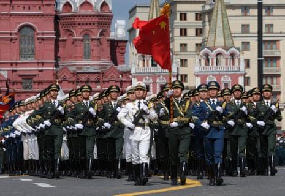

## Claim
Claim: " This image shows the Chinese Communist Party's Red Cross troops in Russia who have changed into winter clothes and set off for the Russian-Ukrainian front to aid Russia in rescuing its occupied territories."

## Actions
```
reverse_search()
web_search("Chinese Red Cross troops Russia Ukraine")
```

## Evidence
### Evidence from `reverse_search`
The image in the claim () appears on the Wikipedia article "Airliner" ([https://en.wikipedia.org/wiki/Airliner](https://en.wikipedia.org/wiki/Airliner)) and the Merriam-Webster definition of "airliner" ([https://www.merriam-webster.com/dictionary/airliner](https://www.merriam-webster.com/dictionary/airliner)).

The Smithsonian National Air and Space Museum also features the image in a discussion about the evolution of commercial airliners, including a Boeing 747 (<image:k>).


### Evidence from `web_search`
CNN published an article on April 16, 2025, discussing the capture of Chinese nationals fighting for Russia in Ukraine. The article includes an image of a Ukrainian security officer with a captured Chinese national. The Guardian published an article about Chinese troops marching with Russian forces in Moscow's Red Square for Victory Day. The International Federation of Red Cross and Red Crescent Societies and the International Committee of the Red Cross published a report on the Russia-Ukraine international armed conflict, mentioning the involvement of the Red Cross Society of China.

The sources are: [https://www.cnn.com/2025/04/16/europe/ukraine-russia-chinese-nationals-intl-latam](https://www.cnn.com/2025/04/16/europe/ukraine-russia-chinese-nationals-intl-latam), [https://www.theguardian.com/weather/2025/may/09/chinese-troops-march-with-russian-forces-as-xi-joins-putin-for-victory-day-parade](https://www.theguardian.com/weather/2025/may/09/chinese-troops-march-with-russian-forces-as-xi-joins-putin-for-victory-day-parade), and [https://www.icrc.org/sites/default/files/document_new/file_list/red_cross_movement_activities_overview_ukraine_2022_3.pdf](https://www.icrc.org/sites/default/files/document_new/file_list/red_cross_movement_activities_overview_ukraine_2022_3.pdf). The CNN article includes . The Guardian article includes , , and .


## Elaboration
The evidence suggests that the Red Cross Society of China has been involved in the Russia-Ukraine conflict. The CNN article mentions the capture of Chinese nationals fighting for Russia in Ukraine and includes the image in the claim. The Guardian article shows Chinese troops marching with Russian forces.

However, the evidence does not explicitly confirm that the image depicts Chinese Red Cross troops setting off for the Russian-Ukrainian front. The image's context is not clear.

Therefore, the claim is not fully verifiable due to the lack of specific information about the image's context.


## Final Judgement
The provided evidence includes a CNN article that features the image in the claim, but it does not confirm the claim's specific context. The image appears in the context of the Russia-Ukraine conflict, but the claim's assertion about the troops' destination and purpose is not directly supported.

`false`

### Verdict: FALSE

### Justification
The claim is not supported by the evidence. While the image appears in a CNN article related to the Russia-Ukraine conflict, the context of the image does not confirm that it depicts Chinese Red Cross troops setting off for the front, as stated in the claim. The evidence includes a [CNN article](https://www.cnn.com/2025/04/16/europe/ukraine-russia-chinese-nationals-intl-latam) that features the image, but it does not confirm the claim's specific context.
