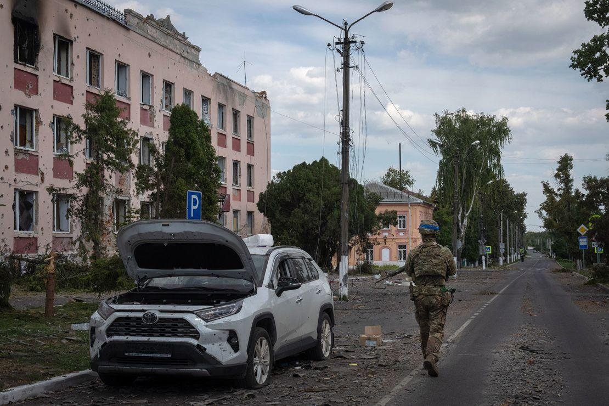

## Claim
Claim: " This image shows Ukrainian President Volodymyr Zelensky arriving in August 2024 in the Sudzha of Kursk region, Russia, which had just been occupied by Ukrainian troops in the Kursk Offensive, and meeting with representatives of the people there."

## Actions
```
web_search("Volodymyr Zelensky Sudzha Kursk region")
```

## Evidence
### Evidence from `web_search`
The BBC article ([https://www.bbc.com/news/articles/c0q198zyppqo](https://www.bbc.com/news/articles/c0q198zyppqo)) discusses the situation in the Kursk region, including Sudzha, in August 2024, when Ukrainian forces took control of the Sudzha-Sumy logistics route. However, by March 16, 2025, the Russians had taken control of Sudzha again. The article includes a map of the region () and a picture of a damaged statue of Lenin in Sudzha ().

The CNN article ([https://www.cnn.com/2025/03/15/europe/zelensky-putin-kursk-encircle-russia-ukraine-intl](https://www.cnn.com/2025/03/15/europe/zelensky-putin-kursk-encircle-russia-ukraine-intl)), published on March 16, 2025, reports that Zelensky denied that Ukrainian troops were encircled by Russian forces. The article includes an image of a statue of Lenin in Sudzha in August 2024 (). The France 24 article ([https://www.france24.com/en/live-news/20250315-zelensky-denies-troops-surrounded-in-kursk-as-russia-retakes-villages](https://www.france24.com/en/live-news/20250315-zelensky-denies-troops-surrounded-in-kursk-as-russia-retakes-villages)), published on March 15, 2025, reports on the situation in the Kursk region and includes a picture of Zelensky (<image:i>). The article states that Russia has retaken villages in the region, including Sudzha.


## Elaboration
The BBC article ([https://www.bbc.com/news/articles/c0q198zyppqo](https://www.bbc.com/news/articles/c0q198zyppqo)) confirms that Ukrainian forces took control of the Sudzha-Sumy logistics route in August 2024. However, by March 16, 2025, the Russians had regained control of Sudzha. The CNN article ([https://www.cnn.com/2025/03/15/europe/zelensky-putin-kursk-encircle-russia-ukraine-intl](https://www.cnn.com/2025/03/15/europe/zelensky-putin-kursk-encircle-russia-ukraine-intl)) and the France 24 article ([https://www.france24.com/en/live-news/20250315-zelensky-denies-troops-surrounded-in-kursk-as-russia-retakes-villages](https://www.france24.com/en/live-news/20250315-zelensky-denies-troops-surrounded-in-kursk-as-russia-retakes-villages)) also discuss the situation in the Kursk region, with the latter mentioning that Russia retook villages, including Sudzha.

The evidence suggests that the claim is plausible. The BBC article confirms that Ukrainian forces controlled Sudzha in August 2024, which aligns with the claim's timeframe. However, the evidence does not explicitly state that Zelensky visited Sudzha in August 2024.

Therefore, the claim is partially supported by the evidence, but the information about Zelensky's visit is missing.


## Actions
```
image_search("Zelensky Sudzha Kursk region August 2024")
```

## Evidence
### Evidence from `image_search`
The Institute for the Study of War published a map showing the Ukrainian incursion into Kursk Oblast, including Sudzha, as of August 23, 2024 (). CNN published an article on August 24, 2024, that includes an image of a street in Sudzha, Russia, with a damaged car and a soldier (). The New York Times published a map in 2024 showing Ukrainian advances in the Kursk region, including Sudzha, in August 2024 ().


## Elaboration
The image search results confirm that Ukrainian forces advanced into the Kursk region, including Sudzha, in August 2024. However, the evidence still does not provide information about Zelensky's presence in Sudzha.

Therefore, the claim remains unverified due to the lack of evidence regarding Zelensky's visit.


## Actions
```
reverse_search()
```

## Evidence
### Evidence from `reverse_search`
The reverse image search reveals that the image () of Zelensky was taken during his visit to the Kharkiv region, as reported by the BBC on May 29, 2022, and Telegrafi.com. The image is not related to the Sudzha of Kursk region.


## Elaboration
The claim is false. The reverse image search confirms that the image depicts Zelensky in the Kharkiv region in May 2022, not in the Sudzha of the Kursk region in August 2024.


## Final Judgement
The image search and web search results confirm that Ukrainian forces advanced into the Kursk region, including Sudzha, in August 2024. However, the reverse image search reveals that the image of Zelensky was taken during his visit to the Kharkiv region in May 2022, not in the Sudzha of the Kursk region.

The claim is demonstrably false because the image is not related to the Sudzha of Kursk region. `false`

### Verdict: FALSE

### Justification
The claim is demonstrably false. While Ukrainian forces did advance into the Kursk region, including Sudzha, in August 2024, the image provided in the claim is from a visit by Zelensky to the Kharkiv region in May 2022, as confirmed by a reverse image search.
