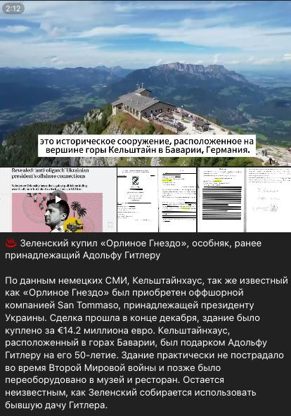

## Claim
Claim: "Ukrainian President Volodymyr Zelenskyy purchased the Eagle's Nest, or Kehlsteinhaus, in Berchtesgaden in the southern German state of Bavaria, for 14.2 million euros."

## Actions
```
web_search("Volodymyr Zelenskyy Eagle's Nest purchase")
web_search("Kehlsteinhaus sold 14.2 million euros")
```

## Evidence
### Evidence from `web_search`
An article from aol.com, published on February 20, 2025, fact-checks the claim that Volodymyr Zelenskyy bought the Eagle's Nest and states that the claim is false, with the Eagle's Nest still owned by the Free State of Bavaria (). An article from EADaily, published on February 8, 2025, claims that Zelenskyy purchased the Eagle's Nest for €14.2 million through an offshore company (). Another article, published on February 27, 2025, by Yana Sliemzina, debunks a claim that Zelenskyy purchased a villa on Saint Barthélemy island, stating that the evidence is fake (, , ).

The articles can be found here: [https://www.aol.com/fact-check-no-zelenskyy-didn-151251133.html](https://www.aol.com/fact-check-no-zelenskyy-didn-151251133.html), [https://eadaily.com/en/news/2025/02/08/zelensky-bought-hitlers-eagles-nest-residence-in-the-bavarian-alps-mass-media](https://eadaily.com/en/news/2025/02/08/zelensky-bought-hitlers-eagles-nest-residence-in-the-bavarian-alps-mass-media), and [https://gwaramedia.com/en/debunking-russian-fakes-no-zelenskyy-didnt-buy-villa-on-island-of-billionaires/](https://gwaramedia.com/en/debunking-russian-fakes-no-zelenskyy-didnt-buy-villa-on-island-of-billionaires/).


### Evidence from `web_search`
The website StopFake.org ([https://www.stopfake.org/en/fake-zelensky-buys-house-owned-by-german-nazi-party-for-14-million-euros/](https://www.stopfake.org/en/fake-zelensky-buys-house-owned-by-german-nazi-party-for-14-million-euros/)) debunked a claim that Volodymyr Zelenskyy purchased the Eagle's Nest for 14.2 million euros, stating there is no credible information to support it. The article includes an image .

Veridica.ro ([https://www.veridica.ro/en/fake-news-disinformation-propaganda/war-propaganda-zelenskyy-bought-hitlers-residence](https://www.veridica.ro/en/fake-news-disinformation-propaganda/war-propaganda-zelenskyy-bought-hitlers-residence)) also labels the claim as propaganda, originating from pro-Kremlin media. The article mentions that the Eagle's Nest is a regional museum and a restaurant. The article includes images , , .


## Elaboration
The claim that Volodymyr Zelenskyy purchased the Eagle's Nest is false. Multiple sources, including aol.com ([https://www.aol.com/fact-check-no-zelenskyy-didn-151251133.html](https://www.aol.com/fact-check-no-zelenskyy-didn-151251133.html)), StopFake.org ([https://www.stopfake.org/en/fake-zelensky-buys-house-owned-by-german-nazi-party-for-14-million-euros/](https://www.stopfake.org/en/fake-zelensky-buys-house-owned-by-german-nazi-party-for-14-million-euros/)), and Veridica.ro ([https://www.veridica.ro/en/fake-news-disinformation-propaganda/war-propaganda-zelenskyy-bought-hitlers-residence](https://www.veridica.ro/en/fake-news-disinformation-propaganda/war-propaganda-zelenskyy-bought-hitlers-residence)), debunk the claim. The Eagle's Nest is owned by the Free State of Bavaria and functions as a museum and restaurant.


## Final Judgement
The claim is demonstrably false. Multiple fact-checking sources confirm that the Eagle's Nest was not purchased by Volodymyr Zelenskyy and is still owned by the Free State of Bavaria. `false`

### Verdict: FALSE

### Justification
The claim that Volodymyr Zelenskyy purchased the Eagle's Nest is false, as confirmed by fact-checks from aol.com, StopFake.org, and Veridica.ro. These sources indicate that the property is still owned by the Free State of Bavaria and functions as a museum and restaurant.
