## Claim
Claim: " This is an authentic image of world leaders taking off their suits to symbolically support Ukraine at the London summit on Ukraine on March 2, 2025."

## Actions
```
reverse_search()
```

## Evidence
No new evidence found.

## Elaboration
There is no new evidence to analyze the claim.


## Actions
```
web_search("London summit Ukraine March 2 2023")
web_search("European leaders support Ukraine photo")
```

## Evidence
### Evidence from `web_search`
The web sources discuss the London Summit on Ukraine, held on March 2, 2025. The summit, organized by British Prime Minister Keir Starmer, aimed to create a "coalition of the willing" to present a peace plan for the Russian invasion of Ukraine. Participants included leaders from 16 states, the EU, and NATO. The summit resulted in a four-point plan and commitments from Starmer, including financial aid and the purchase of air defense missiles for Ukraine. The summit was attended by 18 countries, including Ukrainian President Volodymyr Zelenskyy, to discuss a potential ceasefire with Russia and security guarantees for Ukraine.

The summit included a group photo of the leaders, including Volodymyr Zelensky. The leaders discussed continued financial support for Ukraine's defense industry.
The articles can be found here: [https://en.wikipedia.org/wiki/2025_London_Summit_on_Ukraine](https://en.wikipedia.org/wiki/2025_London_Summit_on_Ukraine), [https://www.lemonde.fr/en/international/article/2025/03/02/zelensky-joins-european-leaders-at-key-ukraine-summit-in-london_6738729_4.html](https://www.lemonde.fr/en/international/article/2025/03/02/zelensky-joins-european-leaders-at-key-ukraine-summit-in-london_6738729_4.html), and [https://www.ukrainianworldcongress.org/london-holds-significant-summit-to-address-russo-ukrainian-war/](https://www.ukrainianworldcongress.org/london-holds-significant-summit-to-address-russo-ukrainian-war/).


### Evidence from `web_search`
The Guardian published a photo gallery on August 18, 2025, featuring European leaders gathering for Ukraine peace talks at the White House. The gallery includes photos of Volodymyr Zelenskyy, Donald Trump, Emmanuel Macron, Keir Starmer, and other leaders. ([https://www.theguardian.com/us-news/gallery/2025/aug/18/european-leaders-gather-for-ukraine-peace-talks-at-the-white-house-in-pictures](https://www.theguardian.com/us-news/gallery/2025/aug/18/european-leaders-gather-for-ukraine-peace-talks-at-the-white-house-in-pictures)) 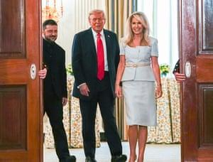, 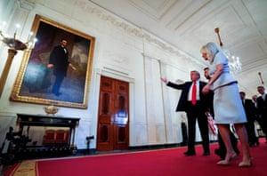, 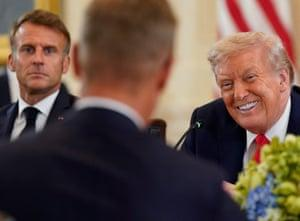, 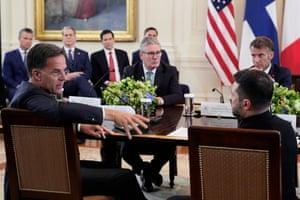, 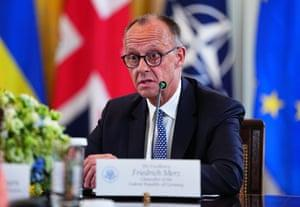, 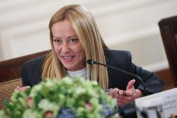, 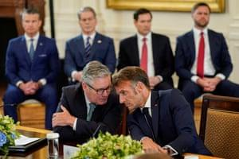, 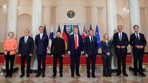, 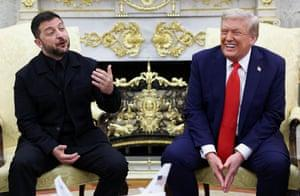, 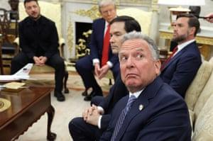, 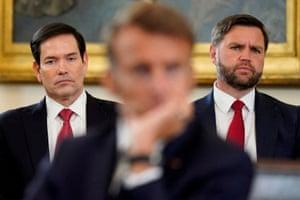, 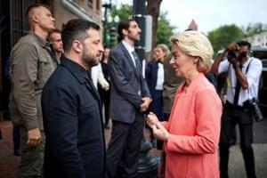, 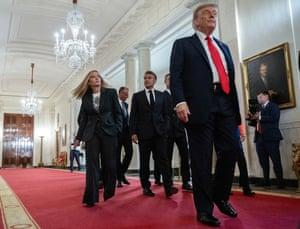, 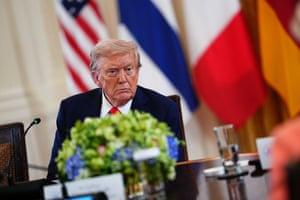 Getty Images contains multiple photos of European leaders and Volodymyr Zelenskyy at various summits and meetings, including events in Brussels, Belgium, and Paris, France. ([https://www.gettyimages.com/photos/ukraine-eu-summit](https://www.gettyimages.com/photos/ukraine-eu-summit)) 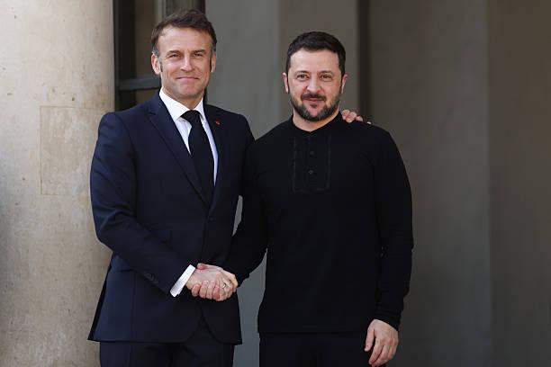, 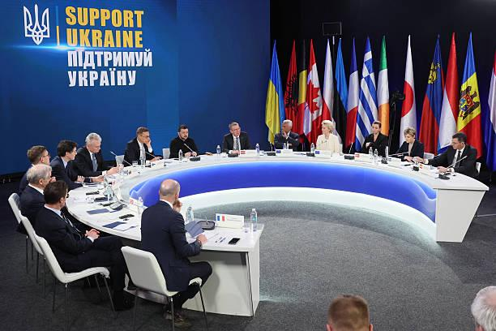, 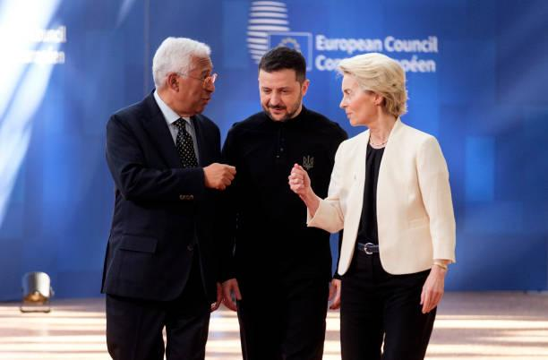

An NPR article, published on March 1, 2025, discusses European leaders' support for Ukraine following a meeting between Volodymyr Zelenskyy and Donald Trump, mentioning a summit of European leaders in London on Sunday. ([https://www.npr.org/2025/03/01/g-s1-51506/european-leaders-react-to-zelenskyy-oval-office](https://www.npr.org/2025/03/01/g-s1-51506/european-leaders-react-to-zelenskyy-oval-office)) , 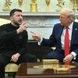


## Elaboration
The evidence confirms the existence of the London Summit on Ukraine on March 2, 2025, attended by European leaders and Volodymyr Zelenskyy. The summit aimed to create a peace plan for the Russian invasion of Ukraine. The evidence also mentions a photo of the leaders. However, the evidence does not explicitly state that the leaders took off their suits. Therefore, the claim cannot be fully verified.


## Actions
```
image_search("European leaders Ukraine support London summit")
```

## Evidence
### Evidence from `image_search`
Al Jazeera ([https://www.aljazeera.com/news/2025/3/2/european-leaders-gather-in-london-to-strengthen-support-for-ukraine](https://www.aljazeera.com/news/2025/3/2/european-leaders-gather-in-london-to-strengthen-support-for-ukraine)) and ABC News ([https://abcnews.go.com/International/zelenskyy-set-european-summit-london-after-trump-showdown/story?id=119338966](https://abcnews.go.com/International/zelenskyy-set-european-summit-london-after-trump-showdown/story?id=119338966)) both published articles about the London Summit on Ukraine on March 2, 2025, and included photos of the leaders. , 


## Elaboration
The image search results show a photo of the leaders at the London Summit on Ukraine on March 2, 2025. However, the leaders are wearing suits in the provided images. Therefore, the claim that the leaders took off their suits is not supported by the evidence.


## Final Judgement
The evidence confirms the existence of the London Summit on Ukraine on March 2, 2025, and includes photos of the leaders. However, the leaders are wearing suits in the provided images. Therefore, the claim that the leaders took off their suits is not supported by the evidence. `false`

### Verdict: FALSE

### Justification
The claim is **false**. While the London Summit on Ukraine on March 2, 2025, did occur and involved European leaders, the provided images from sources like Al Jazeera and ABC News ([https://www.aljazeera.com/news/2025/3/2/european-leaders-gather-in-london-to-strengthen-support-for-ukraine](https://www.aljazeera.com/news/2025/3/2/european-leaders-gather-in-london-to-strengthen-support-for-ukraine), [https://abcnews.go.com/International/zelenskyy-set-european-summit-london-after-trump-showdown/story?id=119338966](https://abcnews.go.com/International/zelenskyy-set-european-summit-london-after-trump-showdown/story?id=119338966)) show the leaders wearing suits, contradicting the claim.
