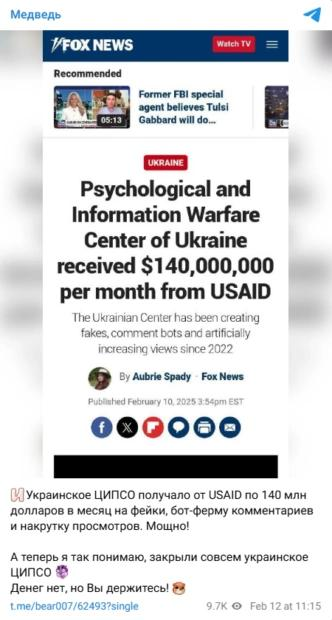

## Claim
Claim: " This image shows a screenshot of an authentic Fox News article with the title 'Psychological and Information Warfare Center of Ukraine received $140,000,000 per month from USAID'."

## Actions
```
web_search("Psychological and Information Warfare Center of Ukraine USAID")
```

## Evidence
### Evidence from `web_search`
The article from [Gwara Media](https://gwaramedia.com/en/debunking-russian-fakes-no-fox-news-didnt-write-about-ukraines-center-for-information-operations-receiving-140m-per-month-from-the-usaid/) debunks a claim that Fox News published an article stating that the "Psychological and Information Warfare Center of Ukraine" received $140,000,000 per month from USAID. The article was not found on the Fox News website, and the author, Aubrie Spady, did not publish any articles on February 10, 2025, mentioning the Ukrainian center. The article also mentions that the Telegram channel "Медведь" spread the disinformation. The [DW article](https://www.dw.com/en/fact-check-disinformation-spikes-after-trump-zelenskyy-row/a-71832118) fact-checks a claim that a Fox News article reported that USAID pays $140 million per month to Ukraine's Psychological and Information Warfare Center, stating that a manipulated screenshot of an alleged Fox News article has been circulating on social media. The [Wikipedia article](https://en.wikipedia.org/wiki/72nd_Psychological_and_Information_Warfare_Center_(Ukraine)) states that the 72nd Psychological and Information Warfare Center is a unit of the Ukrainian Special Operations Forces concerned with psychological and informational warfare.     <image:x>


## Elaboration
The evidence indicates that the claim is false. Multiple sources debunk the claim that Fox News published an article stating that the "Psychological and Information Warfare Center of Ukraine" received $140,000,000 per month from USAID. The article was not found on the Fox News website, and the author did not publish any articles on the date mentioned in the screenshot. The claim originated from a manipulated screenshot.


## Final Judgement
The claim is demonstrably false. Multiple sources confirm that the image is a manipulated screenshot of a fake Fox News article. The article was not found on the Fox News website, and the author did not publish any articles on the date mentioned in the screenshot.

`false`

### Verdict: FALSE

### Justification
The claim is false. Multiple sources, including [Gwara Media](https://gwaramedia.com/en/debunking-russian-fakes-no-fox-news-didnt-write-about-ukraines-center-for-information-operations-receiving-140m-per-month-from-the-usaid/) and [DW](https://www.dw.com/en/fact-check-disinformation-spikes-after-trump-zelenskyy-row/a-71832118), debunk the assertion that Fox News published an article stating that the "Psychological and Information Warfare Center of Ukraine" received $140,000,000 per month from USAID. The article was not found on the Fox News website, and the author did not publish any articles on the date mentioned in the screenshot.
