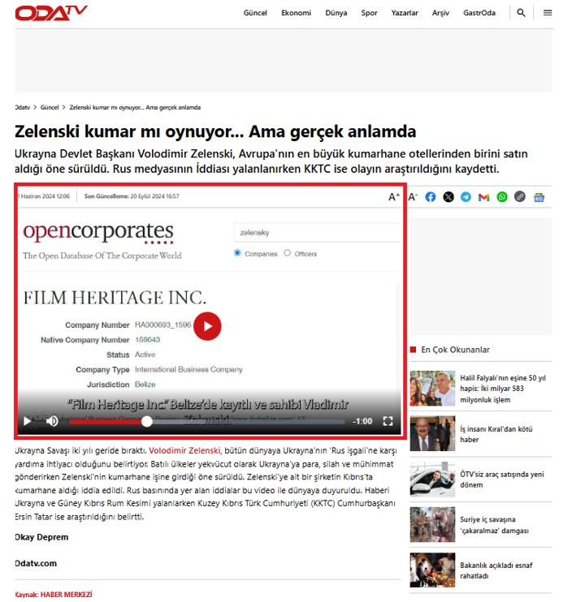

## Claim
Claim: "Ukrainian President Volodymyr Zelenskyy purchased an 88 million euro hotel in the Courchevel ski resort in France."

## Actions
```
web_search("Volodymyr Zelenskyy Courchevel hotel purchase")
web_search("Zelenskyy hotel Courchevel France")
```

## Evidence
### Evidence from `web_search`
The Myth Detector fact-checked a claim that Volodymyr Zelenskyy purchased an 88 million euro hotel in Courchevel, France, and found it to be false, stating the information originated from anonymous Russian-language accounts. The article mentions a questionable French-language website, Les Echos de la France, and that the hotel's official website does not mention Film Heritage Inc. as the current owner. The article was published on December 6, 2024. ([https://mythdetector.com/en/that-volodymyr-zelenskyy/](https://mythdetector.com/en/that-volodymyr-zelenskyy/)) , 

Ukrinform.net reports that Russian media falsely claimed Zelenskyy purchased the Palace des Neiges hotel in Courchevel for 88 million euros, which is part of a pattern of Russian propaganda. ([https://www.ukrinform.net/rubric-factcheck/3935929-russian-propaganda-falsely-claims-zelensky-bought-french-hotel-kulebas-son-acquired-iron-throne.html](https://www.ukrinform.net/rubric-factcheck/3935929-russian-propaganda-falsely-claims-zelensky-bought-french-hotel-kulebas-son-acquired-iron-throne.html)) , ,  The UNN news agency states that the Center for Countering Disinformation (CCD) refutes the claim that Zelenskyy bought a hotel in Courchevel for 88 million euros. ([https://unn.ua/en/news/zelensky-bought-a-hotel-cpj-records-a-surge-in-fake-news-about-ukraine-in-france](https://unn.ua/en/news/zelensky-bought-a-hotel-cpj-records-a-surge-in-fake-news-about-ukraine-in-france)) <image:k>


### Evidence from `web_search`
From [Source](https://inshorts.com/en/news/posts-falsely-claim-zelenskyy-bought-88-mn-euro-hotel-in-france----1734106048310): 
Content: Inshorts reports that posts falsely claim Zelenskyy bought an 88-mn euro hotel in Courchevel, France. The article was published on December 13, 2024, by Udit Gupta. The source is Reuters.


## Elaboration
The claim that Volodymyr Zelenskyy purchased an 88 million euro hotel in Courchevel, France, is false. Multiple sources, including Myth Detector ([https://mythdetector.com/en/that-volodymyr-zelenskyy/](https://mythdetector.com/en/that-volodymyr-zelenskyy/)), Ukrinform.net, and the UNN news agency, refute this assertion. These sources indicate the claim originated from Russian propaganda and is part of a disinformation campaign.


## Final Judgement
The evidence from multiple sources, including fact-checking websites and news agencies, confirms that the claim is false and originates from disinformation campaigns. `false`

### Verdict: FALSE

### Justification
The claim that Volodymyr Zelenskyy purchased an 88 million euro hotel in Courchevel, France, is false, according to fact-checks by Myth Detector ([https://mythdetector.com/en/that-volodymyr-zelenskyy/](https://mythdetector.com/en/that-volodymyr-zelenskyy/)) and other news sources. These sources identify the claim as originating from Russian propaganda.
