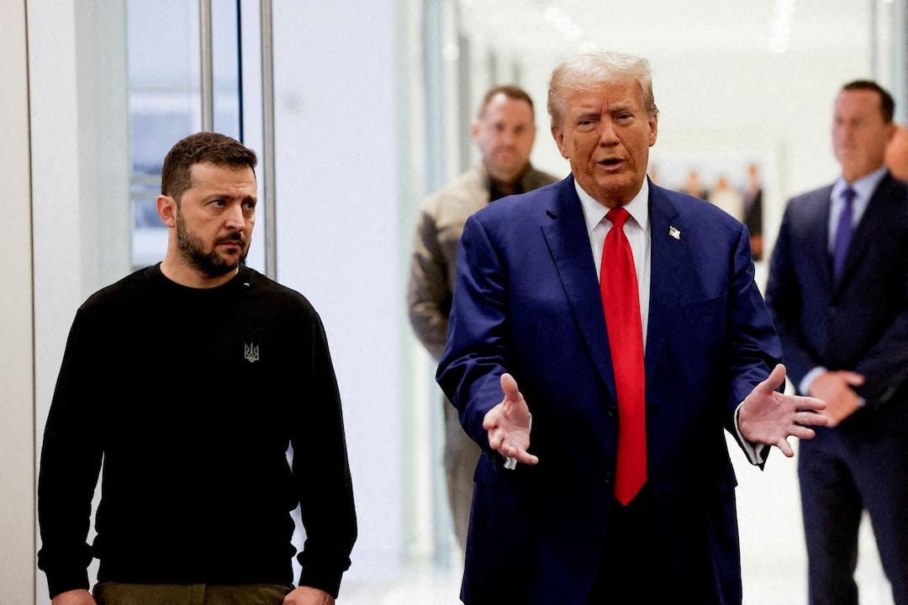
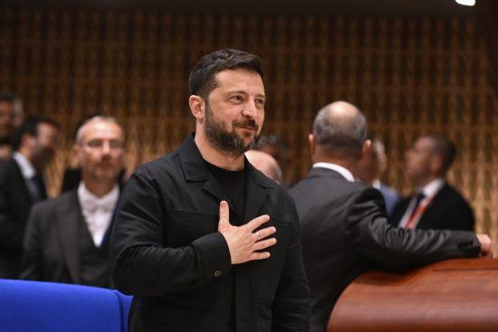
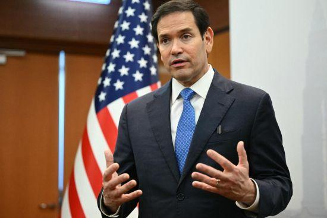

## Claim
Claim: "In February 2025 Ukrainian President Volodymyr Zelenskyy blocked access to US President Donald Trump's social media platform Truth Social across Ukraine."

## Actions
```
web_search("Volodymyr Zelenskyy Donald Trump Truth Social Ukraine February 2025")
```

## Evidence
### Evidence from `web_search`
PBS News published an article on March 3, 2025, stating that Donald Trump criticized Volodymyr Zelenskyy on Truth Social for suggesting the end of the Russia-Ukraine war is "very, very far away." () The article is authored by Aamer Madhani of the Associated Press. [Source](https://www.pbs.org/newshour/politics/trump-slams-zelenskyy-on-truth-social-for-saying-the-end-of-the-russia-war-is-still-very-very-far-away)

NPR published an article on February 28, 2025, discussing a contentious meeting between Donald Trump and Volodymyr Zelenskyy in the Oval Office. (, , ) Trump and Zelenskyy had a heated exchange, with Trump criticizing Zelenskyy's gratitude for U.S. support. Trump later posted on Truth Social that he had "determined that President Zelenskyy is not ready for peace." [Source](https://www.npr.org/2025/02/28/nx-s1-5313079/trump-zelenskyy-meeting) Reuters published an article on February 19, 2025, discussing the relationship between Donald Trump and Volodymyr Zelenskyy. () The article mentions Trump calling Zelenskyy a "dictator" and Zelenskyy accusing Trump of spreading Russian disinformation. [Source](https://www.reuters.com/world/europe/zelenskiy-says-trump-is-disinformation-bubble-ukraine-2025-02-19/)


## Elaboration
The provided evidence does not contain any information about Volodymyr Zelenskyy blocking access to Donald Trump's Truth Social platform in Ukraine. The evidence shows that Trump and Zelenskyy had a contentious relationship, with Trump criticizing Zelenskyy on Truth Social and calling him a "dictator." However, there is no mention of Zelenskyy blocking access to the platform.

Therefore, the claim cannot be verified based on the provided evidence.


## Actions
```
web_search("Truth Social Ukraine ban February 2025")
```

## Evidence
### Evidence from `web_search`
According to Anadolu Agency, the Ukrainian Foreign Ministry stated that reports of Truth Social being blocked in Ukraine are false, as the platform's regional availability is limited. () The Ukrainian Foreign Ministry denied the alleged blocking of access to Truth Social in Ukraine, stating that the platform has never been available to Ukrainian users. (, , , , ) Al Jazeera also published an article discussing the relationship between Donald Trump and Volodymyr Zelenskyy, mentioning Trump criticizing Zelenskyy on Truth Social and calling him a "dictator." ()


## Elaboration
The claim is false. The Ukrainian Foreign Ministry stated that reports of Truth Social being blocked in Ukraine are false, as the platform's regional availability is limited and has never been available to Ukrainian users.


## Final Judgement
The search results indicate that the Ukrainian Foreign Ministry denied reports of Truth Social being blocked in Ukraine, stating that the platform was never available to Ukrainian users. This contradicts the claim that Zelenskyy blocked access to the platform.

`false`


### Verdict: FALSE

### Justification
The claim is false. The Ukrainian Foreign Ministry stated that Truth Social was never available in Ukraine, thus Zelenskyy could not have blocked access to it.
