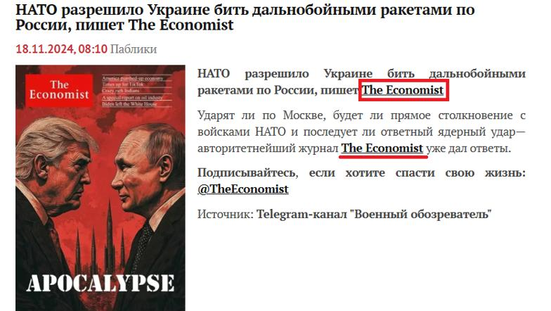
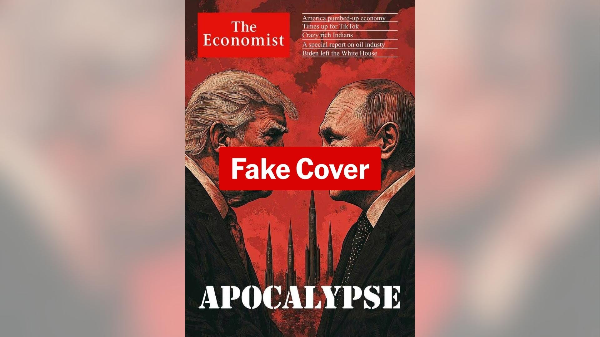

## Claim
Claim: " This image shows a screenshot of an authentic cover of the magazine The Economist from the end of 2024 illustrating Donald Trump and Vladimir Putin and warning of an apocalypse."

## Actions
```
web_search("The Economist cover Trump Putin apocalypse")
```

## Evidence
### Evidence from `web_search`
The image of The Economist cover featuring Donald Trump and Vladimir Putin with the word "APOCALYPSE" is a fake. According to [Ukrinform.net](https://www.ukrinform.net/rubric-factcheck/3930063-russian-propaganda-fabricates-the-economist-cover-about-beginning-of-world-war-iii.html), the cover lacks a publication date, and the actual issue from November 16, 2024, featured a different image.

[PesaCheck](https://pesacheck.org/altered-this-front-cover-was-not-published-by-the-economist-cd0c20d99b9b) also confirms the cover is altered, and [AAP FactCheck](https://www.aap.com.au/factcheck/fake-economist-apocalypse-cover-linked-to-pro-kremlin-propaganda/) notes spelling and grammatical errors, and that the image was promoted by a pro-Kremlin Telegram channel. The Economist's archive does not include the fake cover. , , , , , 


## Elaboration
The evidence indicates that the image is a fake cover of The Economist. Multiple sources, including Ukrinform.net ([https://www.ukrinform.net/rubric-factcheck/3930063-russian-propaganda-fabricates-the-economist-cover-about-beginning-of-world-war-iii.html](https://www.ukrinform.net/rubric-factcheck/3930063-russian-propaganda-fabricates-the-economist-cover-about-beginning-of-world-war-iii.html)), PesaCheck ([https://pesacheck.org/altered-this-front-cover-was-not-published-by-the-economist-cd0c20d99b9b](https://pesacheck.org/altered-this-front-cover-was-not-published-by-the-economist-cd0c20d99b9b)), and AAP FactCheck ([https://www.aap.com.au/factcheck/fake-economist-apocalypse-cover-linked-to-pro-kremlin-propaganda/](https://www.aap.com.au/factcheck/fake-economist-apocalypse-cover-linked-to-pro-kremlin-propaganda/)), confirm this. The cover lacks a publication date, contains spelling and grammatical errors, and was promoted by a pro-Kremlin Telegram channel. The Economist's archive does not include this cover.


## Final Judgement
The claim is demonstrably false. The image is a fabricated cover of The Economist, as confirmed by multiple fact-checking sources. The cover contains errors and was promoted by a pro-Kremlin source. `false`

### Verdict: FALSE

### Justification
The image purporting to be a cover of The Economist featuring Trump and Putin with the word "APOCALYPSE" is a fake. Fact-checkers at [Ukrinform.net](https://www.ukrinform.net/rubric-factcheck/3930063-russian-propaganda-fabricates-the-economist-cover-about-beginning-of-world-war-iii.html), [PesaCheck](https://pesacheck.org/altered-this-front-cover-was-not-published-by-the-economist-cd0c20d99b9b), and [AAP FactCheck](https://www.aap.com.au/factcheck/fake-economist-apocalypse-cover-linked-to-pro-kremlin-propaganda/) have all confirmed the image is altered and not an authentic cover.
