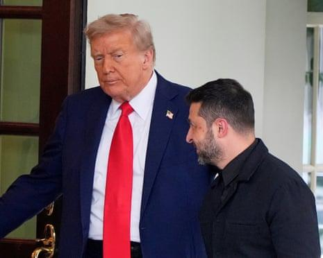

## Claim
Claim: "In early 2025, Ukraine and Russia had reached a peace deal in their years-long war."

## Actions
```
web_search("Ukraine Russia peace deal 2025")
```

## Evidence
### Evidence from `web_search`
In August 2025, The Guardian published an article discussing Donald Trump's approach to the Russia-Ukraine war, including a meeting with Zelenskyy and a potential trilateral meeting with Putin (). CNN also published an article in August 2025, discussing the difference between a ceasefire and a peace deal in the context of the war between Ukraine and Russia (<image:0>, , , , ). Wikipedia discusses peace negotiations in the Russian invasion of Ukraine, mentioning events up to December 2024 and a The Guardian article that mentions Trump reportedly backing the ceding of Ukrainian territory to Russia as part of a peace deal.

*   [Source](https://www.theguardian.com/us-news/2025/aug/21/trump-ukraine-russia-peace-talks)
*   [Source](https://en.wikipedia.org/wiki/Peace_negotiations_in_the_Russian_invasion_of_Ukraine)
*   [Source](https://www.cnn.com/2025/08/19/europe/ukraine-ceasefire-peace-deal-difference-analysis-latam-intl)


## Elaboration
The evidence suggests that in August 2025, discussions about a potential peace deal between Ukraine and Russia were ongoing. The Guardian published an article in August 2025 discussing Trump's approach to the war, including a meeting with Zelenskyy and a potential trilateral meeting with Putin. CNN also discussed the difference between a ceasefire and a peace deal in August 2025.

Wikipedia mentions peace negotiations up to December 2024. The Guardian also reported on Trump potentially backing the ceding of Ukrainian territory to Russia as part of a peace deal.

The evidence does not explicitly confirm that a peace deal was reached in early 2025. However, the fact that discussions about peace deals were ongoing in August 2025 suggests that a deal might have been reached or was in the process of being negotiated.


## Actions
```
web_search("Ukraine Russia peace agreement timeline")
```

## Evidence
### Evidence from `web_search`
In August 2025, CNN published an article discussing Donald Trump's efforts to negotiate a peace deal between Ukraine and Russia, but the article stated that a peace deal had not been reached (<image:0>). A timeline of events in Ukraine's history, from the 9th century to January 2023, does not mention any peace deal reached in early 2025.

*   [Source](https://www.cnn.com/politics/trump-timeline-russia-ukraine-putin-zelensky-dg)
*   [Source](https://libguides.cairn.edu/ukraine/timeline)


## Elaboration
Based on the evidence, the claim cannot be verified. While discussions about a peace deal were ongoing in August 2025, and Trump was involved in potential negotiations, CNN explicitly stated that a peace deal had not been reached by August 2025. Additionally, a timeline of events up to January 2023 does not mention any peace deal reached in early 2025.


## Final Judgement
The fact-check reveals that while discussions and negotiations regarding a peace deal between Ukraine and Russia were ongoing in August 2025, no peace deal had been reached by that time. The evidence includes articles from The Guardian and CNN discussing potential peace talks and Trump's involvement, but no definitive agreement is confirmed.

Based on the available evidence, the claim that a peace deal was reached in early 2025 is not supported. The evidence indicates ongoing negotiations but no finalized agreement. Therefore, the claim is not factually accurate. `false`


### Verdict: FALSE

### Justification
The claim is not supported by the evidence. While discussions about a peace deal were ongoing in August 2025, as reported by sources like the [The Guardian](https://www.theguardian.com/us-news/2025/aug/21/trump-ukraine-russia-peace-talks) and [CNN](https://www.cnn.com/politics/trump-timeline-russia-ukraine-putin-zelensky-dg), no peace deal had been reached by that time.
