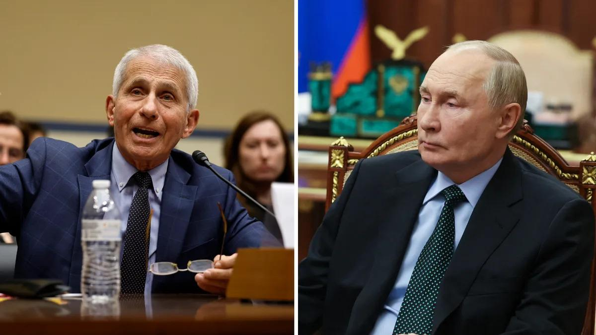

## Claim
Claim: "In January 2025, Russian President Vladimir Putin was seeking to have Dr. Anthony Fauci in the U.S. extradited to Russia in exchange for ending the war in Ukraine."

## Actions
```
web_search("Vladimir Putin Anthony Fauci extradition Ukraine war")
```

## Evidence
### Evidence from `web_search`
The claim that Vladimir Putin sought to extradite Dr. Anthony Fauci in January 2025 is false. A fact-check from Snopes, reported by Yahoo News, rated the claim as "False" and noted that the claim originated from social media posts on January 22, 2025 (, ). AOL News also debunked the claim, stating that it originated from a website known for spreading fake news and that there was no credible evidence to support it. Boatos.org also reported that there is no official record of Putin making any extradition request involving Anthony Fauci.

*   [https://www.yahoo.com/news/fact-check-no-evidence-vladimir-224900291.html](https://www.yahoo.com/news/fact-check-no-evidence-vladimir-224900291.html)
*   [https://www.aol.com/news/fact-check-putin-demanding-dr-194705273.html](https://www.aol.com/news/fact-check-putin-demanding-dr-194705273.html)
*   [https://www.boatos.org/english/did-putin-request-the-extradition-of-bill-gates-and-anthony-fauci-to-end-the-war-in-ukraine.html](https://www.boatos.org/english/did-putin-request-the-extradition-of-bill-gates-and-anthony-fauci-to-end-the-war-in-ukraine.html)


## Elaboration
The claim is false. Multiple sources, including Yahoo News and AOL News, have fact-checked and debunked the claim. These sources indicate that the claim originated from social media and websites known for spreading fake news. There is no credible evidence to support the claim.


## Final Judgement
The fact-check reveals that the claim is false. Multiple sources, including Snopes, AOL News, and Boatos.org, have debunked the claim, citing its origin in social media and unreliable sources, and the lack of any credible evidence.

The most appropriate decision option is `false`.


### Verdict: FALSE

### Justification
The claim is false. Fact-checks from sources like Yahoo News, based on a Snopes report, and AOL News, have debunked the claim, citing its origin in social media and unreliable sources, and the lack of any credible evidence.
