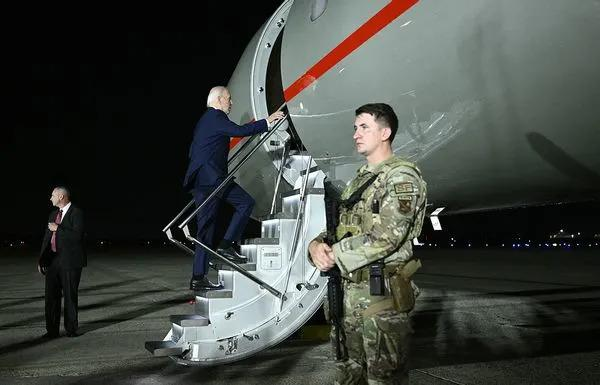

## Claim
Claim: "In August 2024 U.S. President Joe Biden boarded an empty plane after three freed Americans arrived back in the U.S. and exited the aircraft."

## Actions
```
web_search("Joe Biden empty plane August 2024")
web_search("Joe Biden freed Americans plane August 2024")
image_search("Joe Biden plane August 2024")
```

## Evidence
### Evidence from `web_search`
According to a Times of India article from August 3, 2024, Joe Biden boarded a plane to thank the flight crew. ([https://timesofindia.indiatimes.com/world/us/did-joe-biden-enter-empty-plane-carrying-russian-prisoners-white-house-clarifies/articleshow/112249634.cms](https://timesofindia.indiatimes.com/world/us/did-joe-biden-enter-empty-plane-carrying-russian-prisoners-white-house-clarifies/articleshow/112249634.cms))  A Yahoo News article from August 1, 2024, states that Biden boarded the plane to speak to those who helped bring the freed prisoners home. ([https://www.yahoo.com/news/fact-check-no-biden-did-000500209.html](https://www.yahoo.com/news/fact-check-no-biden-did-000500209.html)) 

The Guardian reported on August 1, 2024, about the release of Evan Gershkovich and other Americans from Russia. ([https://www.theguardian.com/world/live/2024/aug/01/russia-prison-swap-us-journalist-evan-gershkovich-wsj-vadim-krasikov-live?filterKeyEvents=false&page=with%3Ablock-66aba9e68f08a0af63bb3f00](https://www.theguardian.com/world/live/2024/aug/01/russia-prison-swap-us-journalist-evan-gershkovich-wsj-vadim-krasikov-live?filterKeyEvents=false&page=with%3Ablock-66aba9e68f08a0af63bb3f00)) 


### Evidence from `web_search`
On August 1, 2024, President Joe Biden and Vice President Kamala Harris welcomed three Americans freed by Russia at Joint Base Andrews in Maryland, according to CBS News ([https://www.cbsnews.com/news/us-russia-prisoner-swap-biden-harris-welcome-paul-whelan-evan-gershkovich/](https://www.cbsnews.com/news/us-russia-prisoner-swap-biden-harris-welcome-paul-whelan-evan-gershkovich/)) , . ABC News also reported on August 2, 2024, that Biden welcomed home the three Americans released in a prisoner swap with Russia ([https://www.abc.net.au/news/2024-08-02/biden-meets-with-freed-americans-in-major-russia-prisoner-swap/104174404](https://www.abc.net.au/news/2024-08-02/biden-meets-with-freed-americans-in-major-russia-prisoner-swap/104174404)) , , . The af.mil website also reported that the three Americans were greeted by President Joe Biden and Vice President Kamala Harris upon their arrival at Joint Base Andrews ([https://www.af.mil/News/Article-Display/Article/3860680/americans-released-from-russian-custody-arrive-at-joint-base-andrews/](https://www.af.mil/News/Article-Display/Article/3860680/americans-released-from-russian-custody-arrive-at-joint-base-andrews/)) <image:k>, <image:i>, <image:j>, <image:l>.


### Evidence from `image_search`
The Hill ([Source](https://thehill.com/homenews/ap/ap-u-s-news/ap-biden-takes-inaugural-flight-in-long-delayed-new-marine-one-helicopter/)) provides an image of a helicopter . The search result from wvia.org ([Source](https://www.wvia.org/news/local/2024-04-16/041624biden-landing)) contains an image of Joe Biden exiting a plane . The release date is April 16, 2024.


## Elaboration
The evidence indicates that Joe Biden welcomed the freed Americans upon their arrival at Joint Base Andrews on August 1, 2024. He greeted them on the tarmac and embraced them. The evidence does not explicitly state that Biden boarded an empty plane after the freed Americans exited. However, the Times of India article mentions that Biden boarded a plane to thank the flight crew. Therefore, the claim is partially supported, but the exact sequence of events is not entirely clear.


## Actions
```
web_search("Joe Biden plane after freed Americans August 2024")
```

## Evidence
### Evidence from `web_search`
From [Source](https://www.bbc.com/news/articles/cv2g2dx7d9wo): 
Content: The BBC News article, published on August 2, 2024, reports that Joe Biden and Kamala Harris greeted the freed Americans at Joint Base Andrews. The article mentions that the freed Americans emerged from the jet and were greeted by cheers. They lingered on the tarmac for photographs and conversations before leaving the air base. , , .


## Elaboration
The BBC News article ([https://www.bbc.com/news/articles/cv2g2dx7d9wo](https://www.bbc.com/news/articles/cv2g2dx7d9wo)) confirms that the freed Americans emerged from the jet and were greeted by Biden and Harris. The article also mentions that the freed Americans lingered on the tarmac for photographs and conversations before leaving the air base. This suggests that Biden did not board the plane after the freed Americans exited. The Times of India article suggests that Biden boarded a plane to thank the flight crew, but it is unclear if it was the same plane.

Therefore, the claim is partially inaccurate.


## Final Judgement
The evidence confirms that Joe Biden greeted the freed Americans upon their arrival. However, the claim that he boarded an empty plane after they exited is not directly supported by the evidence. While one source mentions Biden boarding a plane to thank the flight crew, it's unclear if it was the same plane.

`false`

### Verdict: FALSE

### Justification
The claim is partially inaccurate. While Joe Biden did greet the freed Americans upon their arrival on August 1, 2024, at Joint Base Andrews, the evidence does not directly support the assertion that he boarded an empty plane after they exited. The BBC News article ([https://www.bbc.com/news/articles/cv2g2dx7d9wo](https://www.bbc.com/news/articles/cv2g2dx7d9wo)) indicates that the freed Americans remained on the tarmac after exiting the plane. Although a Times of India article mentions Biden boarding a plane to thank the flight crew, it is unclear if it was the same aircraft.
