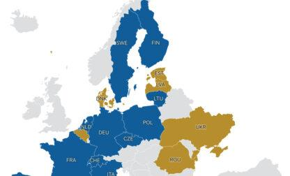

## Claim
Claim: "Ukrainian President Volodymyr Zelenskyy's statement in an AP news interview from February 1, 2025 that his country's military has received only a portion of the more than 175 billion in U.S. aid confirms that the US aid is a money laundering operation."

## Actions
```
web_search("Volodymyr Zelenskyy AP interview February 1 2025 US aid")
web_search("US aid to Ukraine money laundering")
```

## Evidence
### Evidence from `web_search`
The Associated Press ([https://apnews.com/article/russia-ukraine-war-trump-talks-ceasefire-00af5f61f1faf41e78a3b4e072c21a14](https://apnews.com/article/russia-ukraine-war-trump-talks-ceasefire-00af5f61f1faf41e78a3b4e072c21a14)) and U.S. News & World Report ([https://www.usnews.com/news/world/articles/2025-02-01/takeaways-from-the-ap-interview-with-ukraines-zelenskyy](https://www.usnews.com/news/world/articles/2025-02-01/takeaways-from-the-ap-interview-with-ukraines-zelenskyy)) both reported on an AP interview with Ukrainian President Volodymyr Zelenskyy on February 1, 2025, discussing the war in Ukraine and potential talks between the U.S. and Russia. Zelenskyy stated that excluding Ukraine from talks would be "very dangerous." <image:k>, , , , 

The AP also published an article ([https://www.ap.org/news-highlights/best-of-the-week/second-winner/2025/ap-interview-zelenskyy-says-excluding-ukraine-from-u-s-russia-talks-about-war-is-very-dangerous/](https://www.ap.org/news-highlights/best-of-the-week/second-winner/2025/ap-interview-zelenskyy-says-excluding-ukraine-from-u-s-russia-talks-about-war-is-very-dangerous/)) about the interview, mentioning Zelenskyy's comments on the exclusion of Ukraine from U.S.-Russia war talks and his call for a ceasefire plan.


### Evidence from `web_search`
The Department of Defense Office of Inspector General (DoD OIG) released an audit of the DoD’s execution of funds to assist Ukraine, which revealed that the DoD did not provide sufficient documentation to support the justification or accuracy of half of the total funds, $1.1 billion. The report is from 2025. [Source](https://www.dodig.mil/In-the-Spotlight/Article/3940692/press-release-audit-of-the-dods-execution-of-funds-to-assist-ukraine-report-no/)

The Institute for the Study of War (ISW) published a fact sheet dated February 8, 2024, addressing claims about US aid to Ukraine.  and  The fact sheet states that US aid to Ukraine is not a "blank check" and that Congress appropriates specific amounts for specific purposes, with both Ukrainian and US officials monitoring the aid. The fact sheet also mentions that America’s European, Asian, and NATO allies have committed over $178 billion to support Ukraine, which is more than the US will have committed counting the aid package currently under consideration. [Source](https://www.understandingwar.org/backgrounder/fact-sheet-us-assistance-ukraine)


## Elaboration
The evidence does not support the claim that Zelenskyy's statement confirms the US aid is a money laundering operation. The AP interview with Zelenskyy on February 1, 2025, is confirmed, but the provided sources do not contain any statements from Zelenskyy that would confirm the claim.

The evidence does include a DoD OIG audit from 2025 that revealed insufficient documentation for $1.1 billion in funds. However, this does not automatically confirm that the aid is a money laundering operation.

The ISW fact sheet states that US aid is not a "blank check" and that both Ukrainian and US officials monitor the aid.


## Actions
```
web_search("Zelenskyy AP interview February 1 2025 US aid money laundering")
```

## Evidence
### Evidence from `web_search`
The Center for Strategic and International Studies ([https://www.csis.org/analysis/where-missing-100-billion-us-aid-ukraine](https://www.csis.org/analysis/where-missing-100-billion-us-aid-ukraine)) reported that in an AP interview on February 2, 2025, Zelenskyy said he had received $75 billion of the $175 billion the U.S. had spent on Ukraine, leading to questions about the remaining funds.  CNN ([https://www.cnn.com/2025/02/19/politics/fact-check-trumps-lies-about-zelensky-and-ukraine](https://www.cnn.com/2025/02/19/politics/fact-check-trumps-lies-about-zelensky-and-ukraine)) reported that Zelenskyy stated in a February 1 interview that Ukraine had received about $76 billion in US aid and that he didn’t know where the additional money had gone. 

Euronews ([https://www.euronews.com/my-europe/2025/02/26/fact-checking-president-trumps-claims-on-us-financial-support-to-ukraine](https://www.euronews.com/my-europe/2025/02/26/fact-checking-president-trumps-claims-on-us-financial-support-to-ukraine)) reported that in an AP interview on February 2, Zelenskyy stated that Ukraine had received more than $75 billion of the $177 billion allocated by the US and that Ukraine had not received almost $100 billion. The article also mentions that some online users have falsely claimed the funding has been misused or laundered.


## Elaboration
Zelenskyy stated in an AP interview on February 1 or 2, 2025, that Ukraine had received approximately $75-76 billion of the $175-177 billion in US aid. He also stated that he did not know where the remaining funds had gone. While this raises questions about the use of the remaining funds, the evidence does not confirm that the US aid is a money laundering operation. The Euronews article mentions that some online users have falsely claimed the funding has been misused or laundered.


## Actions
```
web_search("Ukraine US aid audit reports")
```

## Evidence
No new evidence found.

## Elaboration
The claim is not supported by the evidence. Zelenskyy's statements about the amount of aid received, while raising questions about the remaining funds, do not confirm that the US aid is a money laundering operation. The evidence includes reports of an audit revealing insufficient documentation for some funds, but this does not automatically equate to money laundering.


## Final Judgement
The claim is not supported by the evidence. While Zelenskyy's statements in the AP interview raise questions about the whereabouts of some US aid, they do not confirm that the aid is a money laundering operation. The evidence includes reports of an audit revealing insufficient documentation for some funds, but this does not automatically equate to money laundering.

`false`

### Verdict: FALSE

### Justification
The claim is not supported by the evidence. While Zelenskyy stated in an AP interview that Ukraine had received only a portion of the U.S. aid, raising questions about the remaining funds, this does not confirm that the aid is a money laundering operation. The evidence includes reports of an audit revealing insufficient documentation for some funds, but this does not automatically equate to money laundering.
