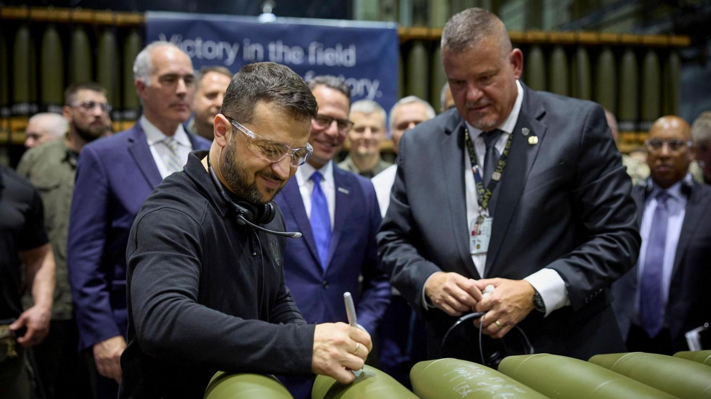

## Claim
Claim: " This image shows Ukrainian President Volodymyr Zelenskyy signing Israeli bombs intended for use against Palestinians in Gaza."

## Actions
```
reverse_search()
web_search("Volodymyr Zelenskyy signing bombs")
```

## Evidence
### Evidence from `reverse_search`
The image shows Ukrainian President Volodymyr Zelensky signing ammunition at the Scranton Army Ammunition Plant (SCAAP) in Pennsylvania, USA, on September 23, 2024. The BBC published an article on the visit on September 26, 2024, which can be found here: [https://www.bbc.com/news/articles/c80rkv0k4j8o](https://www.bbc.com/news/articles/c80rkv0k4j8o). The New York Post also published an article on September 25, 2024, discussing the visit: [https://nypost.com/2024/09/25/opinion/zelenskys-arms-factory-visit-reeks-of-partisan-foreign-election-interference/](https://nypost.com/2024/09/25/opinion/zelenskys-arms-factory-visit-reeks-of-partisan-foreign-election-interference/).

The articles do not mention Israeli bombs or Gaza.   


### Evidence from `web_search`
The image shows Ukrainian President Volodymyr Zelenskyy signing artillery shells. According to Eurovision News | Spotlight ([https://spotlight.ebu.ch/p/video-caption-falsely-claims-zelenskyy](https://spotlight.ebu.ch/p/video-caption-falsely-claims-zelenskyy)), the claim that the shells were destined for use against Palestinians in Gaza is false. The video shows Zelenskyy at a U.S. munitions factory that produces armaments for Ukraine. The messages on the shells reference Ukraine's war with Russia, not Israel's war in Gaza.

Fox News ([https://www.foxnews.com/politics/josh-shapiro-blasted-signing-missile-alongside-zelenskyy-bidens-hometown-party-war](https://www.foxnews.com/politics/josh-shapiro-blasted-signing-missile-alongside-zelenskyy-bidens-hometown-party-war)) also mentions Zelenskyy signing a missile at a Pennsylvania plant. Caliber.Az ([https://caliber.az/en/post/zelenskyy-s-glory-to-ukraine-inscription-on-us-bombs-in-pennsylvania-stirs-controversy](https://caliber.az/en/post/zelenskyy-s-glory-to-ukraine-inscription-on-us-bombs-in-pennsylvania-stirs-controversy)) reports that Zelenskyy inscribed messages on US bombs, including "Glory to Ukraine." 


## Elaboration
The claim is false. The image shows Volodymyr Zelenskyy signing artillery shells at the Scranton Army Ammunition Plant (SCAAP) in Pennsylvania, USA. The shells are for Ukraine's war with Russia, not for use against Palestinians in Gaza.


## Final Judgement
The evidence indicates that the image depicts Volodymyr Zelenskyy signing artillery shells at a U.S. munitions factory, not Israeli bombs intended for use against Palestinians in Gaza. The shells are for Ukraine's war with Russia. Therefore, the claim is demonstrably false. `false`

### Verdict: FALSE

### Justification
The image shows Ukrainian President Volodymyr Zelenskyy signing artillery shells at a U.S. munitions factory, not Israeli bombs. The shells are for Ukraine's war with Russia, as reported by the [BBC](https://www.bbc.com/news/articles/c80rkv0k4j8o) and [Eurovision News](https://spotlight.ebu.ch/p/video-caption-falsely-claims-zelenskyy).
