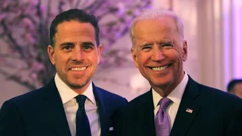
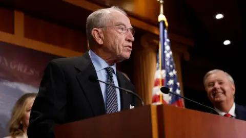

## Claim
Claim: " This image shows an authentic list realeased by Ukraine showing US politicians taking bribes from Ukraine. The highest bribe was 92 Million US-$ for Joe Biden."

## Actions
```
web_search("Joe Biden net worth")
web_search("Mitch McConnell net worth")
web_search("Nancy Pelosi net worth")
web_search("US politicians Ukraine bribes")
```

## Evidence
### Evidence from `web_search`
Joe Biden's net worth is estimated to be around $9 million as of May 2025, according to [Yahoo](https://www.yahoo.com/news/joe-biden-net-worth-time-205550551.html). [Investopedia](https://www.investopedia.com/joe-biden-net-worth-8655652) estimates his net worth at $10 million. The Wikipedia article on Joe Biden states that as of November 2020, the Bidens were worth $9 million.

The image in the claim () shows a list of US politicians with alleged bribe amounts, with Joe Biden listed at $92 million.


### Evidence from `web_search`
The search results provide information on the net worth of Mitch McConnell. OpenSecrets.org estimates his net worth at $34,137,534 in 2018 (). Quiverquant.com also provides information on McConnell's net worth, but the specific net worth section is loading (). An article from city-countyobserver.com states that McConnell's net worth exceeds $30 million.

The search results do not provide any information about US politicians taking bribes from Ukraine.


### Evidence from `web_search`
The provided search results offer information on Nancy Pelosi's net worth. OpenSecrets.org estimated her net worth at $114,662,521 in 2018 (). Wikipedia states her net worth was estimated at $58 million in 2009, $101 million in 2014, and $120 million as of 2021. Quiverquant.com also provides information on her net worth, trade volume, and stock portfolio.

The sources are: [https://www.opensecrets.org/personal-finances/nancy-pelosi/net-worth?cid=N00007360&year=2018](https://www.opensecrets.org/personal-finances/nancy-pelosi/net-worth?cid=N00007360&year=2018), [https://en.wikipedia.org/wiki/Nancy_Pelosi](https://en.wikipedia.org/wiki/Nancy_Pelosi), and [https://www.quiverquant.com/congresstrading/politician/Nancy%20Pelosi-P000197/net-worth](https://www.quiverquant.com/congresstrading/politician/Nancy%20Pelosi-P000197/net-worth).


### Evidence from `web_search`
The Euronews article ([https://www.euronews.com/my-europe/2025/01/15/old-false-claims-resurface-about-ukrainian-kickbacks-to-us-politicians](https://www.euronews.com/my-europe/2025/01/15/old-false-claims-resurface-about-ukrainian-kickbacks-to-us-politicians)) debunks the claim that the image listing US politicians and alleged bribes from Ukraine is authentic, stating it is false and lacks evidence. The BBC News ([https://www.bbc.com/news/world-us-canada-66272217](https://www.bbc.com/news/world-us-canada-66272217)) discusses an FBI document alleging Joe Biden and his son accepted bribes from a Ukrainian firm, but there is no evidence to support this.

Wikipedia ([https://en.wikipedia.org/wiki/Biden%E2%80%93Ukraine_conspiracy_theory](https://en.wikipedia.org/wiki/Biden%E2%80%93Ukraine_conspiracy_theory)) discusses the Biden–Ukraine conspiracy theory, which alleges wrongdoing by Joe Biden, but states that a joint investigation found no evidence of it.    


## Elaboration
The claim that the image is an authentic list released by Ukraine showing US politicians taking bribes is false. Multiple sources, including Euronews and Wikipedia, debunk the image's authenticity and state that there is no evidence to support the claim. The search results also provide information on the net worth of some of the politicians listed in the image, which does not correlate with the alleged bribe amounts.


## Final Judgement
The claim is demonstrably false. Multiple sources confirm that the image is not authentic and that there is no evidence to support the claim that it is a list of bribes from Ukraine.
`false`

### Verdict: FALSE

### Justification
The claim is false. Multiple sources, including [Euronews](https://www.euronews.com/my-europe/2025/01/15/old-false-claims-resurface-about-ukrainian-kickbacks-to-us-politicians) and [Wikipedia](https://en.wikipedia.org/wiki/Biden%E2%80%93Ukraine_conspiracy_theory), debunk the image's authenticity and state that there is no evidence to support the claim that it is a list of bribes from Ukraine.
