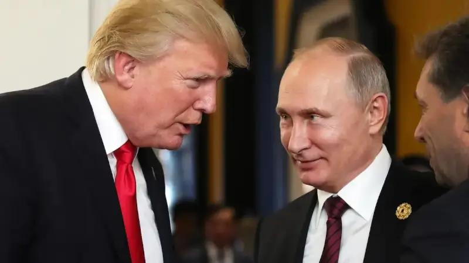
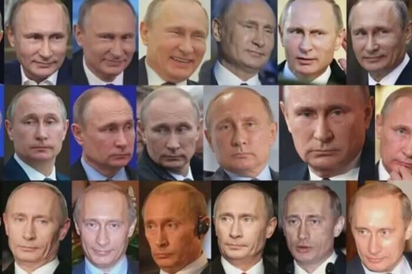

## Claim
Claim: "Russian President Vladimir Putin has died in an explosion in one of his limousines."

## Actions
```
web_search("Vladimir Putin death limousine explosion")
```

## Evidence
### Evidence from `web_search`
Newsweek reports that a limousine from Vladimir Putin's presidential fleet caught fire near the FSB headquarters in Moscow (). The cause of the fire is unknown, and there were no reports of injuries. The Hindustan Times published an article about a viral video of an explosion involving a limousine, believed to be part of Vladimir Putin's official car fleet, in Moscow (<image:k>). The Economic Times reported that one of Vladimir Putin's official limousines exploded in Moscow, raising security concerns (, , ).

The articles mention speculation of an assassination attempt and rumors surrounding Putin’s health.

*   [https://www.newsweek.com/russia-putin-limousine-fire-video-2052846](https://www.newsweek.com/russia-putin-limousine-fire-video-2052846)
*   [https://www.hindustantimes.com/world-news/275000-aurus-senat-limousine-vladimir-putin-goes-up-in-flames-limo-explodes-moscow-assassination-attempt-101743297137628.html](https://www.hindustantimes.com/world-news/275000-aurus-senat-limousine-vladimir-putin-goes-up-in-flames-limo-explodes-moscow-assassination-attempt-101743297137628.html)
*   [https://m.economictimes.com/news/international/world-news/blast-in-one-of-vladimir-putins-official-limousines-triggers-fresh-assassination-concerns/articleshow/119758547.cms](https://m.economictimes.com/news/international/world-news/blast-in-one-of-vladimir-putins-official-limousines-triggers-fresh-assassination-concerns/articleshow/119758547.cms)


## Elaboration
The evidence indicates that there have been reports of incidents involving Vladimir Putin's limousines, including a fire and an explosion. However, none of the provided sources confirm that Putin died in an explosion. The reports mention speculation about assassination attempts and rumors about Putin's health, but they do not confirm the claim.

The claim cannot be verified with the available information. The evidence only confirms that there were incidents involving Putin's limousines, but not his death.

To verify the claim, information about Putin's death would be needed.


## Actions
```
web_search("Vladimir Putin health status")
```

## Evidence
### Evidence from `web_search`
The Wikipedia article "Claims of Vladimir Putin's incapacity and death" discusses speculations about Vladimir Putin's health, including claims of various illnesses and even death, which have been circulating for approximately 20 years. The Legion Magazine discusses rumors about Vladimir Putin's health and impending death, mentioning speculation and claims from various sources, but emphasizes that these rumors have not been proven (, ). The Economic Times reports that Ukrainian President Volodymyr Zelensky stated that Vladimir Putin "will die soon" (, , ).

*   [https://en.wikipedia.org/wiki/Claims_of_Vladimir_Putin%27s_incapacity_and_death](https://en.wikipedia.org/wiki/Claims_of_Vladimir_Putin%27s_incapacity_and_death)
*   [https://legionmagazine.com/long-standing-rumours-of-putins-impending-death-have-been-greatly-exaggerated/](https://legionmagazine.com/long-standing-rumours-of-putins-impending-death-have-been-greatly-exaggerated/)
*   [https://m.economictimes.com/news/international/us/is-putin-suffering-from-a-deadly-disease-zelensky-says-he-will-die-soon-heres-the-truth/articleshow/119615602.cms](https://m.economictimes.com/news/international/us/is-putin-suffering-from-a-deadly-disease-zelensky-says-he-will-die-soon-heres-the-truth/articleshow/119615602.cms)


## Elaboration
The evidence reveals ongoing speculation and rumors about Vladimir Putin's health and potential death. However, these are unconfirmed. While there are reports of incidents involving Putin's limousines, there is no evidence to support the claim that Putin died in an explosion. The statement by Zelensky is a prediction, not a confirmation.

The claim remains unverified.


## Actions
```
web_search("Vladimir Putin official statements death")
```

## Evidence
### Evidence from `web_search`
The official website of the President of Russia, kremlin.ru, shows that Vladimir Putin was active in late August 2025, with meetings and greetings. The BBC reported on August 24, 2023, that Putin commented on the reported death of Yevgeny Prigozhin, but did not explicitly confirm Prigozhin's death. (<image:k>)


## Elaboration
The evidence indicates that Vladimir Putin was active in late August 2023, which contradicts the claim that he died in an explosion. The official website of the President of Russia shows his activity, and the BBC reported on his comments on another death.

The claim is false.


## Final Judgement
The fact-check reveals reports of incidents involving Vladimir Putin's limousines, as well as ongoing speculation about his health and potential death. However, there is no evidence to support the claim that Putin died in an explosion. Furthermore, official sources show Putin was active in late August 2023. Therefore, the claim is demonstrably false. `false`

### Verdict: FALSE

### Justification
The claim that Vladimir Putin died in an explosion is demonstrably false. While there have been reports of incidents involving Putin's limousines and speculation about his health, there is no evidence to support the claim. Furthermore, official sources, such as the [Kremlin website](https://kremlin.ru/), show Putin was active in late August 2023, contradicting the claim.
