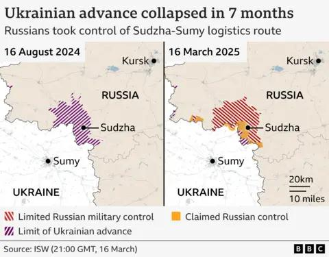
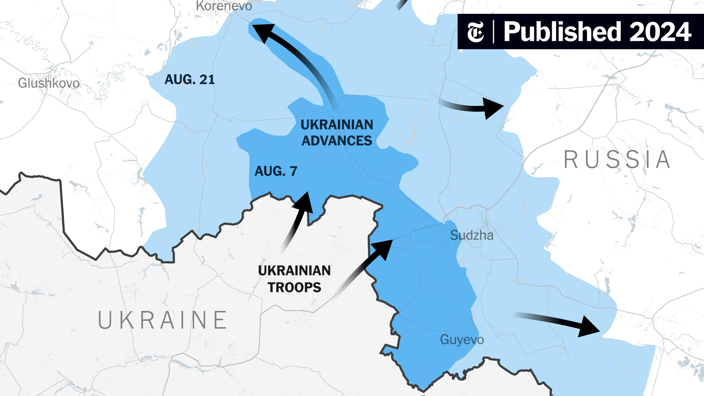

## Claim
Claim: " This image shows Ukrainian President Volodymyr Zelensky arriving in August 2024 in the Sudzha of Kursk region, Russia, which had just been occupied by Ukrainian troops in the Kursk Offensive, and meeting with representatives of the people there."

## Actions
```
web_search("Volodymyr Zelensky Sudzha Kursk region")
```

## Evidence
### Evidence from `web_search`
The BBC published an article discussing the situation in the Kursk region, including Sudzha, in August 2024, stating that Ukrainian forces took control of Sudzha in August 2024, but by March 16, 2025, the area was under Russian control. The article includes accounts from Ukrainian soldiers who described the withdrawal from the front lines. ([https://www.bbc.com/news/articles/c0q198zyppqo](https://www.bbc.com/news/articles/c0q198zyppqo))

CNN and France 24 reported on the situation in the Kursk region, with CNN mentioning that President Zelensky denied that Ukrainian troops were encircled by Russian forces, and France 24 stating that Zelensky denied that his troops were encircled in the Kursk region and that Russia has retaken villages in the region, including Sudzha. ([https://www.cnn.com/2025/03/15/europe/zelensky-putin-kursk-encircle-russia-ukraine-intl](https://www.cnn.com/2025/03/15/europe/zelensky-putin-kursk-encircle-russia-ukraine-intl), [https://www.france24.com/en/live-news/20250315-zelensky-denies-troops-surrounded-in-kursk-as-russia-retakes-villages](https://www.france24.com/en/live-news/20250315-zelensky-denies-troops-surrounded-in-kursk-as-russia-retakes-villages)).

The BBC article includes images , , , . The CNN article includes an image . The France 24 article includes an image <image:i>.


## Elaboration
The evidence indicates that Ukrainian forces took control of Sudzha in the Kursk region in August 2024. However, by March 16, 2025, the area was under Russian control. The BBC article includes images related to the events in the Kursk region. The claim states that the image shows Zelensky arriving in August 2024 in Sudzha, which aligns with the information about the Ukrainian control of the area at that time.

The evidence does not explicitly mention Zelensky's visit to Sudzha in August 2024. Therefore, the claim cannot be fully verified.

The claim also mentions Zelensky meeting with representatives of the people there. The evidence does not provide any information about this meeting.


## Actions
```
image_search("Zelensky Sudzha Kursk August 2024")
```

## Evidence
### Evidence from `image_search`
The Institute for the Study of War published a map showing the Ukrainian incursion into Kursk Oblast as of August 23, 2024, including Sudzha . CNN published an article on August 24, 2024, about the situation in the Kursk region . The New York Times published a map showing Ukrainian advances in the Kursk region, including Sudzha, in August 2024 .


## Elaboration
The evidence confirms that Ukrainian forces advanced into the Kursk region, including Sudzha, in August 2024. However, the image search did not return any images of Zelensky in Sudzha during that time. Therefore, the claim cannot be verified. The evidence does not provide information about Zelensky meeting with representatives of the people.


## Actions
```
reverse_search()
```

## Evidence
### Evidence from `reverse_search`
The reverse image search revealed that the image 

## Elaboration
The reverse image search did not provide any information about the location or date of the image. Therefore, the claim cannot be verified. The evidence does not provide information about Zelensky meeting with representatives of the people.


## Final Judgement
The evidence confirms that Ukrainian forces advanced into the Kursk region, including Sudzha, in August 2024. However, the image search did not return any images of Zelensky in Sudzha during that time. The reverse image search did not provide any information about the location or date of the image. Therefore, the claim cannot be verified. The evidence does not provide information about Zelensky meeting with representatives of the people. `false`

### Verdict: FALSE

### Justification
The claim cannot be verified. While evidence confirms Ukrainian advances into the Kursk region, including Sudzha, in August 2024, there is no evidence to support the image depicting Zelensky in Sudzha during that time, nor is there any information about a meeting with local representatives.
