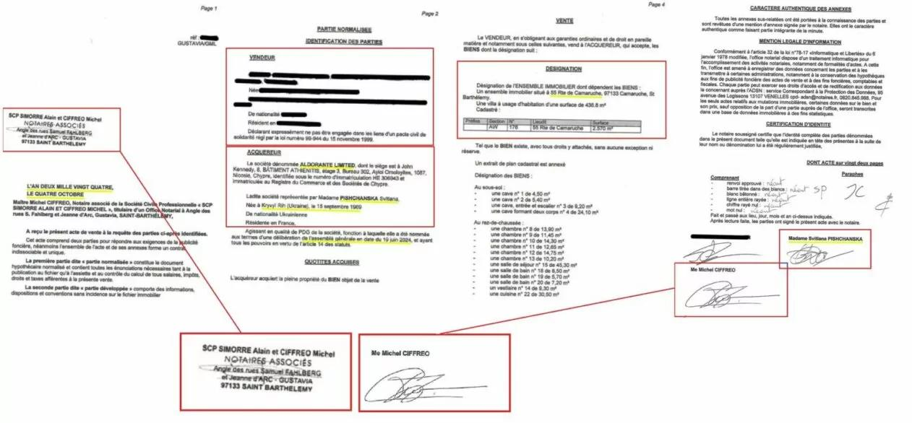

## Claim
Claim: "Ukrainian President Volodymyr Zelenskyy purchased the Eagle's Nest, or Kehlsteinhaus, in Berchtesgaden in the southern German state of Bavaria, for 14.2 million euros."

## Actions
```
web_search("Volodymyr Zelenskyy Eagle's Nest purchase")
web_search("Kehlsteinhaus sold 14.2 million euros")
```

## Evidence
### Evidence from `web_search`
One article from aol.com, published on February 20, 2025, fact-checks the claim and states that the Free State of Bavaria still owns the Kehlsteinhaus, deeming the claim false (). Another article from EADaily, published on February 8, 2025, claims that Volodymyr Zelenskyy purchased the Eagle's Nest for €14.2 million through an offshore company (). An article from gwaramedia.com, published on February 27, 2025, debunks a claim that Volodymyr Zelenskyy purchased a villa on Saint Barthélemy island, stating that the document presented as evidence is fake (, , ).

*   [https://www.aol.com/fact-check-no-zelenskyy-didn-151251133.html](https://www.aol.com/fact-check-no-zelenskyy-didn-151251133.html)
*   [https://eadaily.com/en/news/2025/02/08/zelensky-bought-hitlers-eagles-nest-residence-in-the-bavarian-alps-mass-media](https://eadaily.com/en/news/2025/02/08/zelensky-bought-hitlers-eagles-nest-residence-in-the-bavarian-alps-mass-media)
*   [https://gwaramedia.com/en/debunking-russian-fakes-no-zelenskyy-didnt-buy-villa-on-island-of-billionaires/](https://gwaramedia.com/en/debunking-russian-fakes-no-zelenskyy-didnt-buy-villa-on-island-of-billionaires/)


### Evidence from `web_search`
The claim that Volodymyr Zelenskyy purchased the Eagle's Nest is fake news, according to StopFake.org ([https://www.stopfake.org/en/fake-zelensky-buys-house-owned-by-german-nazi-party-for-14-million-euros/](https://www.stopfake.org/en/fake-zelensky-buys-house-owned-by-german-nazi-party-for-14-million-euros/)). The article states that the fake news was spread by a fake German news outlet. There is no credible information that the property has been sold, let alone that Volodymyr Zelensky is its new owner.

Veridica.ro ([https://www.veridica.ro/en/fake-news-disinformation-propaganda/war-propaganda-zelenskyy-bought-hitlers-residence](https://www.veridica.ro/en/fake-news-disinformation-propaganda/war-propaganda-zelenskyy-bought-hitlers-residence)) labels the claim as propaganda originating from pro-Kremlin media. The Eagle's Nest is a regional museum and a restaurant managed by a non-profit foundation. , 


## Elaboration
The claim that Volodymyr Zelenskyy purchased the Eagle's Nest is false. Multiple sources, including aol.com and StopFake.org, debunk the claim, with StopFake.org explicitly labeling it as fake news. Veridica.ro identifies the claim as propaganda originating from pro-Kremlin media. The evidence indicates that the Free State of Bavaria owns the Kehlsteinhaus, which is a regional museum and restaurant.


## Final Judgement
The claim is demonstrably false. Multiple sources confirm that the Eagle's Nest is not owned by Volodymyr Zelenskyy and that the claim is fake news and propaganda. `false`

### Verdict: FALSE

### Justification
The claim is demonstrably false. Multiple sources, including [aol.com](https://www.aol.com/fact-check-no-zelenskyy-didn-151251133.html) and [StopFake.org](https://www.stopfake.org/en/fake-zelensky-buys-house-owned-by-german-nazi-party-for-14-million-euros/), debunk the claim, and [Veridica.ro](https://www.veridica.ro/en/fake-news-disinformation-propaganda/war-propaganda-zelenskyy-bought-hitlers-residence) identifies it as propaganda. The Eagle's Nest is a regional museum and restaurant owned by the Free State of Bavaria.
