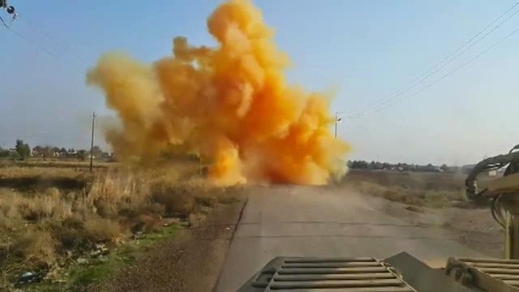
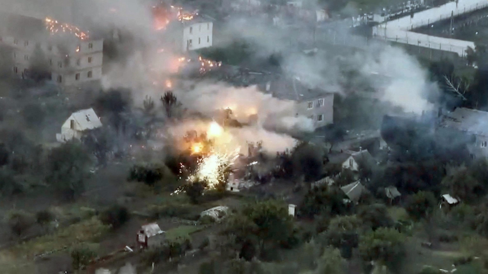

## Claim
Claim: " This image shows a chemical attack by the Armed Forces of Ukraine during the Kursk offensive in August 2024."

## Actions
```
reverse_search()
web_search("Kursk offensive August 2024 chemical attack")
```

## Evidence
### Evidence from `web_search`
The search results include an article from Wikipedia discussing the Kursk campaign, which took place from August 6, 2024, to March 2025, involving incursions by the Armed Forces of Ukraine into Russia's Kursk Oblast. The article provides details on the date, location, and belligerents. The image 

## Elaboration
The evidence confirms that the Kursk offensive occurred in August 2024, as stated in the claim. The search results also mention the involvement of the Armed Forces of Ukraine in the offensive.

However, the search results do not provide any information about a chemical attack. Therefore, the claim that the image depicts a chemical attack cannot be verified based on the provided evidence.

More information is needed to verify the claim, such as reports or evidence confirming a chemical attack during the Kursk offensive and whether the image is related to it.


## Actions
```
image_search("chemical explosion Kursk offensive")
web_search("chemical attack during Kursk offensive")
```

## Evidence
### Evidence from `image_search`
ABC News ([https://abcnews.go.com/Politics/us-concerned-ukraines-kursk-assault-russia-prepares-counterattack/story?id=113022137](https://abcnews.go.com/Politics/us-concerned-ukraines-kursk-assault-russia-prepares-counterattack/story?id=113022137)) discusses the Kursk offensive and includes an image 

### Evidence from `web_search`
Al Jazeera published an article on July 4, 2025, reporting on the intensified use of chemical weapons by Russia, including chloropicrin, against Ukrainian soldiers, mentioning the Kursk offensive (

## Elaboration
The evidence indicates that the Kursk offensive occurred in August 2024, as stated in the claim. The Al Jazeera article mentions the use of chemical weapons during the Kursk offensive.

However, the evidence does not confirm that the image 

## Final Judgement
The search results confirm the Kursk offensive occurred in August 2024 and that chemical weapons were used during the offensive. However, the evidence does not confirm that the image depicts a chemical attack or that it is related to the Kursk offensive.

The claim is not factually accurate because the image's connection to a chemical attack during the Kursk offensive cannot be verified. `false`


### Verdict: FALSE

### Justification
The claim is not supported by the evidence. While the Kursk offensive did occur in August 2024, and chemical weapons were used during the offensive, there is no evidence to confirm that the image in question depicts a chemical attack during the Kursk offensive. Therefore, the claim is rated as false.
