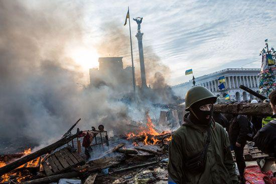
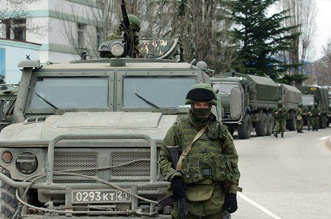

## Claim
Claim: "Ukrainian President Volodymyr Zelenskyy started the 2022 war in Ukraine with Russia."

## Actions
```
web_search("Volodymyr Zelenskyy Russia war 2022")
web_search("causes of Russia Ukraine war 2022")
```

## Evidence
### Evidence from `web_search`
The Wikipedia article on Volodymyr Zelenskyy ([https://en.wikipedia.org/wiki/Volodymyr_Zelenskyy](https://en.wikipedia.org/wiki/Volodymyr_Zelenskyy)) details his career and role as President of Ukraine during the Russo-Ukrainian War, noting that Putin announced a "special military operation" on February 24, 2022. Sky News ([https://news.sky.com/story/ukraine-war-latest-russia-rape-putin-zelenskyy-12541713](https://news.sky.com/story/ukraine-war-latest-russia-rape-putin-zelenskyy-12541713)) reports on the ongoing war, mentioning meetings and calls involving Zelenskyy, Trump, and Putin, and was published on August 6, 2025.

An Al Jazeera article ([https://www.aljazeera.com/news/2025/2/20/fact-check-did-ukraine-start-its-war-with-russia-as-trump-claims](https://www.aljazeera.com/news/2025/2/20/fact-check-did-ukraine-start-its-war-with-russia-as-trump-claims)), published on February 20, 2025, addresses claims that Ukraine started the war, referencing Trump's statements and the historical context, including Russia's 2022 invasion.


### Evidence from `web_search`
The war between Russia and Ukraine began in 2014 with Russia's annexation of Crimea and escalated on February 24, 2022, when Russia invaded Ukraine. The CIRSD article discusses the causes of the war, mentioning the American-led effort to make Ukraine a Western bulwark on Russia’s borders as a key factor. The Britannica article states that in the early hours of February 24, 2022, Zelenskyy addressed the Russian people, pleading for peace but vowing that Ukraine would defend itself , , , .

The sources are: [https://www.cirsd.org/en/horizons/horizons-summer-2022-issue-no.21/the-causes-and-consequences-of-the-ukraine-war](https://www.cirsd.org/en/horizons/horizons-summer-2022-issue-no.21/the-causes-and-consequences-of-the-ukraine-war), [https://en.wikipedia.org/wiki/Russian_invasion_of_Ukraine](https://en.wikipedia.org/wiki/Russian_invasion_of_Ukraine), and [https://www.britannica.com/event/2022-Russian-invasion-of-Ukraine](https://www.britannica.com/event/2022-Russian-invasion-of-Ukraine).


## Elaboration
The evidence indicates that the 2022 war escalated on February 24, 2022, when Russia invaded Ukraine. Zelenskyy, as the President of Ukraine, addressed the Russian people, pleading for peace but vowing to defend Ukraine. The Al Jazeera article ([https://www.aljazeera.com/news/2025/2/20/fact-check-did-ukraine-start-its-war-with-russia-as-trump-claims](https://www.aljazeera.com/news/2025/2/20/fact-check-did-ukraine-start-its-war-with-russia-as-trump-claims)) addresses claims that Ukraine started the war.

The evidence suggests that the war's escalation was initiated by Russia's invasion, not by Zelenskyy. The claim is therefore not supported by the provided evidence.

The evidence also mentions the historical context of the war, including Russia's annexation of Crimea in 2014 and the American-led effort to make Ukraine a Western bulwark on Russia’s borders. However, the evidence does not provide enough information to determine the full extent of Zelenskyy's actions leading up to the 2022 invasion.


## Final Judgement
The evidence indicates that the 2022 war was initiated by Russia's invasion of Ukraine, not by Zelenskyy. While Zelenskyy was the President of Ukraine during the war, the claim that he started the war is not supported by the provided evidence.

`false`

### Verdict: FALSE

### Justification
The claim that Ukrainian President Volodymyr Zelenskyy started the 2022 war in Ukraine is false. Evidence from Wikipedia ([https://en.wikipedia.org/wiki/Volodymyr_Zelenskyy](https://en.wikipedia.org/wiki/Volodymyr_Zelenskyy)) and Britannica ([https://www.britannica.com/event/2022-Russian-invasion-of-Ukraine](https://www.britannica.com/event/2022-Russian-invasion-of-Ukraine)) indicates that the war escalated with Russia's invasion on February 24, 2022. Zelenskyy, as president, addressed the Russian people, pleading for peace but vowing to defend Ukraine.
