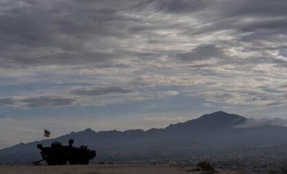

## Claim
Claim: "Ukrainian President Volodymyr Zelenskyy's statement in an AP news interview from February 1, 2025 that his country's military has received only a portion of the more than 175 billion in U.S. aid confirms that the US aid is a money laundering operation."

## Actions
```
web_search("Volodymyr Zelenskyy AP interview February 1 2025 US aid")
web_search("US aid to Ukraine money laundering")
```

## Evidence
### Evidence from `web_search`
The Associated Press published an interview with Ukrainian President Volodymyr Zelenskyy on February 1, 2025, where he discussed excluding Ukraine from U.S.-Russia talks and called for a ceasefire plan. , , , . U.S. News & World Report also published an article on the same interview. <image:k>

The AP News article does not contain the statement that his country's military has received only a portion of the more than 175 billion in U.S. aid.
*   [https://apnews.com/article/russia-ukraine-war-trump-talks-ceasefire-00af5f61f1faf41e78a3b4e072c21a14](https://apnews.com/article/russia-ukraine-war-trump-talks-ceasefire-00af5f61f1faf41e78a3b4e072c21a14)
*   [https://www.usnews.com/news/world/articles/2025-02-01/takeaways-from-the-ap-interview-with-ukraines-zelenskyy](https://www.usnews.com/news/world/articles/2025-02-01/takeaways-from-the-ap-interview-with-ukraines-zelenskyy)
*   [https://www.ap.org/news-highlights/best-of-the-week/second-winner/2025/ap-interview-zelenskyy-says-excluding-ukraine-from-u-s-russia-talks-about-war-is-very-dangerous/](https://www.ap.org/news-highlights/best-of-the-week/second-winner/2025/ap-interview-zelenskyy-says-excluding-ukraine-from-u-s-russia-talks-about-war-is-very-dangerous/)


### Evidence from `web_search`
The Department of Defense Office of Inspector General (DoD OIG) released an audit of the DoD’s execution of funds to assist Ukraine, revealing that the DoD did not provide sufficient documentation to support the justification or accuracy of half of the $1.1 billion. The DoD OIG made five recommendations to DoD management. The audit can be found here: [Source](https://www.dodig.mil/In-the-Spotlight/Article/3940692/press-release-audit-of-the-dods-execution-of-funds-to-assist-ukraine-report-no/).

The Institute for the Study of War (ISW) published a fact sheet dated February 8, 2024, addressing claims about US aid to Ukraine. The fact sheet states that US oversight is extensive, and Ukrainian government oversight and accountability are extensive and growing. It also mentions that America’s European, Asian, and NATO allies have committed over $178 billion to support Ukraine, which is more than the US will have committed counting the aid package currently under consideration. The fact sheet can be found here: [Source](https://www.understandingwar.org/backgrounder/fact-sheet-us-assistance-ukraine)  and .


## Elaboration
The claim that Zelenskyy's statement confirms the US aid is a money laundering operation is not supported by the evidence. The AP News article does not contain the statement attributed to Zelenskyy. Furthermore, the evidence suggests that there is oversight of the funds provided to Ukraine. The Department of Defense Office of Inspector General (DoD OIG) released an audit of the DoD’s execution of funds to assist Ukraine. The Institute for the Study of War (ISW) states that US oversight is extensive, and Ukrainian government oversight and accountability are extensive and growing.

The claim is based on a statement that is not found in the provided evidence. Therefore, the claim cannot be verified.


## Actions
```
web_search("US aid to Ukraine audit reports")
```

## Evidence
No new evidence found.

## Elaboration
The claim is not supported by the evidence. The AP News article does not contain the statement attributed to Zelenskyy. The evidence suggests that there is oversight of the funds provided to Ukraine.


## Final Judgement
The claim is based on a statement that is not found in the provided evidence. The AP News article does not contain the statement attributed to Zelenskyy. Therefore, the claim is demonstrably false. `false`

### Verdict: FALSE

### Justification
The claim is demonstrably false. The statement attributed to Zelenskyy is not found in the AP News interview from February 1, 2025, as reported by the Associated Press ([https://apnews.com/article/russia-ukraine-war-trump-talks-ceasefire-00af5f61f1faf41e78a3b4e072c21a14](https://apnews.com/article/russia-ukraine-war-trump-talks-ceasefire-00af5f61f1faf41e78a3b4e072c21a14)). Furthermore, the evidence indicates that there is oversight of the funds provided to Ukraine, as the Department of Defense Office of Inspector General (DoD OIG) and the Institute for the Study of War (ISW) have reported.
