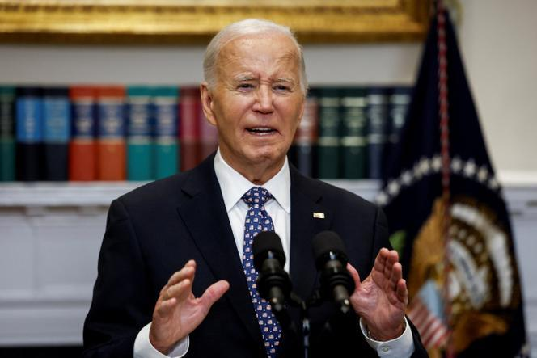

## Claim
Claim: "In remarks to reporters on September 29, 2024 US President Joe Biden announced that no more aid would be provided for the areas affected by Hurrican Helene, but 2.4 billion US-$ more for Ukraine."

## Actions
```
web_search("Joe Biden remarks Hurricane Helene Ukraine aid September 29 2024")
```

## Evidence
### Evidence from `web_search`
On October 1, 2024, France 24 reported on President Biden's response to Hurricane Helene, including his visit to North Carolina and his remarks to reporters on September 30, 2024 (<image:k>). The article also mentioned the death toll from the hurricane. Le Monde reported on remarks made by President Biden on September 30, 2024, regarding the response to Hurricane Helene, including his plan to travel to North Carolina to monitor rescue efforts ().

PBS NewsHour published an article on October 6, 2024, discussing false claims about the federal response to Hurricane Helene, mentioning that President Biden said his administration would continue working with local and state leaders ().

*   [https://www.france24.com/en/americas/20241001-biden-defends-government-response-as-hurricane-helene-death-toll-reaches-118](https://www.france24.com/en/americas/20241001-biden-defends-government-response-as-hurricane-helene-death-toll-reaches-118)
*   [https://www.lemonde.fr/en/united-states/article/2024/09/30/biden-pledges-to-aid-victims-of-hurrican-helene-as-long-as-it-takes\_6727795\_133.html](https://www.lemonde.fr/en/united-states/article/2024/09/30/biden-pledges-to-aid-victims-of-hurrican-helene-as-long-as-it-takes_6727795_133.html)
*   [https://www.pbs.org/newshour/politics/fema-chief-calls-false-claims-about-governments-helene-response-truly-dangerous](https://www.pbs.org/newshour/politics/fema-chief-calls-false-claims-about-governments-helene-response-truly-dangerous)


## Elaboration
The evidence indicates that President Biden made remarks regarding Hurricane Helene on September 30, 2024, not September 29, 2024, as stated in the claim. Furthermore, the evidence suggests that Biden pledged to aid victims of Hurricane Helene and that his administration would continue working with local and state leaders. The evidence does not mention any announcement about withholding aid for the affected areas or providing additional aid to Ukraine.

Therefore, the claim is not supported by the provided evidence. The evidence contradicts the claim by showing that Biden pledged to aid victims of Hurricane Helene.

To fully verify the claim, information about Biden's statements on aid allocation for Hurricane Helene and Ukraine on September 29, 2024, would be needed.


## Final Judgement
The search results show that President Biden made remarks about Hurricane Helene on September 30, 2024, not September 29, 2024, as stated in the claim. The evidence indicates that Biden pledged to aid victims of Hurricane Helene and does not mention any announcement about withholding aid for the affected areas or providing additional aid to Ukraine.

The claim is not factually accurate because the date is incorrect, and the evidence contradicts the claim by showing that Biden pledged to aid victims of Hurricane Helene. `false`


### Verdict: FALSE

### Justification
The claim is inaccurate. While President Biden did make remarks regarding Hurricane Helene, the date provided in the claim is incorrect, and the available evidence from sources like [France 24](https://www.france24.com/en/americas/20241001-biden-defends-government-response-as-hurricane-helene-death-toll-reaches-118) and [Le Monde](https://www.lemonde.fr/en/united-states/article/2024/09/30/biden-pledges-to-aid-victims-of-hurrican-helene-as-long-as-it-takes_6727795_133.html) indicates he pledged aid to the victims, contradicting the claim's assertion about withholding aid.
