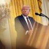

## Claim
Claim: "In February 2025 Ukrainian President Volodymyr Zelenskyy blocked access to US President Donald Trump's social media platform Truth Social across Ukraine."

## Actions
```
web_search("Volodymyr Zelenskyy Donald Trump Truth Social Ukraine February 2025")
```

## Evidence
### Evidence from `web_search`
PBS News published an article on March 3, 2025, stating that Donald Trump criticized Volodymyr Zelenskyy on Truth Social for suggesting the war against Russia would continue for some time (). NPR published an article on February 28, 2025, discussing a contentious meeting between Donald Trump and Volodymyr Zelenskyy in the Oval Office (, , ). Trump criticized Zelenskyy's gratitude for U.S. support and later posted on Truth Social that he had "determined that President Zelenskyy is not ready for peace."

Reuters published an article on February 19, 2025, reporting on the strained relationship between Donald Trump and Volodymyr Zelenskyy. Trump called Zelenskyy a "dictator" and suggested he was prolonging the war. Zelenskyy accused Trump of spreading Russian disinformation ().


## Elaboration
The evidence does not contain any information about Zelenskyy blocking access to Truth Social in Ukraine. The evidence shows that Trump and Zelenskyy had a strained relationship and that Trump used Truth Social to criticize Zelenskyy.


## Actions
```
web_search("Ukraine Truth Social ban February 2025")
```

## Evidence
### Evidence from `web_search`
Euronews published an article on February 26, 2025, stating that Zelenskyy did not ban Trump's Truth Social platform, and that the platform was never available in Ukraine according to Trump Media and Technology Group and the Ukrainian government. () Anadolu Agency published an article on February 20, 2025, stating that a Ukrainian Foreign Ministry spokesman said reports that Truth Social is blocked in Ukraine are "false" because the platform is not available in Ukraine due to its limited regional availability.


## Elaboration
The claim is false. According to the evidence, Truth Social was not available in Ukraine, and there was no ban by Zelenskyy.


## Final Judgement
The search results indicate that the claim is false. Multiple sources state that Truth Social was not available in Ukraine and that there was no ban by Zelenskyy.

`false`

### Verdict: FALSE

### Justification
The claim is false. Evidence from multiple sources, including Euronews and Anadolu Agency, indicates that Truth Social was not available in Ukraine and that there was no ban imposed by Volodymyr Zelenskyy.
