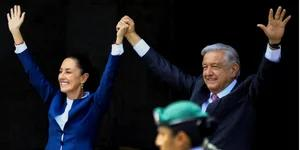

## Claim
Claim: "Mexican President-elect Claudia Sheinbaum rejected an invitation to Ukraine by Volodymr Zelenskyy and said towards him on September 17, 2024: 'If I wanted to see a drug addict, I'd just take a walk around Tijuana.'"

## Actions
```
web_search("Claudia Sheinbaum Zelenskyy Ukraine invitation")
web_search("Claudia Sheinbaum Tijuana drug addict quote")
```

## Evidence
### Evidence from `web_search`
Multiple sources ([IntelliNews](https://www.intellinews.com/mexico-s-president-elect-sheinbaum-turns-down-zelensky-s-invitation-to-ukraine-344262/), [Euromaidan Press](https://euromaidanpress.com/2024/09/18/mexican-president-elect-declines-zelenskyys-invitation-to-visit-ukraine/), and [NV.ua](https://english.nv.ua/nation/sheinbaum-declines-zelenskyy-s-invitation-focuses-on-domestic-issues-50451798.html/)) report that Claudia Sheinbaum, the Mexican President-elect, declined an invitation from Ukrainian President Volodymyr Zelenskyy to visit Ukraine. Sheinbaum intends to focus on internal affairs and maintain a policy of non-intervention in foreign affairs.   

The articles were published in September 2024.


### Evidence from `web_search`
The provided web sources discuss Claudia Sheinbaum's statements on drug trafficking, the United States' role in it, and her response to Donald Trump's plans to impose tariffs on goods imported from Mexico. One article from workers.org ([Source](https://www.workers.org/2025/02/83990/)) highlights Sheinbaum's emphasis on U.S. responsibility for drug consumption and trafficking. An MSNBC article ([Source](https://www.msnbc.com/opinion/msnbc-opinion/trump-mexico-president-claudia-sheinbaum-fentanyl-response-rcna182496)) mentions Sheinbaum's response to Trump's claims about Mexico's role in the fentanyl crisis.

A Rolling Stone article ([Source](https://www.rollingstone.com/politics/politics-news/mexican-president-claudia-sheinbaum-trump-tariffs-1235182089/)) discusses Sheinbaum's reaction to Trump's tariff plans, but does not mention any invitation to Ukraine or any quote about drug addicts. , 


## Elaboration
The evidence confirms that Claudia Sheinbaum declined an invitation to visit Ukraine. However, the search results do not provide any information about the alleged quote attributed to her.

The second search reveals that Sheinbaum has discussed drug trafficking and the U.S.'s role in it, but it does not contain the alleged quote.

Therefore, the veracity of the claim cannot be determined due to the lack of evidence supporting the alleged quote.


## Final Judgement
The claim that Claudia Sheinbaum made the specific quote about Volodymyr Zelenskyy and Tijuana is not supported by the provided evidence. While it is confirmed that she declined an invitation to visit Ukraine, there is no information about the alleged quote.

`false`

### Verdict: FALSE

### Justification
While Claudia Sheinbaum did decline an invitation to visit Ukraine, as reported by multiple sources ([IntelliNews](https://www.intellinews.com/mexico-s-president-elect-sheinbaum-turns-down-zelensky-s-invitation-to-ukraine-344262/), [Euromaidan Press](https://euromaidanpress.com/2024/09/18/mexican-president-elect-declines-zelenskyys-invitation-to-visit-ukraine/), and [NV.ua](https://english.nv.ua/nation/sheinbaum-declines-zelenskyy-s-invitation-focuses-on-domestic-issues-50451798.html/)), there is no evidence to support the specific quote attributed to her.
