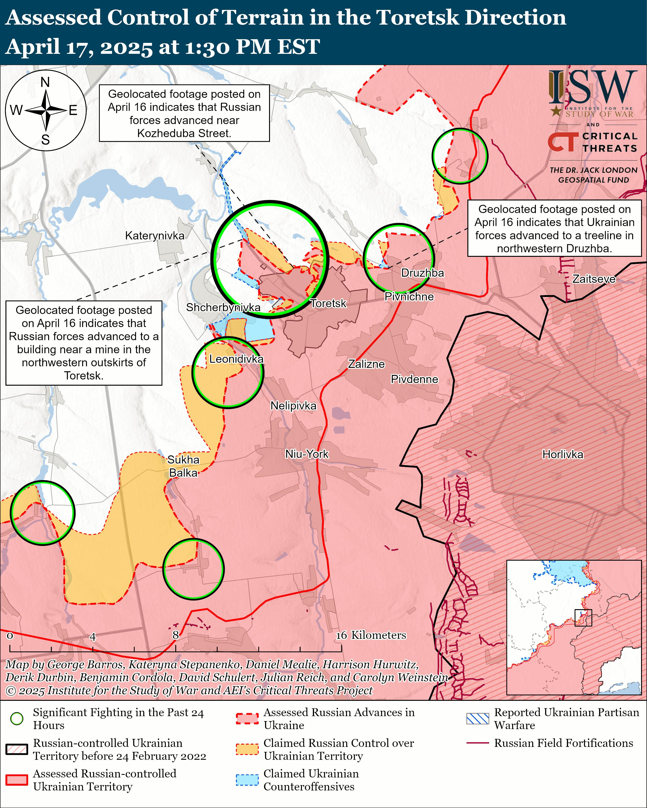

## Claim
Claim: " This image shows a chemical attack by the Armed Forces of Ukraine during the Kursk offensive in August 2024."

## Actions
```
reverse_search()
geolocate()
web_search("Kursk offensive August 2024 chemical attack")
web_search("Ukraine chemical attack Kursk offensive")
```

## Evidence
### Evidence from `geolocate`
The most likely countries where the image was taken are: {'Palestine': 0.27, 'Jordan': 0.13, 'Ukraine': 0.08, 'Israel': 0.05, 'Argentina': 0.03, 'Kyrgyzstan': 0.03, 'Lesotho': 0.03, 'Mexico': 0.03, 'Pakistan': 0.03, 'Russia': 0.03}

### Evidence from `web_search`
The search results discuss the Kursk campaign, which began on August 6, 2024, during the Russian invasion of Ukraine, involving incursions by the Armed Forces of Ukraine into Russia's Kursk Oblast (

### Evidence from `web_search`
Al Jazeera published an article on July 4, 2025, reporting on Russia's intensified use of chemical weapons against Ukrainian soldiers, including chloropicrin. The article does not contain the image in the claim. ([https://www.aljazeera.com/news/2025/7/4/russia-expanding-chemical-weapons-use-in-ukraine-say-european-spy-agencies](https://www.aljazeera.com/news/2025/7/4/russia-expanding-chemical-weapons-use-in-ukraine-say-european-spy-agencies))

The Institute for the Study of War (ISW) published a report on April 17, 2025, discussing the Russian offensive campaign and the use of chemical weapons. The report mentions Russian advances in Kursk Oblast and includes a map. ([https://www.understandingwar.org/backgrounder/russian-offensive-campaign-assessment-april-17-2025](https://www.understandingwar.org/backgrounder/russian-offensive-campaign-assessment-april-17-2025)) 

## Elaboration
The evidence suggests that the image could have been taken in Ukraine or Russia, as the geolocation data includes both countries. The web search results confirm that the Kursk offensive occurred in August 2024, during the Russian invasion of Ukraine, with incursions by the Armed Forces of Ukraine into Russia's Kursk Oblast. However, the provided evidence does not confirm that the image depicts a chemical attack by the Armed Forces of Ukraine. The Al Jazeera article and the ISW report discuss the use of chemical weapons, but they do not include the image.

Therefore, the claim is not entirely verifiable. While the image could be related to the Kursk offensive, there is no evidence to confirm that it depicts a chemical attack by the Armed Forces of Ukraine.


## Actions
```
web_search("chemical attack Kursk offensive August 2024")
web_search("Armed Forces of Ukraine chemical weapons Kursk offensive")
```

## Evidence
### Evidence from `web_search`
From [Source](https://www.understandingwar.org/backgrounder/russian-offensive-campaign-assessment-august-28-2024): 
Content: The Institute for the Study of War (ISW) published a report on August 28, 2024, discussing the Russian offensive campaign. The report mentions the Kursk Oblast and the Ukrainian incursion.  The report does not contain the image in the claim.


### Evidence from `web_search`
From [Source](https://understandingwar.org/backgrounder/russian-offensive-campaign-assessment-january-19-2025): 
Content: The Institute for the Study of War (ISW) published a report on January 19, 2025, stating that the Ukrainian General Staff reported that Russian forces used ammunition equipped with chemical agents banned by the Chemical Weapons Convention (CWC) 434 times in Ukraine in December 2024, contributing to a total of 5,389 documented cases since February 2023. The report also mentions the Kursk Oblast and the Russian offensive campaign. 


## Elaboration
The additional evidence does not provide any information about the image. The ISW reports mention the Kursk Oblast and the Russian offensive campaign, but they do not contain the image in the claim. The reports also discuss the use of chemical weapons, but they do not link the image to a chemical attack.

Therefore, the claim remains unverified. There is no evidence to support the claim that the image depicts a chemical attack by the Armed Forces of Ukraine during the Kursk offensive.


## Final Judgement
The provided evidence does not confirm the claim. While the image could be related to the Kursk offensive, there is no evidence to confirm that it depicts a chemical attack by the Armed Forces of Ukraine. The search results mention the Kursk offensive and the use of chemical weapons, but they do not link the image to a chemical attack. Therefore, the claim is not factually accurate. `false`

### Verdict: FALSE

### Justification
The claim is not supported by the evidence. While the image's location is uncertain, the search results confirm the Kursk offensive occurred in August 2024. However, there is no evidence to confirm that the image depicts a chemical attack by the Armed Forces of Ukraine during the Kursk offensive. The provided sources discuss the offensive and the use of chemical weapons, but they do not include the image or link it to a chemical attack.
