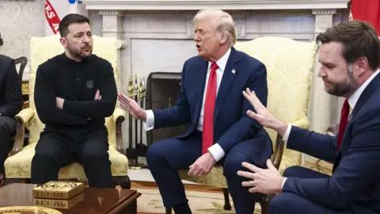

## Claim
Claim: "U.S. Vice President JD Vance's cousin Nate Vance fought in Ukraine for three years during its war with Russia."

## Actions
```
web_search("JD Vance Nate Vance Ukraine")
web_search("Nate Vance Ukraine war")
```

## Evidence
### Evidence from `web_search`
Nate Vance, the first cousin of U.S. Vice President J.D. Vance, fought in Ukraine from 2022 to 2025, serving in the Ukrainian Armed Forces and as a volunteer combatant in the Russo-Ukrainian War according to [Source](https://en.wikipedia.org/wiki/Nate_Vance). The South China Morning Post reported that Nate Vance fought in the Russo-Ukrainian war for three years  [Source](https://www.scmp.com/magazines/style/entertainment/article/3303271/who-us-vice-president-jd-vances-cousin-nate-former-us-marine-who-fought-ukraine-made-headlines-when).

The BBC reported that Nate Vance spent three years volunteering with the Ukrainian military after Russia's full-scale invasion  [Source](https://www.bbc.com/news/articles/cm2yl5kevrpo).


### Evidence from `web_search`
From [Source](https://theins.ru/en/confession/283471): 
Content: The Insider published an article on July 25, 2025, about Nate Vance, who is the cousin of U.S. Vice President J.D. Vance. The article discusses Nate Vance's experience in the war in Ukraine. , , .


## Elaboration
The evidence confirms that Nate Vance, the first cousin of U.S. Vice President J.D. Vance, fought in Ukraine. Multiple sources, including the South China Morning Post and the BBC, state that he served in the Russo-Ukrainian War. The evidence indicates that he fought for three years, specifically from 2022 to 2025.


## Final Judgement
The evidence from multiple sources confirms that Nate Vance, the cousin of U.S. Vice President J.D. Vance, fought in Ukraine for three years. The sources include the South China Morning Post, the BBC, and Wikipedia.

`true`


### Verdict: TRUE

### Justification
Nate Vance, the first cousin of U.S. Vice President J.D. Vance, fought in Ukraine for three years, from 2022 to 2025, as confirmed by multiple sources, including the [South China Morning Post](https://www.scmp.com/magazines/style/entertainment/article/3303271/who-us-vice-president-jd-vances-cousin-nate-former-us-marine-who-fought-ukraine-made-headlines-when), the [BBC](https://www.bbc.com/news/articles/cm2yl5kevrpo), and Wikipedia.
