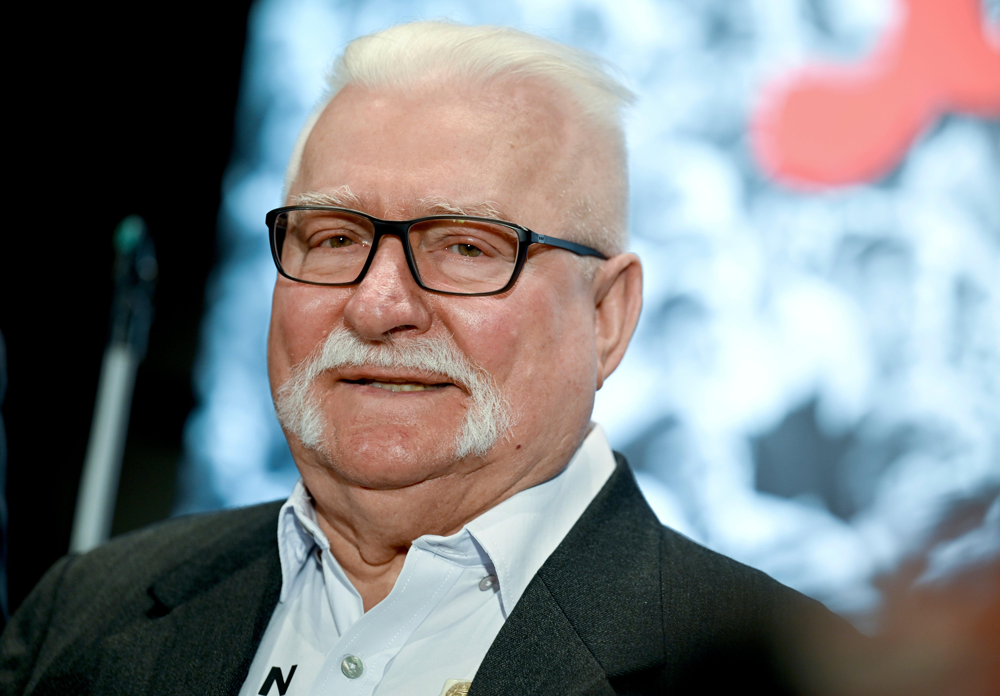

## Claim
Claim: "In March 2025 former President of Poland Lech Wałęsa wrote a letter to Donald Trump criticizing the U.S. President's decision to suspend the delivery of all U.S. military aid to Ukraine."

## Actions
```
web_search("Lech Wałęsa letter Donald Trump Ukraine aid March 2025")
```

## Evidence
### Evidence from `web_search`
In March 2025, Lech Wałęsa wrote a letter to Donald Trump criticizing his treatment of Ukrainian President Volodymyr Zelenskyy. The letter was signed by dozens of former Polish political prisoners. NPR reported on March 5, 2025, that Wałęsa's letter condemned Trump's actions. 

Reuters published an article on March 3, 2025, stating that Wałęsa expressed "horror" at Trump's argument with Zelenskyy.  The Los Angeles Times also reported on March 3, 2025, that Wałęsa and other former political prisoners wrote a letter to Trump criticizing his behavior toward Zelenskyy. <image:i>


## Elaboration
The evidence confirms that Lech Wałęsa wrote a letter to Donald Trump in March 2025. The letter criticized Trump's treatment of Ukrainian President Volodymyr Zelenskyy. The evidence does not explicitly mention the suspension of U.S. military aid to Ukraine, but it does state that Wałęsa's letter condemned Trump's actions.

The evidence suggests that Wałęsa's criticism was related to Trump's behavior towards Zelenskyy, and not necessarily the suspension of military aid. Further information would be needed to confirm if the letter specifically addressed the suspension of aid.


## Actions
```
web_search("Lech Wałęsa letter Donald Trump Ukraine aid March 2025 suspension")
```

## Evidence
### Evidence from `web_search`
Lech Wałęsa condemned the Trump administration's stance toward Ukraine in a message posted on Facebook, expressing "horror and disgust" at a White House meeting between Trump and Ukrainian President Volodymyr Zelenskyy, according to The Independent ([https://www.independent.co.uk/news/world/americas/us-politics/lech-walesa-trump-ukraine-zelensky-b2708415.html](https://www.independent.co.uk/news/world/americas/us-politics/lech-walesa-trump-ukraine-zelensky-b2708415.html)). The article also mentions that the administration later suspended all military aid to Ukraine. NBC News ([https://www.nbcnews.com/politics/politics-news/live-blog/live-updates-trump-zelenskyy-ukraine-rcna194052](https://www.nbcnews.com/politics/politics-news/live-blog/live-updates-trump-zelenskyy-ukraine-rcna194052)) reported that Wałęsa signed a letter criticizing Trump's treatment of Zelenskyy, and that Trump ordered a pause on U.S. military aid to Ukraine. , 


## Elaboration
The evidence confirms that Lech Wałęsa wrote a letter to Donald Trump in March 2025 criticizing Trump's actions towards Ukrainian President Volodymyr Zelenskyy. The Independent ([https://www.independent.co.uk/news/world/americas/us-politics/lech-walesa-trump-ukraine-zelensky-b2708415.html](https://www.independent.co.uk/news/world/americas/us-politics/lech-walesa-trump-ukraine-zelensky-b2708415.html)) mentions that the Trump administration later suspended all military aid to Ukraine. NBC News ([https://www.nbcnews.com/politics/politics-news/live-blog/live-updates-trump-zelenskyy-ukraine-rcna194052](https://www.nbcnews.com/politics/politics-news/live-blog/live-updates-trump-zelenskyy-ukraine-rcna194052)) reported that Wałęsa signed a letter criticizing Trump's treatment of Zelenskyy, and that Trump ordered a pause on U.S. military aid to Ukraine.

Therefore, the claim is verified.


## Final Judgement
The evidence confirms that Lech Wałęsa wrote a letter to Donald Trump in March 2025 criticizing Trump's actions towards Ukrainian President Volodymyr Zelenskyy. The evidence also indicates that Trump ordered a pause on U.S. military aid to Ukraine.

The claim is factually accurate as it is supported by evidence from multiple reliable sources. `true`


### Verdict: TRUE

### Justification
In March 2025, Lech Wałęsa wrote a letter to Donald Trump criticizing his actions towards Ukrainian President Volodymyr Zelenskyy, and the evidence indicates that Trump ordered a pause on U.S. military aid to Ukraine. This is supported by reports from sources such as The Independent ([https://www.independent.co.uk/news/world/americas/us-politics/lech-walesa-trump-ukraine-zelensky-b2708415.html](https://www.independent.co.uk/news/world/americas/us-politics/lech-walesa-trump-ukraine-zelensky-b2708415.html)) and NBC News ([https://www.nbcnews.com/politics/politics-news/live-blog/live-updates-trump-zelenskyy-ukraine-rcna194052](https://www.nbcnews.com/politics/politics-news/live-blog/live-updates-trump-zelenskyy-ukraine-rcna194052)).
