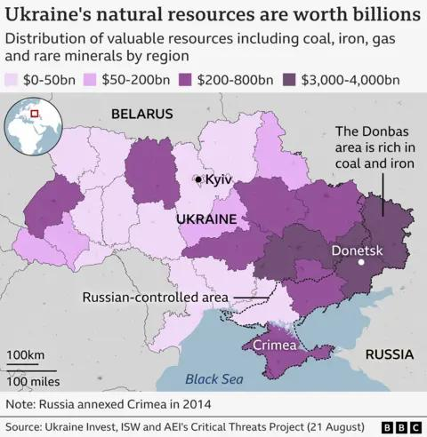
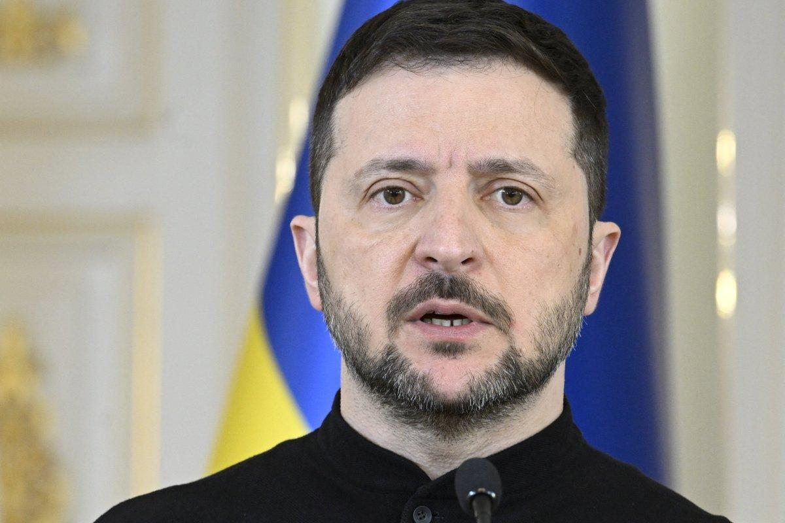

## Claim
Claim: "In early 2025, Ukraine and Russia had reached a peace deal in their years-long war."

## Actions
```
web_search("Ukraine Russia peace deal 2025")
web_search("Ukraine Russia war end date")
```

## Evidence
### Evidence from `web_search`
The Guardian published an article on August 21, 2025, discussing Trump's involvement in peace talks between Russia and Ukraine, mentioning a meeting between Trump and Zelenskyy on August 18, 2025, at the White House (). The article states that Trump intends to let Russia and Ukraine organize a meeting between their leaders without his direct involvement for now. The Wikipedia article discusses peace negotiations in the Russian invasion of Ukraine, mentioning a timeline of the war, including events up to December 2024, and a section on January 2025 - May 2025. It also mentions that in December 2024, Donald Trump, after winning the U.S. presidential election, began a push for peace negotiations between Russia and Ukraine. The article also links to a "2025 Putin–Trump call".

A CNN article, published on August 19, 2025, discusses the difference between a ceasefire and a peace deal in the context of the war between Ukraine and Russia (<image:0>, , , , ). It mentions that Donald Trump is pushing for a peace deal, while Ukraine and its allies are more focused on a ceasefire. The article also notes that any peace deal that would force Ukraine to cede territory to Russia would be illegal under international law.


### Evidence from `web_search`
The Wikipedia article on the Russo-Ukrainian War ([https://en.wikipedia.org/wiki/Russo-Ukrainian_War](https://en.wikipedia.org/wiki/Russo-Ukrainian_War)) states that the conflict began in late February 2014 and is ongoing, including the Russian annexation of Crimea. The BBC article ([https://www.bbc.com/news/articles/c0l0k4389g2o](https://www.bbc.com/news/articles/c0l0k4389g2o)) discusses the ongoing war, mentioning no diplomatic breakthroughs and that the war is in its fourth year. The article includes maps showing the changes in Russian military control from February 2022 to August 2025. In December 2024, Zelensky acknowledged 43,000 Ukrainian deaths.

Newsweek ([https://www.newsweek.com/zelensky-sees-timeline-end-ukraine-war-2046992](https://www.newsweek.com/zelensky-sees-timeline-end-ukraine-war-2046992)) reports that Zelensky sees the war ending in 2025. The article mentions ongoing talks and areas of disagreement. <image:k>, , , , , 


## Elaboration
The evidence suggests that while there were ongoing discussions and efforts towards a peace deal in 2025, a deal had not yet been reached by August 2025. The articles mention Trump's involvement in peace talks, a meeting between Trump and Zelenskyy, and the push for a peace deal. However, they also highlight the difference between a ceasefire and a peace deal, and the ongoing disagreements. The Newsweek article indicates that Zelenskyy sees the war ending in 2025, but it also mentions ongoing talks and areas of disagreement. Therefore, the claim is not supported by the evidence.


## Final Judgement
The evidence indicates that while there were efforts towards a peace deal in 2025, no deal had been reached by August 2025. The sources mention ongoing talks and disagreements, suggesting that a peace deal was not finalized.

`false`

### Verdict: FALSE

### Justification
The evidence indicates that while there were ongoing discussions and efforts towards a peace deal in 2025, a deal had not yet been reached by August 2025. Articles from sources like the [BBC](https://www.bbc.com/news/articles/c0l0k4389g2o) and [Newsweek](https://www.newsweek.com/zelensky-sees-timeline-end-ukraine-war-2046992) mention ongoing talks and disagreements, suggesting that a peace deal was not finalized.
