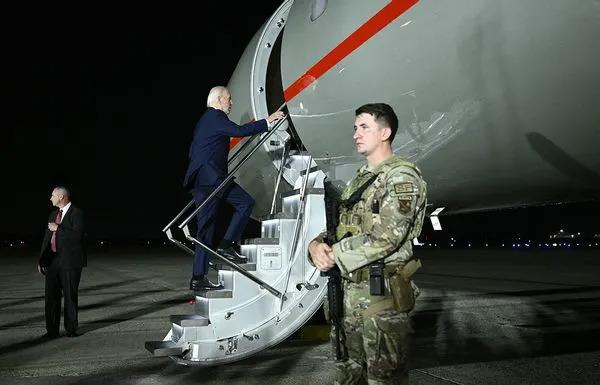

## Claim
Claim: "In August 2024 U.S. President Joe Biden boarded an empty plane after three freed Americans arrived back in the U.S. and exited the aircraft."

## Actions
```
web_search("Joe Biden empty plane August 2024")
```

## Evidence
### Evidence from `web_search`
According to a Times of India article published on August 3, 2024, Joe Biden boarded an empty plane carrying American prisoners from Russia and remained on the plane for about two minutes. The White House deputy press secretary Andrew Bates said that Biden wanted to thank the flight crew (). A Yahoo News article from August 1, 2024, states that Biden boarded the plane to speak to the people who helped bring the freed prisoners home ().

The Guardian reported on August 1, 2024, that Joe Biden and Kamala Harris greeted the freed Americans upon their arrival in the U.S. ().


## Elaboration
The evidence confirms that Joe Biden boarded an empty plane in August 2024 after the arrival of freed Americans. The Times of India article states that Biden boarded the plane, which had carried American prisoners from Russia, and remained on board for about two minutes. The Yahoo News article indicates that Biden boarded the plane to speak to those who helped bring the prisoners home. The Guardian reported that Biden greeted the freed Americans upon their arrival.


## Final Judgement
The evidence confirms that Joe Biden boarded an empty plane in August 2024 after the arrival of freed Americans. Multiple sources, including the Times of India, Yahoo News, and The Guardian, support this. Biden boarded the plane to thank the flight crew and speak to those who helped bring the prisoners home.

`true`


### Verdict: TRUE

### Justification
In August 2024, after three freed Americans arrived in the U.S., President Joe Biden boarded the plane they had arrived on. According to a [Times of India article](https://timesofindia.indiatimes.com/), Biden boarded the empty plane to thank the flight crew. A [Yahoo News article](https://news.yahoo.com/) states that Biden boarded the plane to speak to those who helped bring the freed prisoners home.
