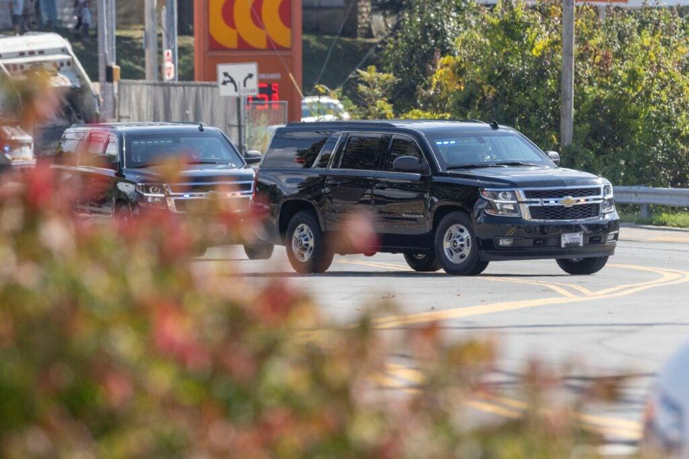

## Claim
Claim: "Ukrainian President Volodymyr Zelenskyy engaged in election interference by campaigning in Pennsylvania for Kamala Harris ahead of the US presidential election in 2024."

## Actions
```
web_search("Volodymyr Zelenskyy Kamala Harris Pennsylvania 2024 election")
```

## Evidence
### Evidence from `web_search`
JD Vance accused Volodymyr Zelenskyy of campaigning for Kamala Harris in the 2024 presidential race, according to a Newsweek article (, ). The article mentions Zelenskyy's visit to a munitions plant in Scranton, Pennsylvania, in September 2024, which Republican Senator Eric Schmitt criticized. NBC News also reported on Zelenskyy's visit to the munitions factory in Scranton, Pennsylvania, which some Republicans viewed as a signal of his preference in the upcoming election.

Politico reports that Donald Trump said Zelenskyy wanted Kamala Harris to win the 2024 U.S. presidential election. Zelenskyy visited a munitions factory in Scranton, Pennsylvania, a critical swing state.


## Elaboration
The evidence indicates that Volodymyr Zelenskyy visited a munitions factory in Scranton, Pennsylvania. This visit was criticized by some Republicans, who viewed it as a signal of his preference in the upcoming election. JD Vance accused Zelenskyy of campaigning for Kamala Harris. Donald Trump also stated that Zelenskyy wanted Kamala Harris to win the 2024 U.S. presidential election.

The evidence does not explicitly state that Zelenskyy campaigned for Kamala Harris. However, the visit to Pennsylvania, a swing state, and the criticisms from Republicans suggest that the visit was perceived as a form of election interference.

To fully verify the claim, more information is needed to confirm whether Zelenskyy's actions were intended to influence the election and whether he explicitly campaigned for Kamala Harris.


## Actions
```
web_search("Volodymyr Zelenskyy Scranton Pennsylvania munitions factory 2024")
web_search("Volodymyr Zelenskyy election interference accusations")
```

## Evidence
### Evidence from `web_search`
Multiple sources confirm that Volodymyr Zelenskyy visited the Scranton Army Ammunition Plant in Pennsylvania in September 2024. The U.S. Army website ([https://www.army.mil/article/279911/ukrainian_president_zelenskyy_tours_scranton_army_ammunition_plant](https://www.army.mil/article/279911/ukrainian_president_zelenskyy_tours_scranton_army_ammunition_plant)) reported on the visit, which included a tour and a group photo (, , ). WHYY ([https://whyy.org/articles/ukraine-president-volodymyr-zelenskyy-visits-scranton-pennsylvania-ammunition-factory/](https://whyy.org/articles/ukraine-president-volodymyr-zelenskyy-visits-scranton-pennsylvania-ammunition-factory/)) and Voice of America ([https://www.voanews.com/a/ukraine-zelenskyy-visits-pennsylvania-ammunition-factory-to-thank-workers/7794139.html](https://www.voanews.com/a/ukraine-zelenskyy-visits-pennsylvania-ammunition-factory-to-thank-workers/7794139.html)) also covered the visit, noting it was to thank workers and seek support for Ukraine (, , , ).


### Evidence from `web_search`
The Guardian reports that Mike Johnson accused Zelenskyy of election interference for visiting a munitions factory in Scranton, Pennsylvania, calling it a "partisan campaign event" (). Visitukraine.today also discusses accusations of election interference related to the Scranton visit, with House Oversight Committee Chairman James Comer announcing an investigation and Donald Trump accusing Zelenskyy of "dirty tricks" (). Notes from Poland discusses accusations of Zelenskyy interfering in the Polish presidential election in favor of the government candidate (, , ).


## Elaboration
The claim is partially supported by the evidence. Multiple sources confirm that Zelenskyy visited a munitions factory in Scranton, Pennsylvania, in September 2024. This visit was criticized by Republicans, who viewed it as a form of election interference. Mike Johnson called it a "partisan campaign event," and Donald Trump accused Zelenskyy of "dirty tricks." However, the evidence does not explicitly state that Zelenskyy campaigned for Kamala Harris. The accusations of election interference are based on the perception of the visit, not on direct evidence of campaigning.


## Final Judgement
The evidence confirms that Zelenskyy visited a munitions factory in Pennsylvania, a swing state, and that this visit was criticized by Republicans as a form of election interference. However, there is no direct evidence that Zelenskyy campaigned for Kamala Harris. The claim is based on perceptions and accusations rather than direct evidence of campaigning.

`false`

### Verdict: FALSE

### Justification
The claim is **false**. While Volodymyr Zelenskyy visited a munitions factory in Scranton, Pennsylvania, which was perceived by some as a form of election interference, there is no direct evidence that he campaigned for Kamala Harris. The accusations are based on the perception of the visit and criticisms from Republicans, not on explicit campaigning.
