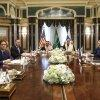
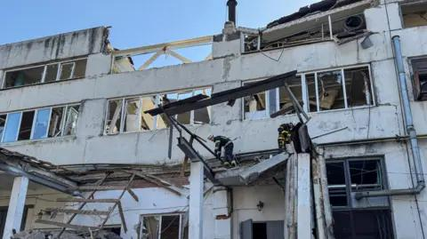

## Claim
Claim: "In February 2025 German Chancellor Olaf Scholz declared a state of emergency in Germany due to US President Donald Trump's peace plan for Ukraine."

## Actions
```
web_search("Olaf Scholz state of emergency Germany February 2025")
web_search("Donald Trump peace plan Ukraine February 2025")
```

## Evidence
### Evidence from `web_search`
Euronews published a fact-check on February 19, 2025, stating that Olaf Scholz did not declare a state of emergency in Germany due to US-Russia peace talks, and that misleading claims were spreading online before the German elections <image:i>. POLITICO reports that Scholz was unaware of Donald Trump's peace plan for Ukraine, and that Trump would begin immediate negotiations with Russian President Vladimir Putin, with German Defense Minister Boris Pistorius criticizing Trump’s stance on negotiations with Moscow ([https://www.politico.eu/article/olaf-scholz-germany-donald-trump-war-in-ukraine-peace-plan/](https://www.politico.eu/article/olaf-scholz-germany-donald-trump-war-in-ukraine-peace-plan/)).

RBC-Ukraine published an article on August 30 discussing Scholz's proposal to declare a state of emergency in Germany due to the war in Ukraine .


### Evidence from `web_search`
The Council on Foreign Relations published a blog post and podcast episode on February 24, 2025, discussing Donald Trump's evolving policy toward Ukraine, including his approach to a peace deal. The NPR article discusses Donald Trump's efforts to bring about peace in Ukraine after his second-term inauguration, mentioning calls he made in February 2025 and the suspension of aid in March 2025. The BBC News article, published on April 19, 2025, discusses Trump's stance on brokering further Russia-Ukraine talks.

The sources are: [https://www.cfr.org/blog/presidents-inbox-recap-trumps-peace-plan-ukraine](https://www.cfr.org/blog/presidents-inbox-recap-trumps-peace-plan-ukraine), [https://www.npr.org/2025/06/02/nx-s1-5414522/ukraine-peace-talks-russia-trump-putin-istanbul](https://www.npr.org/2025/06/02/nx-s1-5414522/ukraine-peace-talks-russia-trump-putin-istanbul), and [https://www.bbc.com/news/articles/c20x5xn1g92o](https://www.bbc.com/news/articles/c20x5xn1g92o). , , , , , .


## Elaboration
The evidence indicates that the claim is false. Euronews explicitly states that Olaf Scholz did not declare a state of emergency in February 2025. Furthermore, POLITICO reports that Scholz was unaware of Trump's peace plan. While Trump was indeed working on a peace plan for Ukraine, there is no evidence to suggest that Scholz declared a state of emergency in response to it.


## Final Judgement
The claim is demonstrably false. Multiple sources confirm that Olaf Scholz did not declare a state of emergency in February 2025. Additionally, there is no evidence linking any such declaration to Donald Trump's peace plan. `false`

### Verdict: FALSE

### Justification
The claim is false. According to a Euronews fact-check, Olaf Scholz did not declare a state of emergency in February 2025. Furthermore, POLITICO reports that Scholz was unaware of Donald Trump's peace plan for Ukraine.
