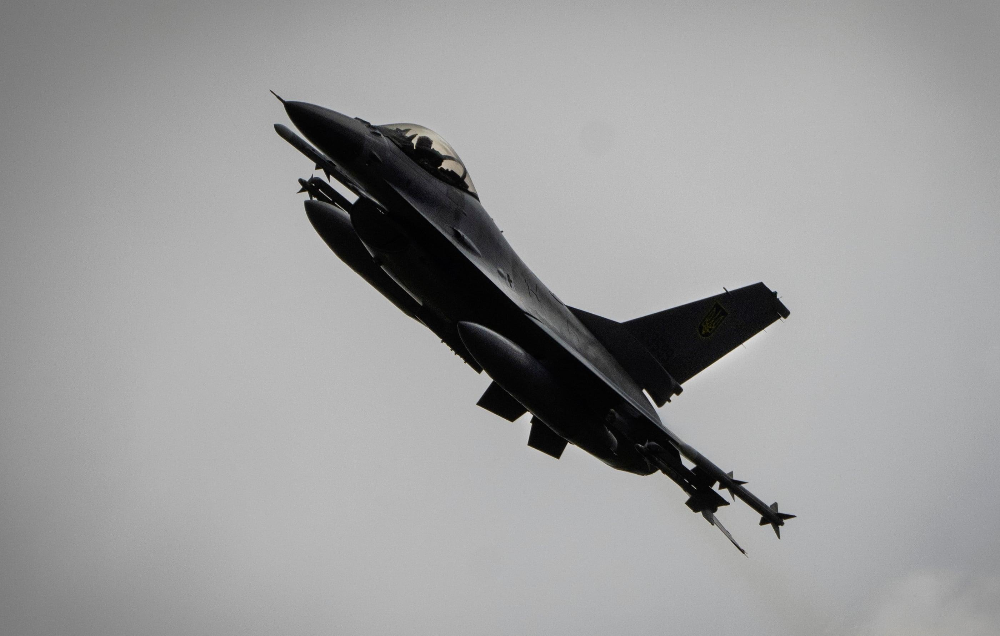
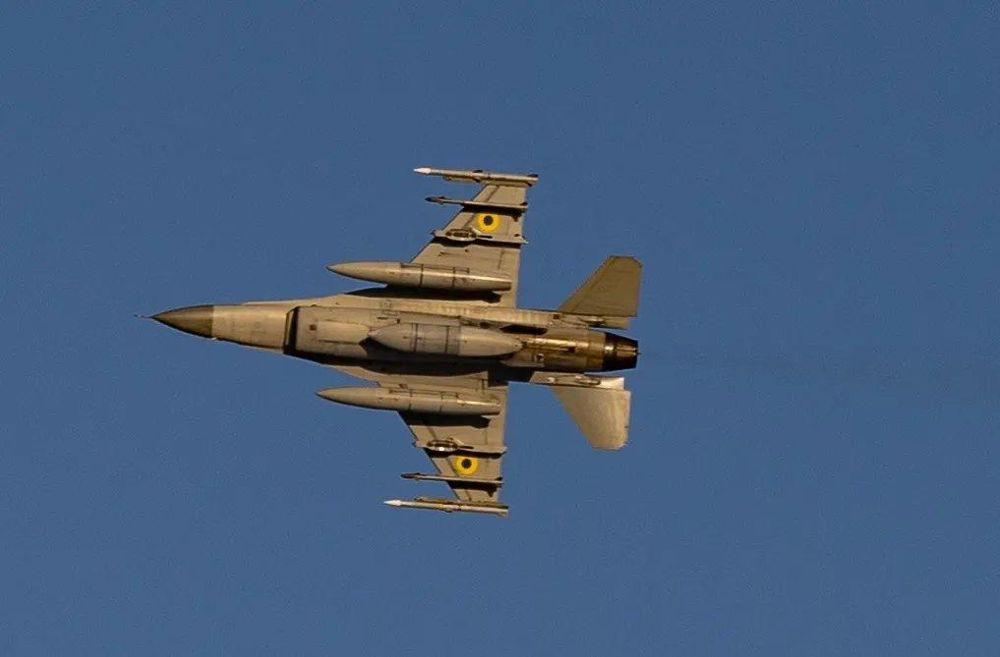
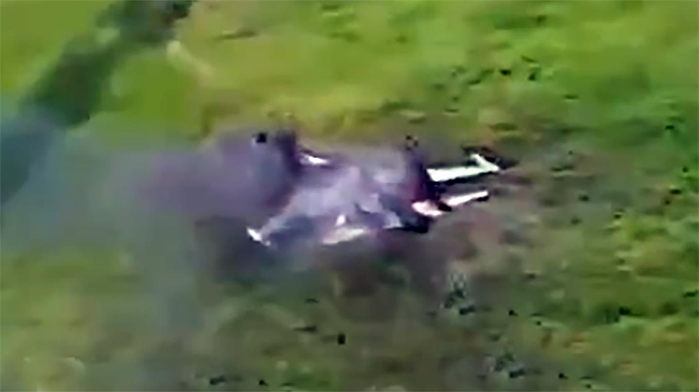
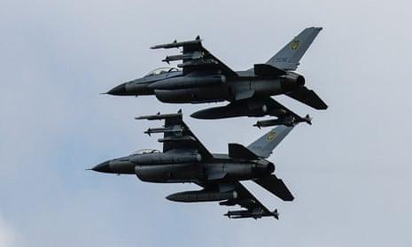

## Claim
Claim: " This image shows a US F-16 fighter jet which was shot down in August 2024 in airspace over the Black Sea after refusing to obey Russian orders."

## Actions
```
reverse_search()
web_search("F-16 shot down Black Sea August 2024")
```

## Evidence
### Evidence from `reverse_search`
The image 

### Evidence from `web_search`
Defense News reported on August 29, 2024, that an F-16 jet crashed in Ukraine during a Russian attack, resulting in the pilot's death. The article mentions that some F-16s have been used to intercept Russian missiles. ([https://www.defensenews.com/global/europe/2024/08/29/ukraine-f-16-jet-crashes-during-russian-attack-killing-pilot/](https://www.defensenews.com/global/europe/2024/08/29/ukraine-f-16-jet-crashes-during-russian-attack-killing-pilot/)) , 

The War Zone discusses claims about a Ukrainian F-16 shooting down a Russian Su-35S Flanker fighter and mentions the death of F-16 pilot Oleksiy Mes in August 2024. ([https://www.twz.com/air/claims-swirl-around-russian-su-35s-flanker-shootdown](https://www.twz.com/air/claims-swirl-around-russian-su-35s-flanker-shootdown)) ,  The Guardian reported on August 28, 2024, that Volodymyr Zelenskiy said F-16s were used to shoot down Russian missiles. ([https://www.theguardian.com/world/article/2024/aug/28/ukraine-war-briefing-zelenskiy-says-f16s-shooting-down-russian-missiles](https://www.theguardian.com/world/article/2024/aug/28/ukraine-war-briefing-zelenskiy-says-f16s-shooting-down-russian-missiles)) 


## Elaboration
The evidence indicates that F-16s were involved in combat operations in Ukraine in August 2024. One F-16 crashed during a Russian attack, resulting in the pilot's death. There are also claims of F-16s shooting down Russian missiles and even a Russian Su-35S Flanker fighter. However, the provided evidence does not confirm the specific details of the claim, such as the location (Black Sea) or the reason for the jet being shot down.

The image 

## Final Judgement
The evidence confirms that F-16s were involved in combat operations in Ukraine in August 2024, with one crashing and claims of shooting down Russian missiles. However, the claim's specific details, such as the location (Black Sea) and the reason for the jet being shot down, are not confirmed by the evidence.

`false`

### Verdict: FALSE

### Justification
The claim is not supported by the evidence. While F-16s were involved in combat in Ukraine in August 2024, as reported by [Defense News](https://www.defensenews.com/global/europe/2024/08/29/ukraine-f-16-jet-crashes-during-russian-attack-killing-pilot/) and [The Guardian](https://www.theguardian.com/world/article/2024/aug/28/ukraine-war-briefing-zelenskiy-says-f16s-shooting-down-russian-missiles), the specific details of the claim, including the location (Black Sea) and the reason for the jet being shot down, are not confirmed.
