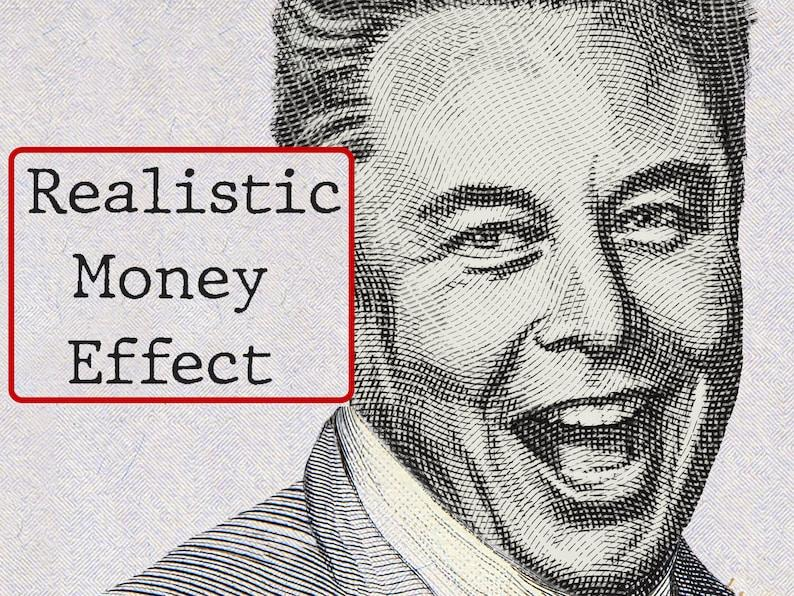
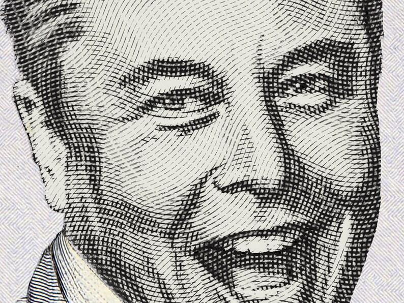
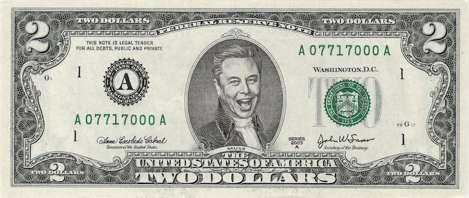
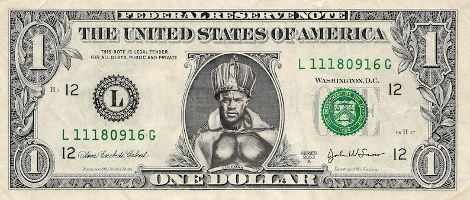
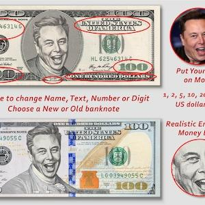
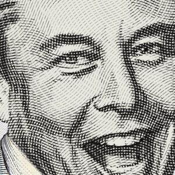
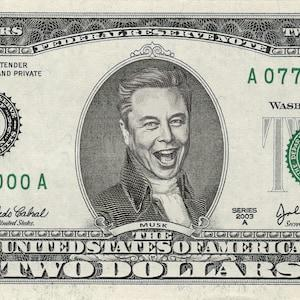
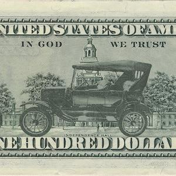
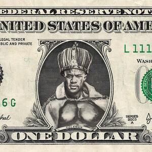

## Claim
Claim: " This image shows a screenshot of an authentic X post from Elon Musk on November 6, 2025 saying 'The last dollar for Zelenskiy'."

## Actions
```
reverse_search()
web_search("Elon Musk Zelenskiy last dollar")
```

## Evidence
### Evidence from `reverse_search`
The image in the claim was found on a website with the title "Dollar Bill Frame Gold Glass Frame For Coin Display Wall Hanging ..." ([https://collegeofems.com/Coin-Display-Wall-Hanging-Coin-Collecting-Holders-Dollar-Bill/983708](https://collegeofems.com/Coin-Display-Wall-Hanging-Coin-Collecting-Holders-Dollar-Bill/983708)). , , ,  The image was also found on Etsy, in a listing for custom dollar bill art ([https://www.etsy.com/ie/listing/1407539034/custom-dollar-dollar-bill-art-100-dollar](https://www.etsy.com/ie/listing/1407539034/custom-dollar-dollar-bill-art-100-dollar)). , , , , , , , , , , , , , ,  The image was also found on Redbubble, a website that sells stickers ([https://www.redbubble.com/shop/one+dollar+stickers](https://www.redbubble.com/shop/one+dollar+stickers)). 


### Evidence from `web_search`
An AOL article fact-checked the claim that Elon Musk posted a "last dollar" image for Zelenskyy and found it to be false, with no evidence of the post. The article includes an image of the purported tweet and states that the image is fabricated. A wider internet search and a review of Musk’s X account did not yield any results for this claim. ([https://www.aol.com/fact-check-elon-musk-didn-164103080.html](https://www.aol.com/fact-check-elon-musk-didn-164103080.html)) 

Politico.eu reported that Elon Musk mocked Ukrainian President Volodymyr Zelenskyy on X using a meme. ([https://www.politico.eu/article/billionaire-elon-musk-mocks-ukraine-president-zelenskyy-asking-aid-with-meme/](https://www.politico.eu/article/billionaire-elon-musk-mocks-ukraine-president-zelenskyy-asking-aid-with-meme/)) StopFake.org refutes a fake story about Elon Musk. ([https://www.stopfake.org/en/fake-ukraine-stopped-using-the-starlink-system-and-insulted-elon-musk-united24/](https://www.stopfake.org/en/fake-ukraine-stopped-using-the-starlink-system-and-insulted-elon-musk-united24/))


## Elaboration
The claim is false. The image in the claim is a fabricated image of a dollar bill with Donald Trump's face on it. The image has been found on websites that sell custom dollar bill art. A web search found that the claim was fact-checked and found to be false, with no evidence of the post on Elon Musk's X account.


## Final Judgement
The image in the claim is a fabricated image of a dollar bill with Donald Trump's face on it. The image has been found on websites that sell custom dollar bill art. A web search found that the claim was fact-checked and found to be false, with no evidence of the post on Elon Musk's X account. `false`

### Verdict: FALSE

### Justification
The claim is false. The image in the claim is a fabricated image of a dollar bill with Donald Trump's face on it, which has been found on websites selling custom dollar bill art ([https://www.etsy.com/ie/listing/1407539034/custom-dollar-dollar-bill-art-100-dollar](https://www.etsy.com/ie/listing/1407539034/custom-dollar-dollar-bill-art-100-dollar)). A web search confirmed that the claim was fact-checked and found to be false, with no evidence of the post on Elon Musk's X account ([https://www.aol.com/fact-check-elon-musk-didn-164103080.html](https://www.aol.com/fact-check-elon-musk-didn-164103080.html)).
