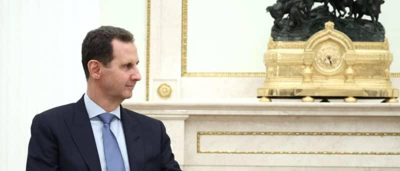

## Claim
Claim: " This image shows an authentic Russian passport of deposed Syrian dictator Bashar al-Assad."

## Actions
```
web_search("Bashar al-Assad Russian passport")
reverse_search()
```

## Evidence
### Evidence from `web_search`
The AOL article ([https://www.aol.com/fact-check-assad-passport-image-140122086.html](https://www.aol.com/fact-check-assad-passport-image-140122086.html)) fact-checks the claim about Bashar al-Assad's Russian passport and states that the image is fake and photoshopped. The original passport image was found on Wikipedia.

The NV.ua article ([https://english.nv.ua/nation/relatives-of-bashar-al-assad-arrested-at-beirut-airport-using-fake-passports-50477670.html](https://english.nv.ua/nation/relatives-of-bashar-al-assad-arrested-at-beirut-airport-using-fake-passports-50477670.html)) discusses the arrest of Bashar al-Assad's relatives for using fake passports and mentions that his regime collapsed and he fled to Moscow. The Wikipedia article discusses Bashar al-Assad's presidency and the fall of the Assad regime.   


### Evidence from `reverse_search`
The image of the Russian passport () appears on the Wikipedia article "East Slavic name" ([https://en.wikipedia.org/wiki/East_Slavic_name](https://en.wikipedia.org/wiki/East_Slavic_name)) and on a website about Russian internal passports ([https://ukrainian-passport.com/blog/internal-russian-passport/](https://ukrainian-passport.com/blog/internal-russian-passport/)). The image also appears on Wikimedia Commons ([https://commons.wikimedia.org/wiki/File:Pasport_RF.jpg](https://commons.wikimedia.org/wiki/File:Pasport_RF.jpg)), which shows a Russian passport.


## Elaboration
The claim that the image shows an authentic Russian passport of Bashar al-Assad is false. The AOL article ([https://www.aol.com/fact-check-assad-passport-image-140122086.html](https://www.aol.com/fact-check-assad-passport-image-140122086.html)) states that the image is photoshopped. The reverse image search confirms that the passport image is a real Russian passport, but the image has been altered.


## Final Judgement
The evidence indicates that the image is a manipulated version of a real Russian passport. The AOL fact-check explicitly states the image is photoshopped. Therefore, the claim is not accurate. `false`

### Verdict: FALSE

### Justification
The claim is false. An AOL fact-check ([https://www.aol.com/fact-check-assad-passport-image-140122086.html](https://www.aol.com/fact-check-assad-passport-image-140122086.html)) states that the image is photoshopped. The reverse image search confirms that the passport image is a real Russian passport, but the image has been altered.
