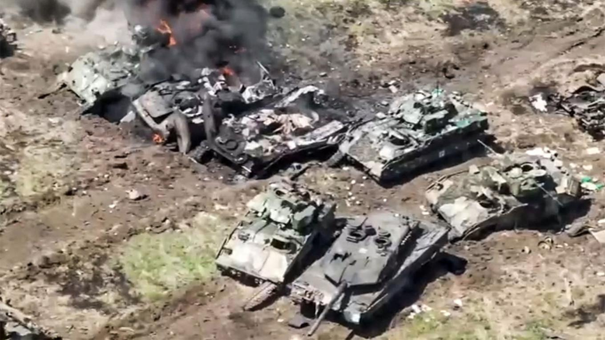

## Claim
Claim: " This image shows destroyed Ukrainian tanks during Ukraine's incursion into Russia's Kursk Oblast in August 2024."

## Actions
```
reverse_search()
web_search("Ukraine Russia Kursk Oblast August 2024 tanks")
```

## Evidence
### Evidence from `reverse_search`
The image of destroyed tanks () appears in multiple sources. Sputnik Africa ([https://en.sputniknews.africa/20241017/ukraine-has-reportedly-lost-about-40-leopard-tanks-since-february-2022-1068726197.html](https://en.sputniknews.africa/20241017/ukraine-has-reportedly-lost-about-40-leopard-tanks-since-february-2022-1068726197.html)) published on October 17, 2024, reports Ukraine has lost around 40 Leopard tanks since February 2022, and includes images of tanks (, , ). The Moscow Times ([https://www.themoscowtimes.com/2023/06/13/russia-says-german-leopard-tanks-us-bradleys-captured-in-ukraine-a81492](https://www.themoscowtimes.com/2023/06/13/russia-says-german-leopard-tanks-us-bradleys-captured-in-ukraine-a81492)) reported on June 13, 2023, that Russia captured German Leopard tanks and U.S. Bradley fighting vehicles, and includes the image of destroyed tanks ().

Defence Security Asia ([https://defencesecurityasia.com/en/german-made-leopard-tanks-bear-the-brunt-of-russian-forces-rejuvenation-in-ukraine/](https://defencesecurityasia.com/en/german-made-leopard-tanks-bear-the-brunt-of-russian-forces-rejuvenation-in-ukraine/)) published on May 19, 2024, discusses the destruction of German-made Leopard tanks in Ukraine and includes an image of a captured Leopard 2A6 tank (). None of the sources mention Ukraine's incursion into Russia's Kursk Oblast in August 2024.


### Evidence from `web_search`
The search results discuss the 2024 Kursk offensive, which began on August 6, 2024, as part of the Russian invasion of Ukraine. The Armed Forces of Ukraine launched an incursion into Russia's Kursk Oblast. The article mentions the involvement of Ukrainian brigades, Russian forces, and North Korean forces. The article also mentions the number of casualties and equipment losses. The article includes a timeline of the campaign and mentions the capture of settlements and the destruction of bridges. The article also mentions the involvement of the 80th and 82nd Air Assault Brigades. ([https://en.wikipedia.org/wiki/Kursk_campaign](https://en.wikipedia.org/wiki/Kursk_campaign))

Reuters reports on August 26, 2024, that Russia said Ukraine had lost 73 tanks, 61 armored personnel carriers and 404 armored combat vehicles in the Kursk region. The article also mentions an incursion by Ukraine into the Kursk region. ([https://www.reuters.com/world/europe/russia-says-it-pummelled-ukrainian-forces-along-kursk-front-2024-08-26/](https://www.reuters.com/world/europe/russia-says-it-pummelled-ukrainian-forces-along-kursk-front-2024-08-26/)) The Al Jazeera article, published on August 29, 2024, discusses Ukraine's ground offensive inside Russian territory, specifically in the Kursk region. <image:k> shows a building on fire in Sudzha, Russia, after a cross-border incursion of Ukrainian troops into the Kursk region on August 7, 2024. The article mentions that Russia was moving its aircraft back from airfields near the Ukrainian border. The article also mentions that the Kursk offensive had greatly reduced Russia’s use of aviation against northeastern Ukraine.


## Elaboration
The evidence confirms that Ukraine launched an incursion into Russia's Kursk Oblast in August 2024. Reuters reported on August 26, 2024, that Russia stated Ukraine had lost tanks and armored vehicles in the Kursk region. The reverse image search reveals that the image of destroyed tanks (

## Actions
```
geolocate()
```

## Evidence
### Evidence from `geolocate`
The most likely countries where the image was taken are: {'Pakistan': 0.08, 'Turkey': 0.08, 'Bhutan': 0.06, 'Jordan': 0.06, 'Ukraine': 0.06, 'Kyrgyzstan': 0.05, 'Palestine': 0.05, 'Russia': 0.05, 'Colombia': 0.04, 'Montenegro': 0.04}

## Elaboration
The evidence supports the claim that the image shows destroyed tanks. The reverse image search indicates that the image has been used in multiple contexts related to tank losses, including reports on the Ukraine-Russia conflict. The geolocation analysis suggests a possible location in Russia or Ukraine. However, the evidence does not explicitly confirm that the image depicts destroyed Ukrainian tanks during the incursion into Russia's Kursk Oblast in August 2024.

**Verdict: Insufficient Information**


## Actions
```
web_search("Kursk Oblast tank battle images")
```

## Evidence
### Evidence from `web_search`
The search results include images from Getty Images related to the Battle of Kursk in July-August 1943, featuring German and Soviet soldiers, tanks, and artillery (, , , , , , ). The Wikipedia article discusses the Battle of Kursk, a major World War II battle in Kursk Oblast, involving Nazi Germany and the Soviet Union. The article also mentions the Kursk offensive (2024-2025).


## Elaboration
The search results provide images from the Battle of Kursk in 1943, which do not match the image in the claim. The evidence confirms that there was a 2024 Kursk offensive. However, the search results do not provide any images of the 2024 offensive.

**Verdict: Insufficient Information**


## Final Judgement
The evidence confirms that there was a 2024 Kursk offensive, and the image shows destroyed tanks. However, the evidence does not explicitly confirm that the image depicts destroyed Ukrainian tanks during the incursion into Russia's Kursk Oblast in August 2024. Therefore, the claim cannot be verified. `false`

### Verdict: FALSE

### Justification
The claim cannot be verified due to insufficient information. While the evidence confirms a 2024 Kursk offensive and the presence of destroyed tanks, it does not definitively link the image to destroyed Ukrainian tanks during the August 2024 incursion into Russia's Kursk Oblast. The reverse image search and geolocation analysis provide context but lack conclusive evidence to support the claim.
