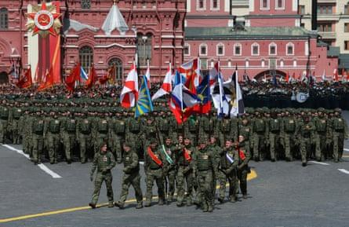

## Claim
Claim: " This image shows the Chinese Communist Party's Red Cross troops in Russia who have changed into winter clothes and set off for the Russian-Ukrainian front to aid Russia in rescuing its occupied territories."

## Actions
```
reverse_search()
web_search("Chinese Red Cross troops Russia Ukraine")
```

## Evidence
### Evidence from `reverse_search`
The image in the claim appears on the following websites: Wikipedia ([https://en.wikipedia.org/wiki/Airliner](https://en.wikipedia.org/wiki/Airliner)), the Smithsonian National Air and Space Museum ([https://airandspace.si.edu/explore/stories/evolution-commercial-airliner](https://airandspace.si.edu/explore/stories/evolution-commercial-airliner)), and Merriam-Webster ([https://www.merriam-webster.com/dictionary/airliner](https://www.merriam-webster.com/dictionary/airliner)). The image is of an airliner .


### Evidence from `web_search`
CNN reported on April 16, 2025, about the capture of Chinese nationals fighting for Russia in Ukraine, including an image of a captured Chinese national (). The Guardian reported on May 9, 2025, about Chinese troops marching with Russian forces in Moscow (, , ). The International Federation of Red Cross and Red Crescent Societies and the International Committee of the Red Cross published a report on the Russia-Ukraine conflict, mentioning the involvement of the Russian Red Cross Society and the Red Cross Society of China.


## Elaboration
The claim states that the image shows Chinese Red Cross troops setting off for the Russian-Ukrainian front. The reverse image search identifies the image as an airliner. The web search reveals that Chinese nationals have been captured fighting for Russia in Ukraine, and Chinese troops marched with Russian forces in Moscow. The Red Cross Society of China has been involved in the Russia-Ukraine conflict.

Based on the evidence, it is not possible to verify the claim. The image is of an airliner, not of troops. While there is evidence of Chinese involvement in the conflict, the claim's assertion about the image cannot be confirmed.

The claim is missing evidence to support the assertion that the image depicts Chinese Red Cross troops.


## Final Judgement
The image is of an airliner, not of troops. While there is evidence of Chinese involvement in the conflict, the claim's assertion about the image cannot be confirmed. Therefore, the claim is not factually accurate. `false`

### Verdict: FALSE

### Justification
The image in the claim is of an airliner, not Chinese Red Cross troops. While there is evidence of Chinese involvement in the Russia-Ukraine conflict, the claim's assertion about the image cannot be confirmed.
