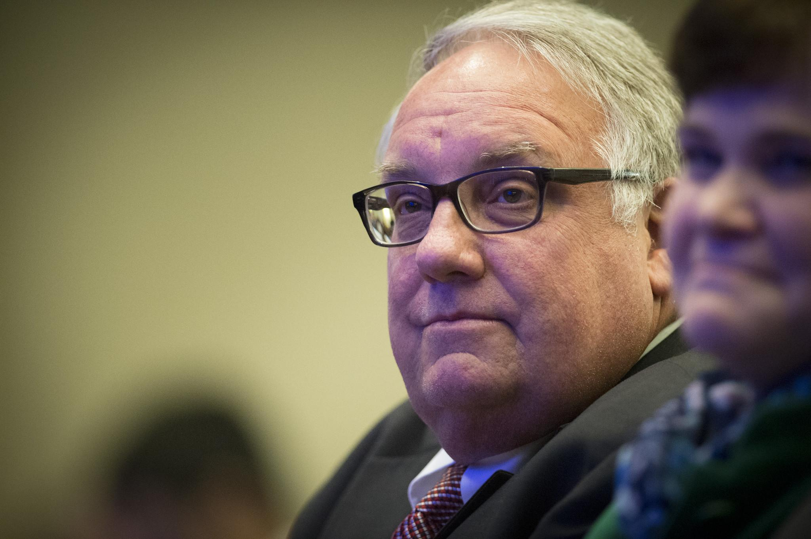

## Claim
Claim: "Warren Buffett has given more than $500 million to Ukraine since 2022."

## Actions
```
web_search("Warren Buffett Ukraine donations 2022")
```

## Evidence
### Evidence from `web_search`
Multiple sources report that Howard Buffett's foundation, led by Warren Buffett's son, has provided significant aid to Ukraine. According to [Fortune](https://fortune.com/2025/04/07/warren-buffetts-son-is-on-track-to-donate-1-billion-in-aid-to-ukraine-this-year-and-pledges-to-continue-despite-trumps-shaky-relations/), the foundation has contributed approximately $800 million since the start of the full-scale invasion and is on track to donate $1 billion this year. The [Alliance magazine](https://www.alliancemagazine.org/blog/howard-buffett-maintains-ukraine-philanthropy-despite-deteriorating-us-support/) and [Euromaidan Press](https://euromaidanpress.com/2025/04/08/buffetts-foundation-committed-to-surpassing-1-billion-in-aid-to-ukraine-this-year/) also mention the $800 million contribution and the goal to surpass $1 billion in aid. <image:k> 


## Elaboration
The evidence indicates that Howard Buffett's foundation, not Warren Buffett himself, has donated approximately $800 million to Ukraine since the start of the full-scale invasion. The foundation is on track to donate $1 billion this year.

Therefore, the claim is partially correct, as the total amount donated exceeds $500 million. However, the evidence specifies that the donations were made by Howard Buffett's foundation, not Warren Buffett directly.


## Final Judgement
The evidence confirms that over $500 million has been donated to Ukraine since 2022. However, the donations were made by Howard Buffett's foundation, not Warren Buffett himself.

`false`

### Verdict: FALSE

### Justification
While the claim is partially correct in that over $500 million has been donated to Ukraine since 2022, the donations were made by the Howard Buffett Foundation, led by Warren Buffett's son, not Warren Buffett himself. Sources like [Fortune](https://fortune.com/2025/04/07/warren-buffetts-son-is-on-track-to-donate-1-billion-in-aid-to-ukraine-this-year-and-pledges-to-continue-despite-trumps-shaky-relations/) and [Alliance magazine](https://www.alliancemagazine.org/blog/howard-buffett-maintains-ukraine-philanthropy-despite-deteriorating-us-support/) confirm the foundation's significant contributions.
