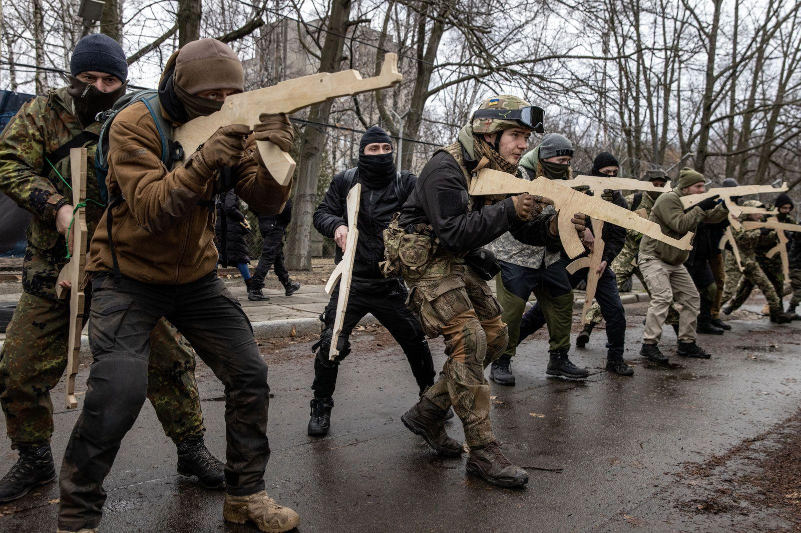

## Claim
Claim: "Ukrainian President Volodymyr Zelenskyy started the 2022 war in Ukraine with Russia."

## Actions
```
web_search("Volodymyr Zelenskyy Russia war 2022")
web_search("causes of 2022 Russia Ukraine war")
```

## Evidence
### Evidence from `web_search`
The Sky News article discusses the war in Ukraine, mentioning meetings between Donald Trump's envoy and Vladimir Putin, a call between Trump and Volodymyr Zelenskyy, and Zelenskyy's visit to troops in the Sumy region. The article also mentions the war began in 2022. ([https://news.sky.com/story/ukraine-war-latest-russia-rape-putin-zelenskyy-12541713](https://news.sky.com/story/ukraine-war-latest-russia-rape-putin-zelenskyy-12541713))

An Al Jazeera article from February 20, 2025, discusses the claim that Ukraine started the war with Russia, mentioning Donald Trump's statement that Zelenskyy "started" the war. The article states that Russian forces launched an invasion of Ukraine on February 24, 2022.  ([https://www.aljazeera.com/news/2025/2/20/fact-check-did-ukraine-start-its-war-with-russia-as-trump-claims](https://www.aljazeera.com/news/2025/2/20/fact-check-did-ukraine-start-its-war-with-russia-as-trump-claims))


### Evidence from `web_search`
The Britannica article ([https://www.britannica.com/event/2022-Russian-invasion-of-Ukraine](https://www.britannica.com/event/2022-Russian-invasion-of-Ukraine)) states that the full-scale invasion began on February 24, 2022, but the war between the two countries began in February 2014. The article mentions that Russia began a massive buildup of troops along its border with Ukraine between October and November 2021. On February 21, 2022, Putin recognized the independence of the self-proclaimed people’s republics of Donetsk and Luhansk. The article includes images of the war , .

The article from cirsd.org ([https://www.cirsd.org/en/horizons/horizons-summer-2022-issue-no.21/the-causes-and-consequences-of-the-ukraine-war](https://www.cirsd.org/en/horizons/horizons-summer-2022-issue-no.21/the-causes-and-consequences-of-the-ukraine-war)) discusses the causes of the 2022 war in Ukraine, mentioning that Putin invaded Ukraine on February 24th, 2022. It also mentions the US and its allies' efforts to bring Ukraine into NATO, which Russia saw as a threat. The Wikipedia article ([https://en.wikipedia.org/wiki/Russian_invasion_of_Ukraine](https://en.wikipedia.org/wiki/Russian_invasion_of_Ukraine)) states that the Russian invasion of Ukraine began on February 24, 2022, escalating a conflict that started in 2014. The invasion followed Russia's build-up of troops near Ukraine's borders and demands to the West, including a ban on Ukraine joining NATO. The article also mentions the annexation of Crimea in 2014 <image:i>.


## Elaboration
The evidence suggests that the 2022 war began with a Russian invasion on February 24, 2022. While the claim suggests Zelenskyy started the war, the provided sources indicate that Russia initiated the full-scale invasion. The Britannica article states that the war between the two countries began in 2014, and the cirsd.org article mentions that the US and its allies' efforts to bring Ukraine into NATO were seen as a threat by Russia. An Al Jazeera article mentions that Donald Trump claimed Zelenskyy "started" the war.

The evidence does not support the claim that Zelenskyy started the war. The provided sources point to Russia's actions as the start of the 2022 escalation.


## Final Judgement
The evidence indicates that Russia initiated the full-scale invasion of Ukraine in 2022, although the conflict has roots dating back to 2014. The claim that Zelenskyy started the war is not supported by the provided sources, which attribute the start of the 2022 escalation to Russia.

`false`

### Verdict: FALSE

### Justification
The claim is false. Multiple sources, including a [Britannica article](https://www.britannica.com/event/2022-Russian-invasion-of-Ukraine) and a [Wikipedia article](https://en.wikipedia.org/wiki/Russian_invasion_of_Ukraine), indicate that the 2022 war was initiated by Russia's invasion of Ukraine on February 24, 2022, although the conflict has roots dating back to 2014.
