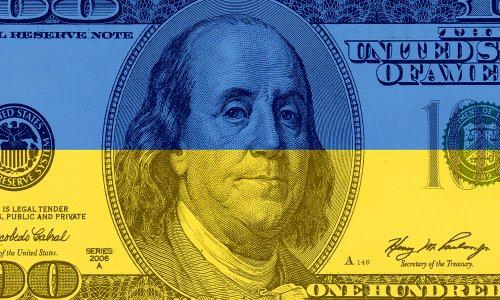
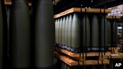

## Claim
Claim: "Ukrainian President Volodymyr Zelenskyy's statement in an AP news interview from February 1, 2025 that his country's military has received only a portion of the more than 175 billion in U.S. aid confirms that the US aid is a money laundering operation."

## Actions
```
web_search("Volodymyr Zelenskyy AP news interview February 1 2025 US aid")
```

## Evidence
### Evidence from `web_search`
An AP News article from an interview with Volodymyr Zelenskyy on February 1, 2025, discusses the war in Ukraine and the exclusion of Ukraine from talks between the U.S. and Russia. Zelenskyy stated that excluding Ukraine from these talks would be "very dangerous" (). The interview was conducted in Kyiv, Ukraine, on Saturday, February 1, 2025. The article also mentions Zelenskyy's view that NATO membership is the "cheapest" option for Ukraine's allies.

The U.S. News & World Report also published an article on February 1, 2025, discussing the AP interview with Ukrainian President Volodymyr Zelenskyy (<image:0>). The article mentions Zelenskyy's statements about talks between Moscow and Washington, which should not exclude Ukraine.

*   [Source](https://apnews.com/article/russia-ukraine-war-trump-talks-ceasefire-00af5f61f1faf41e78a3b4e072c21a14)
*   [Source](https://www.ap.org/news-highlights/best-of-the-week/second-winner/2025/ap-interview-zelenskyy-says-excluding-ukraine-from-u-s-russia-talks-about-war-is-very-dangerous/)
*   [Source](https://www.usnews.com/news/world/articles/2025-02-01/takeaways-from-the-ap-interview-with-ukraines-zelenskyy)


## Elaboration
The provided evidence does not contain any information about the amount of U.S. aid received by Ukraine, nor does it mention any statements by Zelenskyy regarding the portion of aid received. Therefore, the claim cannot be verified.


## Actions
```
web_search("Zelenskyy US aid money laundering")
```

## Evidence
### Evidence from `web_search`
An article from CSIS discusses the controversy surrounding U.S. aid to Ukraine, mentioning that Zelenskyy stated Ukraine received $76 billion out of $177 billion in U.S. aid in an interview with the Associated Press on February 2, leading to questions about the "missing" $100 billion. The article also notes that a significant portion of the aid is spent in the United States. ([Source](https://www.csis.org/analysis/where-missing-100-billion-us-aid-ukraine)) 

DW's fact check discusses Trump's claims about Zelenskyy and U.S. aid to Ukraine, stating that the U.S. government's Ukraine oversight working group estimates the U.S. contribution to Ukraine aid at $203 billion. ([Source](https://www.dw.com/en/fact-check-trumps-attacks-on-zelenskyy-and-ukraine-aid/a-71702392)) VOA News discusses a claim by Dmitry Medvedev that Zelenskyy admitted to embezzling $100 billion of U.S. funds, stating that Zelenskyy said Ukraine received $76 billion in military assistance from the U.S., not the reported $177 billion. The U.S. has provided $175 billion in aid to Ukraine. ([Source](https://www.voanews.com/a/false-russian-allegations-that-ukraine-stole-100-billion-of-us-funds/7967072.html)) 


## Elaboration
Zelenskyy stated in an interview with the Associated Press that Ukraine received $76 billion out of $177 billion in U.S. aid. The U.S. has provided $175 billion in aid to Ukraine. The claim that Zelenskyy's statement confirms the U.S. aid is a money laundering operation is not directly supported by the evidence. The evidence does show that a portion of the aid has not been received, which has led to questions about where the remaining funds have gone. However, the evidence does not provide enough information to confirm the claim.


## Actions
```
web_search("Zelenskyy AP interview February 1 2025 aid portion")
```

## Evidence
### Evidence from `web_search`
From [Source](https://www.usnews.com/news/world/articles/2025-02-01/ap-interview-zelenskyy-says-excluding-ukraine-from-us-russia-talks-about-war-is-very-dangerous): 
Content: An AP News article from February 1, 2025, reports on an interview with Volodymyr Zelenskyy. Zelenskyy stated that excluding Ukraine from talks between the U.S. and Russia about the war would be "very dangerous."  The article does not mention the amount of U.S. aid received by Ukraine.


## Elaboration
The evidence indicates that Zelenskyy did an interview with AP News on February 1, 2025, but the provided article does not mention the amount of U.S. aid received by Ukraine. Other sources state that Zelenskyy said Ukraine received $76 billion out of $177 billion in U.S. aid in an interview with the Associated Press on February 2. The claim cannot be verified because the evidence does not support it.


## Final Judgement
The evidence shows that Zelenskyy did an interview with AP News on February 1, 2025, but the provided article does not mention the amount of U.S. aid received by Ukraine. Other sources state that Zelenskyy said Ukraine received $76 billion out of $177 billion in U.S. aid in an interview with the Associated Press on February 2. The claim that Zelenskyy's statement confirms the U.S. aid is a money laundering operation is not directly supported by the evidence.

`false`

### Verdict: FALSE

### Justification
The claim is not supported by the evidence. While Zelenskyy did give an interview to AP News on February 1, 2025, the provided article does not mention the amount of U.S. aid received by Ukraine. Other sources indicate that Zelenskyy stated Ukraine received $76 billion out of $177 billion in U.S. aid in an interview with the Associated Press on February 2, 2025, but this does not confirm the claim that the aid is a money laundering operation. ([Source](https://www.csis.org/analysis/where-missing-100-billion-us-aid-ukraine), [Source](https://www.voanews.com/a/false-russian-allegations-that-ukraine-stole-100-billion-of-us-funds/7967072.html)).
