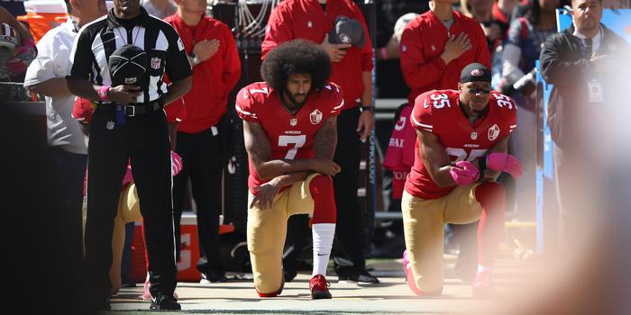

## Claim
Claim: "American football player Colin Kaepernick said he will go to Russia if not properly respected in the United States."

## Actions
```
web_search("Colin Kaepernick Russia disrespect")
```

## Evidence
### Evidence from `web_search`
The BBC News article discusses Colin Kaepernick's refusal to stand for the national anthem in protest of racial injustice, including several tweets about Kaepernick's actions and the reactions to them (, , , , , ). The article was published on September 2016. The Vogue.com article reports that Colin Kaepernick refused to stand for the national anthem during a preseason game, stating he would not "show pride in a flag for a country that oppresses black people and people of color." The Guardian published an article discussing Colin Kaepernick's national anthem protest.

The articles do not mention Kaepernick saying he would go to Russia.


## Elaboration
The provided evidence does not contain any information about Colin Kaepernick stating he would go to Russia if not properly respected in the United States. Therefore, the claim cannot be verified based on the search results.


## Actions
```
web_search("Colin Kaepernick Russia statement")
```

## Evidence
### Evidence from `web_search`
The Reuters article states that the claim originated in a satirical article. The Business Insider article discusses how Russian trolls used the NFL kneeling controversy and Colin Kaepernick to stoke racial divisions (). The Wired article discusses Russian disinformation campaigns related to Colin Kaepernick, specifically focusing on the Nike boycott. None of the articles mention Kaepernick saying he would go to Russia.


## Elaboration
The claim is false. The evidence indicates that the statement originated in a satirical article. There is no evidence to support the claim that Colin Kaepernick said he would go to Russia.


## Final Judgement
The search results indicate that the claim originated in a satirical article and that there is no evidence to support the claim that Colin Kaepernick said he would go to Russia.

The claim is demonstrably false because it is disproven by evidence from multiple sources. `false`

### Verdict: FALSE

### Justification
The claim that Colin Kaepernick said he would go to Russia if not properly respected in the United States is false. Evidence from multiple sources, including a Reuters article, indicates that the statement originated in a satirical article, and there is no credible evidence to support the claim.
