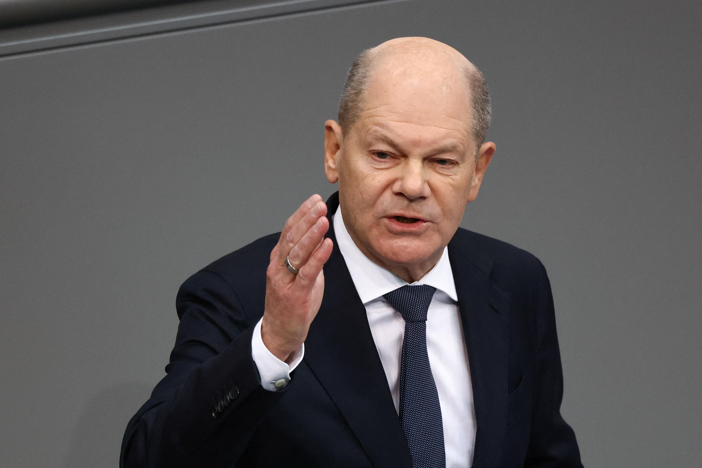
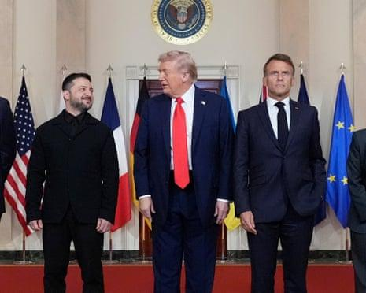
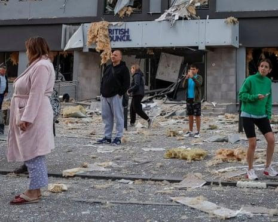
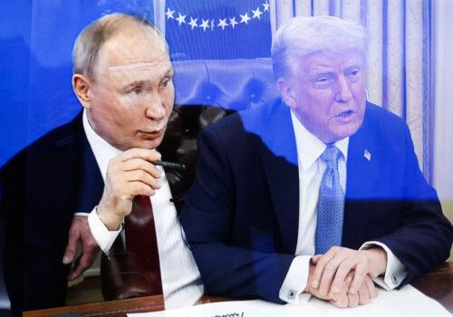
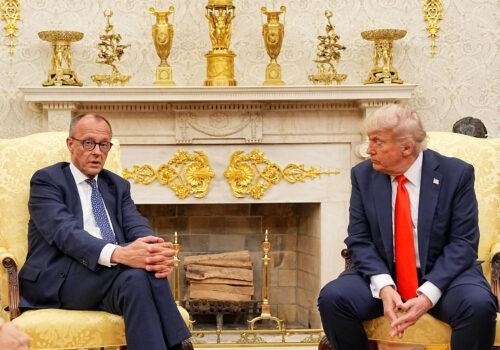
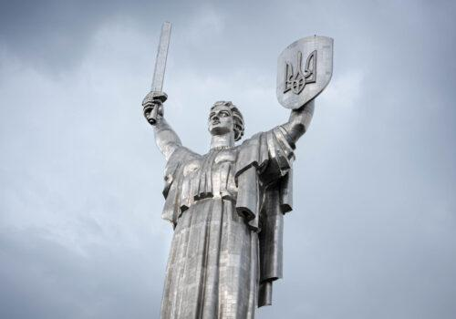

## Claim
Claim: "In February 2025 German Chancellor Olaf Scholz declared a state of emergency in Germany due to US President Donald Trump's peace plan for Ukraine."

## Actions
```
web_search("Olaf Scholz state of emergency February 2025")
web_search("Donald Trump peace plan Ukraine Germany")
```

## Evidence
### Evidence from `web_search`
Euronews published a fact-check on February 19, 2025, stating that Olaf Scholz did not declare a state of emergency in Germany due to US peace talks with Russia. The article clarifies that Scholz referred to "Notlage," an urgent situation, not a state of emergency ("Notstand") (<image:i>). RBC-Ukraine reported that Olaf Scholz proposed declaring a state of emergency in Germany due to the war in Ukraine. Reuters reported on February 13, 2025, that Scholz said there must be no imposed peace in Ukraine, mentioning discussions between Trump, Putin, and Zelenskyy ().

*   [https://www.euronews.com/my-europe/2025/02/19/fact-check-scholz-did-not-call-for-german-state-of-emergency-over-russia-us-peace-talks](https://www.euronews.com/my-europe/2025/02/19/fact-check-scholz-did-not-call-for-german-state-of-emergency-over-russia-us-peace-talks)
*   [https://newsukraine.rbc.ua/news/scholz-proposes-declaring-state-of-emergency-1739502855.html](https://newsukraine.rbc.ua/news/scholz-proposes-declaring-state-of-emergency-1739502855.html)
*   [https://www.reuters.com/world/europe/there-must-be-no-imposed-peace-ukraine-says-germanys-scholz-2025-02-13/](https://www.reuters.com/world/europe/there-must-be-no-imposed-peace-ukraine-says-germanys-scholz-2025-02-13/)


### Evidence from `web_search`
NPR published an article on August 10, 2025, discussing a meeting between Donald Trump and Vladimir Putin in Alaska to discuss ending the war in Ukraine. European leaders, including German Chancellor Friedrich Merz, are urging for Ukraine to be included in the talks (<image:k>). The Guardian reported on August 29, 2025, that French President Macron and German Chancellor Merz attended the 25th Franco-German Council of Ministers, which included a pledge to provide more air defense systems to Ukraine. The article also mentions Donald Trump's comments on EU digital regulations were pushed back by Merz (, , ).

The Atlantic Council published an article on June 5, 2025, discussing Donald Trump's approach to the war in Ukraine, mentioning his reluctance to take strong steps against Russia and decisions that disadvantage Ukraine (, , ).


## Elaboration
The claim is not accurate. Evidence indicates that Olaf Scholz did not declare a state of emergency ("Notstand") in February 2025 due to Donald Trump's peace plan. Instead, Scholz referred to an urgent situation ("Notlage") and proposed declaring a state of emergency due to the war in Ukraine.

Furthermore, the evidence suggests that in August 2025, Friedrich Merz was the German Chancellor, not Olaf Scholz.


## Final Judgement
The claim is false because Olaf Scholz did not declare a state of emergency in February 2025 due to Donald Trump's peace plan. Also, the German Chancellor in August 2025 was Friedrich Merz, not Olaf Scholz. `false`

### Verdict: FALSE

### Justification
The claim is false. According to a Euronews fact-check from February 19, 2025, Olaf Scholz did not declare a state of emergency in Germany due to US peace talks with Russia; he referred to an urgent situation, not a state of emergency. Additionally, by August 2025, Friedrich Merz was the German Chancellor, not Olaf Scholz.
