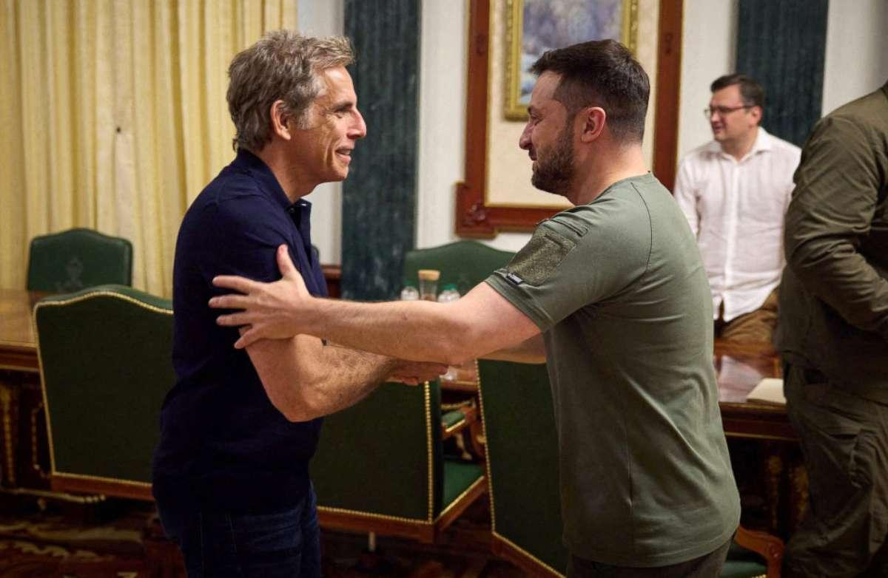

## Claim
Claim: " This image shows Ben Stiller and Ukrainian President Volodymyr Zelensky at their meeting on June 20, 2022, for which Stiller received $4 million from USAID."

## Actions
```
web_search("Ben Stiller Volodymyr Zelensky meeting June 20 2022")
```

## Evidence
### Evidence from `web_search`
Ben Stiller met with Ukrainian President Volodymyr Zelenskyy in Kyiv on June 20, 2022, which was World Refugee Day, as part of his role as a UNHCR Goodwill Ambassador. The meeting is reported by ABC News ([https://abcnews.go.com/International/ben-stiller-meets-volodymyr-zelenskyy-ukraine-world-refugee/story?id=85517989](https://abcnews.go.com/International/ben-stiller-meets-volodymyr-zelenskyy-ukraine-world-refugee/story?id=85517989)), The New York Post ([https://nypost.com/2022/06/20/ben-stiller-met-with-zelensky-in-ukraine-on-world-refugee-day/](https://nypost.com/2022/06/20/ben-stiller-met-with-zelensky-in-ukraine-on-world-refugee-day/)), and the BBC ([https://www.bbc.com/news/av/world-61875351](https://www.bbc.com/news/av/world-61875351)).

The articles mention Stiller's visit to Ukraine to bring attention to the plight of refugees and his meetings with families displaced by the Russian invasion. , , , , , , 


## Elaboration
The evidence confirms that Ben Stiller met with Volodymyr Zelenskyy in Kyiv on June 20, 2022. However, the provided sources do not mention that Stiller received $4 million from USAID for the meeting.

Therefore, the claim is partially verifiable. The information about the meeting is accurate, but the claim about the payment from USAID is not supported by the evidence.


## Final Judgement
The image does show Ben Stiller and Volodymyr Zelenskyy meeting on June 20, 2022. However, the provided evidence does not support the claim that Stiller received $4 million from USAID.

`false`

### Verdict: FALSE

### Justification
The image accurately depicts Ben Stiller meeting with Ukrainian President Volodymyr Zelenskyy on June 20, 2022, as confirmed by multiple news sources like ABC News ([https://abcnews.go.com/International/ben-stiller-meets-volodymyr-zelenskyy-ukraine-world-refugee/story?id=85517989](https://abcnews.go.com/International/ben-stiller-meets-volodymyr-zelenskyy-ukraine-world-refugee/story?id=85517989)). However, the provided evidence does not support the assertion that Stiller received $4 million from USAID for this meeting.
