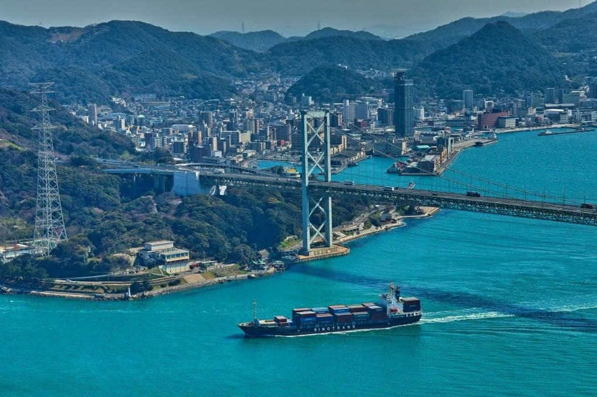

## Claim
Claim: "China and Japan plan to invade the Russian Federation."

## Actions
```
web_search("China Japan Russia invasion plan")
```

## Evidence
### Evidence from `web_search`
The Soviet Union invaded Manchukuo in 1945, overwhelming Japanese forces and leading to significant casualties ([https://en.wikipedia.org/wiki/Soviet_invasion_of_Manchuria](https://en.wikipedia.org/wiki/Soviet_invasion_of_Manchuria)). Leaked Russian military documents reveal plans to target 160 sites in Japan and South Korea ([https://www.scmp.com/week-asia/politics/article/3293037/russias-uncovered-secret-war-plans-target-160-sites-japan-and-south-korea](https://www.scmp.com/week-asia/politics/article/3293037/russias-uncovered-secret-war-plans-target-160-sites-japan-and-south-korea)).

Russian and Chinese naval vessels plan to conduct a joint patrol in the Asia Pacific region ([https://www.aljazeera.com/news/2025/8/6/russia-china-naval-forces-to-carry-out-joint-asia-pacific-patrol-report](https://www.aljazeera.com/news/2025/8/6/russia-china-naval-forces-to-carry-out-joint-asia-pacific-patrol-report)).  <image:k>


## Elaboration
The evidence does not support the claim that China and Japan plan to invade the Russian Federation. The provided sources mention a Soviet invasion of Manchuria, leaked Russian plans to target sites in Japan and South Korea, and joint naval patrols between Russia and China in the Asia Pacific region. None of these sources mention any invasion plans by China or Japan against Russia.

The evidence suggests that Russia and China are cooperating militarily, but this does not imply an invasion plan. The image shows a ship in Japan.


## Final Judgement
The evidence does not support the claim. The search results show historical events and current military activities, but no evidence of a planned invasion of Russia by China or Japan.

`false`


### Verdict: FALSE

### Justification
The claim is unsupported by the evidence. While there is evidence of historical conflicts, such as the Soviet invasion of Manchuria ([https://en.wikipedia.org/wiki/Soviet_invasion_of_Manchuria](https://en.wikipedia.org/wiki/Soviet_invasion_of_Manchuria)), and current military cooperation between Russia and China, there is no evidence to suggest that China and Japan are planning to invade Russia.
