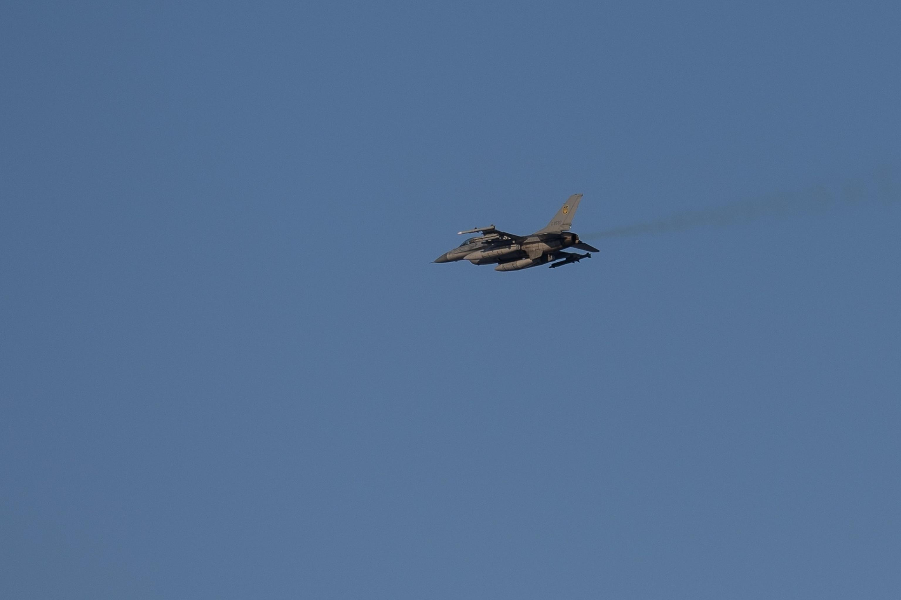
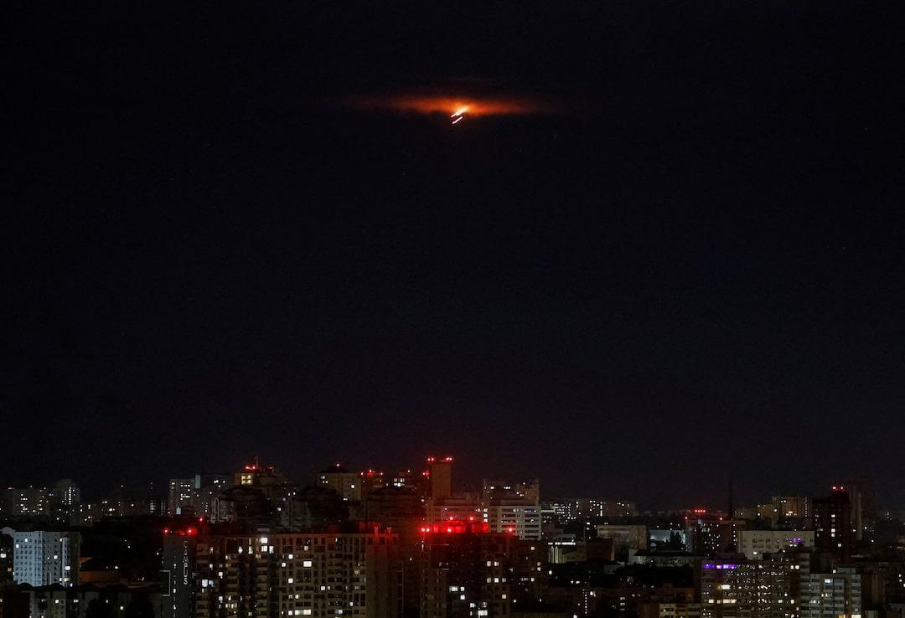

## Claim
Claim: " This image shows a Ukrainian F-16 fighter jet which was shot down by Russia as part of the large-scale Russian invasion in Ukraine."

## Actions
```
reverse_search()
web_search("Ukrainian F-16 shot down")
```

## Evidence
### Evidence from `reverse_search`
The image () shows the wreckage of an F-16 that crashed into a warehouse near March Air Reserve Base, Calif., in May 2019. The crash was caused by a loss of hydraulic pressure due to improperly installed parts. The pilot ejected and survived. The missiles on board did not explode.

The Press-Enterprise published an article on May 1, 2020, about the crash, which can be found here: [Source](https://www.pressenterprise.com/2020/05/01/heres-why-the-missiles-on-the-crashed-f-16-near-march-air-reserve-base-did-not-explode/). Another article from April 28, 2020, by Brian W. Everstine, can be found here: [Source](https://www.airandspaceforces.com/improperly-installed-parts-caused-f-16-to-crash-into-warehouse-in-may-2019/). The search result from The Press-Enterprise, published on April 23, 2020, can be found here: [Source](https://www.sbsun.com/2020/04/23/hydraulic-failure-caused-f-16-to-crash-near-march-base-last-year-air-force-says/). The image is also included in these articles (, , ).


### Evidence from `web_search`
CNN ([https://www.cnn.com/2025/06/29/europe/ukraine-f-16-pilot-killed-russia](https://www.cnn.com/2025/06/29/europe/ukraine-f-16-pilot-killed-russia)) and Reuters ([https://www.reuters.com/business/aerospace-defense/least-six-wounded-large-scale-russian-air-attack-ukraine-ukrainian-authorities-2025-06-29/](https://www.reuters.com/business/aerospace-defense/least-six-wounded-large-scale-russian-air-attack-ukraine-ukrainian-authorities-2025-06-29/)) report that a Ukrainian F-16 pilot died in a crash during a Russian air attack. ABC News ([https://abcnews.go.com/International/ukraine-loses-16-fighter-amid-massed-russian-drone/story?id=123315001](https://abcnews.go.com/International/ukraine-loses-16-fighter-amid-massed-russian-drone/story?id=123315001)) also reports the loss of a Ukrainian F-16, identifying the pilot as Lt. Maksym Ustimenko.

The ABC News article mentions that Russia launched 537 drones and missiles into Ukraine overnight. Reuters states that Ukraine has lost three F-16s since it began operating the jets last year. The articles were published on June 29, 2025. <image:k>, , , 


## Elaboration
The image (

## Final Judgement
The image in the claim shows the wreckage of an F-16 that crashed in 2019 near March Air Reserve Base, California, due to mechanical failure, not being shot down. While there have been recent reports of Ukrainian F-16 losses, the image is not related to those events.

`false`

### Verdict: FALSE

### Justification
The image in the claim depicts the wreckage of an F-16 that crashed in 2019 near March Air Reserve Base, California, due to mechanical failure, as confirmed by sources like [The Press-Enterprise](https://www.pressenterprise.com/2020/05/01/heres-why-the-missiles-on-the-crashed-f-16-near-march-air-reserve-base-did-not-explode/). While there have been recent reports of Ukrainian F-16 losses, the image is unrelated to those events.
