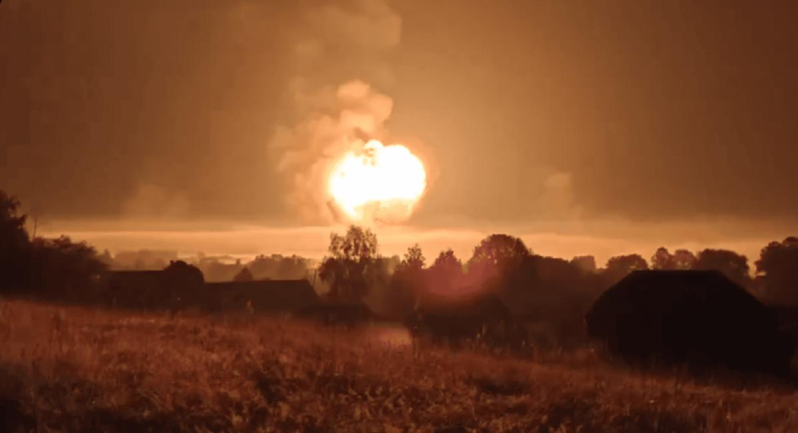

## Claim
Claim: " This image shows a Russian ammunition depot in Toropets, Tver Oblast, before and after it was hit by a, possible nuclear, strike from the North Atlantic Treaty Organization (NATO)."

## Actions
```
reverse_search()
web_search("Russian ammunition depot Toropets Tver Oblast")
web_search("Toropets Tver Oblast NATO strike")
```

## Evidence
### Evidence from `reverse_search`
The image (

### Evidence from `web_search`
The image () shows a Russian ammunition depot in Toropets, Tver Oblast, before and after a Ukrainian drone attack. The attack, which occurred on September 17-18, 2024, caused a large explosion and fires. The depot stored various munitions, including missiles and artillery ammunition. The CIA provided intelligence to Ukraine about the depot.

Sources: [https://en.wikipedia.org/wiki/Toropets_depot_explosions](https://en.wikipedia.org/wiki/Toropets_depot_explosions) and [https://edition.cnn.com/2024/09/18/europe/ukraine-russian-weapons-depot-drone-attack-intl](https://edition.cnn.com/2024/09/18/europe/ukraine-russian-weapons-depot-drone-attack-intl).


### Evidence from `web_search`
From [Source](https://www.newsweek.com/russia-tver-ukraine-drones-1955582): 
Content: The Newsweek article discusses a suspected Ukrainian drone attack on an ammunition depot in Toropets, Tver region, Russia. The article mentions that the explosion was the equivalent of between 1.3 and 1.8 kilotons of TNT. The article includes a screen grab of the fire in Tver, Russia . The article states that the depot reportedly contained North Korean KN23 ballistic missiles, missiles for Grad multiple rocket launcher systems and S-300 air defense systems, as well as Iskander ballistic missiles. The article was published on September 18, 2024.


## Elaboration
The claim that the image shows a Russian ammunition depot in Toropets, Tver Oblast, before and after a NATO strike is **false**. The evidence indicates that the depot was hit by a Ukrainian drone attack, not a NATO strike. The attack occurred on September 17-18, 2024, and caused a large explosion and fires.

The depot stored various munitions, including missiles and artillery ammunition. The explosion was equivalent to between 1.3 and 1.8 kilotons of TNT.


## Final Judgement
The image shows a Russian ammunition depot in Toropets, Tver Oblast, before and after a Ukrainian drone attack, not a NATO strike. The attack caused a large explosion and fires.

The claim is demonstrably false because the evidence from multiple reliable sources confirms that the depot was hit by a Ukrainian drone attack, not a NATO strike. `false`

### Verdict: FALSE

### Justification
The image depicts a Russian ammunition depot in Toropets, Tver Oblast, before and after a Ukrainian drone attack, not a NATO strike. The attack, which occurred on September 17-18, 2024, caused a large explosion and fires, as reported by [Wikipedia](https://en.wikipedia.org/wiki/Toropets_depot_explosions) and [CNN](https://edition.cnn.com/2024/09/18/europe/ukraine-russian-weapons-depot-drone-attack-intl). The depot stored various munitions, and the explosion was equivalent to between 1.3 and 1.8 kilotons of TNT, as stated by [Newsweek](https://www.newsweek.com/russia-tver-ukraine-drones-1955582).
