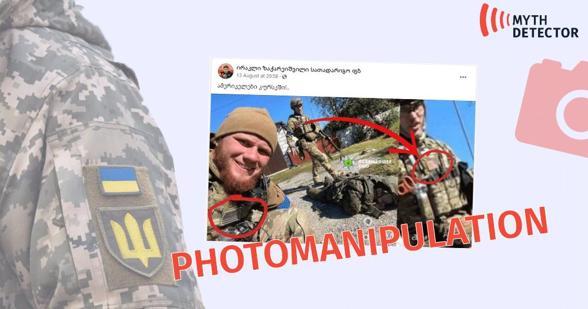

## Claim
Claim: " This image shows American mercenaries participating in Ukraine's incursion into Russia's Kursk Oblast in August 2024."

## Actions
```
web_search("American mercenaries Ukraine Kursk Oblast August 2024")
reverse_search()
```

## Evidence
### Evidence from `web_search`
Newsweek reports that Russia claimed the presence of American mercenaries in the Kursk region during Ukraine's incursion in August 2024 (, , ). The Russian Foreign Ministry protested the alleged involvement of American citizens, which the U.S. denied. The Anadolu Agency also reported on August 20, 2024, that Russia protested the participation of US private military companies fighting alongside Ukraine in the Kursk region (<image:i>).

The Ukrainian Photographers website published news stories on January 23, 2025, and January 21, 2025.

*   [Source](https://www.newsweek.com/russia-protests-american-soldiers-kursk-1942273)
*   [Source](https://www.aa.com.tr/en/russia-ukraine-war/russia-formally-protests-us-mercenaries-joining-ukrainian-soldiers-in-kursk-region-/3308755)
*   [Source](https://www.ukrainianphotographers.com/en/news-articles/foreign-mercenaries-in-the-kursk-region)


### Evidence from `reverse_search`
The image 

## Elaboration
The evidence indicates that Russia claimed the presence of American mercenaries in the Kursk region during Ukraine's incursion in August 2024. The U.S. denied these claims. The Anadolu Agency also reported on Russia's protest regarding the participation of US private military companies.

The image shows individuals with American flags on their uniforms. However, the evidence does not confirm the image's authenticity or its connection to the events in the Kursk region.

To verify the claim, additional information is needed to confirm the image's origin, the identity of the individuals, and their involvement in the events in the Kursk region in August 2024.


## Actions
```
web_search("American mercenaries Kursk Oblast image analysis")
```

## Evidence
### Evidence from `web_search`
Injuredoverseas.com reports that the Forward Observation Group, a private military firm, is active in Kursk, and the Russian Foreign Ministry stated that the participation of American PMCs proves the involvement of the United States as a direct party to the conflict. () Myth Detector fact-checked the claim that the image shows American fighters in the Kursk region and found it to be disinformation. The photo was taken in the Kharkiv region in 2022, and the person depicted is a Ukrainian actor, Serhii Filimonov. (, , )


## Elaboration
The claim is false. Myth Detector fact-checked the image and found it to be disinformation. The photo was taken in the Kharkiv region in 2022, and the person depicted is a Ukrainian actor, Serhii Filimonov.


## Final Judgement
The fact-check reveals that the image in question has been debunked as disinformation. The photo was taken in the Kharkiv region in 2022 and features a Ukrainian actor, not American mercenaries in the Kursk Oblast in August 2024.

`false`


### Verdict: FALSE

### Justification
The claim is false. While Russia claimed the presence of American mercenaries in the Kursk region, the image used to support the claim has been debunked as disinformation. The photo was taken in the Kharkiv region in 2022 and features a Ukrainian actor, not American mercenaries in the Kursk Oblast in August 2024, as reported by [Myth Detector](https://www.mythdetector.ge/en/article/fake-photo-american-fighters-kursk-region).
