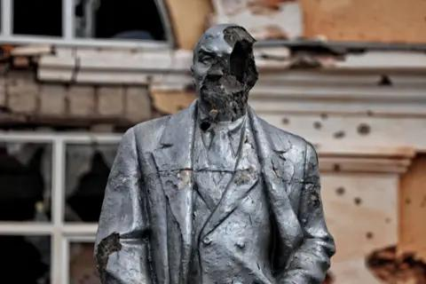

## Claim
Claim: " This image shows Ukrainian President Volodymyr Zelensky arriving in August 2024 in the Sudzha of Kursk region, Russia, which had just been occupied by Ukrainian troops in the Kursk Offensive, and meeting with representatives of the people there."

## Actions
```
reverse_search()
web_search("Volodymyr Zelensky Sudzha Kursk")
```

## Evidence
### Evidence from `reverse_search`
The image () of Volodymyr Zelensky with soldiers was found on the BBC website, which reported that Zelensky visited troops on the front line in the Kharkiv region. The image is from the President of Ukraine's office. The article was published on May 29, 2022. The same image was also found on the website [global.solarpriceza.com](https://global.solarpriceza.com/merchant/zelensky-on-the-front-line-02eb5d0-19-29474101-2-21/) and on Telegrafi.com, which also mentions Zelensky's visit to the frontline positions in the Kharkiv region. The article was published 3 years ago.


### Evidence from `web_search`
The BBC published an article on March 17, 2025, discussing the retreat of Ukrainian troops from the Kursk region, including Sudzha, which was under Ukrainian control in August 2024, but retaken by Russia by March 16, 2025. The article also mentions that President Volodymyr Zelensky said the Kursk operation had "accomplished its task" by forcing Russia to pull troops from the east. ([https://www.bbc.com/news/articles/c0q198zyppqo](https://www.bbc.com/news/articles/c0q198zyppqo))

CNN reported that Ukrainian forces captured Sudzha in the Kursk region on August 15, 2024. ([https://www.cnn.com/2024/08/15/europe/kursk-incursion-sudzha-captured-ukraine-intl](https://www.cnn.com/2024/08/15/europe/kursk-incursion-sudzha-captured-ukraine-intl)) France 24 published an article on March 15, 2025, discussing the situation in the Kursk region, where Russia has retaken villages. ([https://www.france24.com/en/live-news/20250315-zelensky-denies-troops-surrounded-in-kursk-as-russia-retakes-villages](https://www.france24.com/en/live-news/20250315-zelensky-denies-troops-surrounded-in-kursk-as-russia-retakes-villages))

  <image:i> <image:i>


## Elaboration
The claim states that the image shows Zelensky in Sudzha, Kursk region, Russia, in August 2024. The evidence confirms that Ukrainian forces captured Sudzha in the Kursk region on August 15, 2024, according to CNN ([https://www.cnn.com/2024/08/15/europe/kursk-incursion-sudzha-captured-ukraine-intl](https://www.cnn.com/2024/08/15/europe/kursk-incursion-sudzha-captured-ukraine-intl)). However, the image itself is from May 29, 2022, and shows Zelensky in the Kharkiv region, not the Kursk region.

Therefore, the claim is inaccurate because the image is not from August 2024 and does not depict Zelensky in the Kursk region.


## Final Judgement
The image is from May 2022 and shows Zelensky in the Kharkiv region, not the Kursk region in August 2024 as the claim states. While the search results confirm that Ukrainian forces captured Sudzha in the Kursk region in August 2024, the image is not related to this event.

`false`

### Verdict: FALSE

### Justification
The image in the claim is from May 2022 and shows Zelensky in the Kharkiv region, not the Kursk region in August 2024. While Ukrainian forces did capture Sudzha in the Kursk region in August 2024, as reported by CNN ([https://www.cnn.com/2024/08/15/europe/kursk-incursion-sudzha-captured-ukraine-intl](https://www.cnn.com/2024/08/15/europe/kursk-incursion-sudzha-captured-ukraine-intl)), the image is unrelated to this event.
